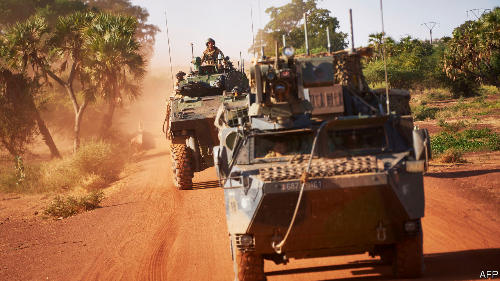

###### Macron’s African mission

# How France can avoid a “forever war” in the Sahel 

##### It will take patience, and the co-operation of local allies 

 

> Feb 20th 2021 


FOR THE past eight years France has been leading a counter-terrorism war in Africa. The fighting is mainly in three countries—Mali, Niger and Burkina Faso—and straddles an area four times the size of France itself, stretching from the great dunes on the southern edge of the Sahara down through the thorny acacia scrub of the Sahel.


It is brutal. Last year jihadist-related violence in the region claimed about 6,200 lives. Almost 2m people have fled their homes. The conflict is not just causing misery among the world’s poorest and fastest-growing populations. It also threatens to spread chaos into coastal countries such as Ivory Coast, Ghana and Benin, whose stability is essential if this huge part of Africa is ever to grow rich.


A year ago, with the backing of leaders in the region, President Emmanuel Macron led a mini-surge to try to push back the jihadists, adding about 600 troops to take France’s total force, known as Operation Barkhane, to 5,100. Working with local armies, French troops have won some big tactical successes, in particular against Islamic State in the Greater Sahara (ISGS). By bombing its hideouts and chasing its convoys of motorbikes and pickup trucks, Barkhane has shaken this jihadist group.


Yet even as French troops have hammered militias linked to ISGS, others mostly affiliated to a branch of al-Qaeda have continued their deadly business. The cruel truth is that France finds itself leading a war it will struggle to win, and for which nobody is particularly grateful. At home, Barkhane enjoys cross-party support, but a new poll suggests that a slim majority of French voters now oppose the war. In the region, where France has often propped up autocrats or turned a blind eye to coups in its former colonies, it faces ongoing protests. On February 16th, after a summit with Sahel leaders, Mr Macron promised that he would not immediately draw down troops, but said that this was not “a forever war” (see ).


The region’s own armies have improved considerably since 2013, when rebels and jihadists overran all of northern Mali and were marching on Bamako, the capital. But they are nowhere near ready to hold the line without the support of French troops and air power, American intelligence-gathering and training from other Western powers. Mali’s government barely controls much of the country’s north or centre beyond its largest cities, and that is only with the help of a 15,000-strong UN force.


There are also limits to what heavily armed outsiders can achieve, as Western armies have learned in Somalia and Afghanistan. This is a fight that will ultimately be won or lost by the region’s own governments. That, in turn, will depend on whether they can regain the trust of long-neglected rural populations, who often see the jihadists as less predatory and corrupt than the state. The governments of Mali, Niger and Burkina Faso must do a better job of supplying services such as clean water, schools and clinics. They will also have to curb graft and human-rights abuses. Last year more civilians in the Sahel were killed by government soldiers than by jihadists. There is only so much that France and its Western allies can do to improve Sahelian governance. But they can make their support for local leaders and armies more conditional on tangible changes, such as the prosecution of soldiers who have been accused of war crimes. An end to coups, such as the one in Mali last year, would also help.


If France wants the Sahel’s governments to take more responsibility, it may have to accept that their leaders could enter into peace talks with some of the jihadists that it is fighting. Local ceasefires such as one struck in Djibo, a city in northern Burkina Faso, could be a useful starting-point and a way of allowing teachers and nurses to return.


As much as Mr Macron would like to find a way to bring France’s troops home, many will be needed in the Sahel for years. However, it is unreasonable to expect France to carry the combat burden alone. The entire region would be damaged if the Sahel’s already-weak states were to collapse. Countries with effective armies such as Ghana could do more to protect themselves by protecting their neighbours. A few of France’s European allies have stepped forward with small commando forces. Others should make good on their promises to join them. Nobody wants to get stuck in a forever war. But repelling the jihadists will take troops, money, co-operation and, above all, patience. ■

