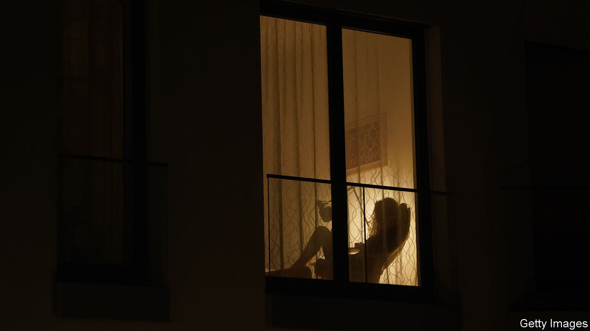

###### More of a rat

# The first novel by a digital laureate 

##### Would Patricia Lockwood be “Patricia Lockwood” without the internet? 

 

> Feb 27th 2021 


No One Is Talking About This. By Patricia Lockwood. Riverhead Books; 224 pages; $25. Bloomsbury Circus; £14.99


WOULD THERE be a Patricia Lockwood without the internet? Once described as “the poet laureate of Twitter”, she belongs to a cadre of writers whose careers can be charted in viral online moments: a video of her reading a poem she wrote called “Rape Joke”; a daring essay on the novels of John Updike; even a feted tweet, sent to the Paris Review, a literary magazine, asking, “So is Paris any good or not?”


“No One Is Talking About This”, her first novel, is about how a collective internet addiction moulds and changes the way people think. The implication is that, although its American author might indeed exist without the web and the intellectual contortions it encourages, she would not be the “Patricia Lockwood” her admirers know today.


The unnamed narrator is a compulsive web user, and the novel is written in zippy gobbets that imitate the truncated thought-processes cultivated by Twitter. In front of her screen, she feels the world “pressing closer and closer, the spiderweb of human connection grown so thick it was almost a shimmering and solid silk”. After the election of Donald Trump, though, she senses something toxic and strangulating in the virtual community. She compares her fellow users to lab-rats hitting levers for food pellets: “When we hit the button, all we were getting was to be more of a rat.”


Ms Lockwood’s prose has a knack of grabbing the reader by the throat, and the book’s first hundred pages are a dazzling set of digressions on her theme. It is only halfway through that, having received a call from her pregnant sister saying that something is seriously wrong with her unborn child, the narrator returns to her family and the ensuing horror.


In the second half of the novel, Ms Lockwood often feels like a writer at the mercy of her own talent. Her cult reputation rests on the dance of her sentences; but here, rather than developing the sense of intimacy that the story requires, the barrage of just-so descriptions and unexpected asides opens up a distance between her narrator and her readers. They will be divided as to whether the hairpin bends of the prose are worth the ride—and whether the author now needs to let “Patricia Lockwood” go.

