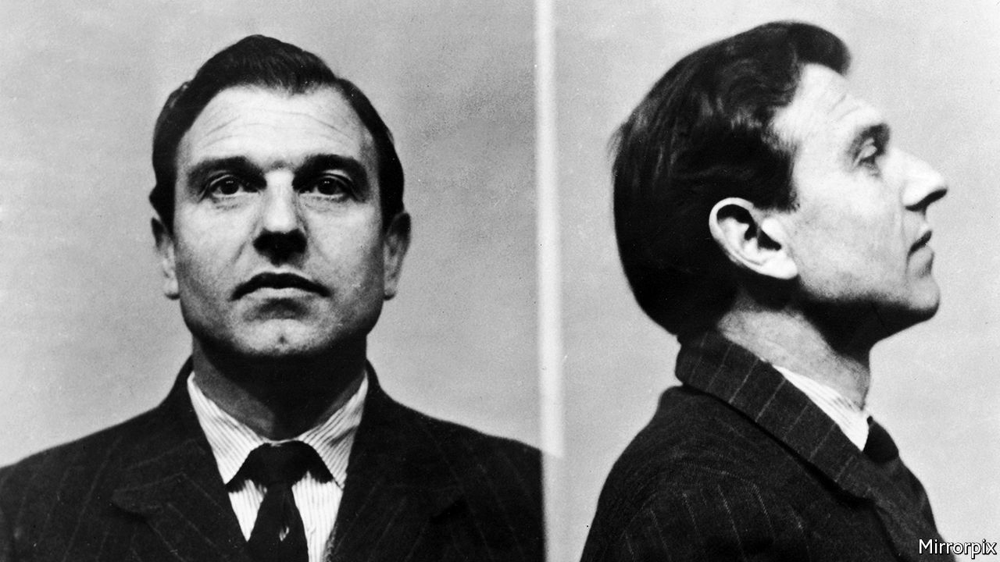

###### Cold war espionage

# The life and lies of an unrepentant double-agent 

##### Simon Kuper recounts George Blake’s story with wit and vim 

 

> Feb 27th 2021 


The Happy Traitor. By Simon Kuper. Profile Books; 288 pages; £14.99. To be published in America by New Press in May as “Spies, Lies and Exile”


HAD HE NOT escaped from Wormwood Scrubs in 1966, the death last year of George Blake, a former double-agent, might have drawn little attention. But the jailbreak was a sensation, inspired a stage play and, in Britain, conferred on Blake an aura of almost Bond-like derring-do.


Simon Kuper tells this extraordinary tale with wit and vim in his entertaining account of the spy’s life. Blake, who had worked for the British Secret Intelligence Service (SIS) since the second world war, was unmasked as a Soviet mole (probably by a Polish double-agent) and given 42 years in prison for treason in 1961. Behind bars, he recruited a couple of peace activists and an Irish adventurer called Sean Bourke, all nearing release, and hatched a plot. Bourke flung a rope ladder over the prison wall; Blake climbed it and jumped, injuring himself, and the pair dashed to a nearby flat. On hearing of the escape, fellow prisoners sang “For he’s a jolly good fellow”. Two months later Blake was on his way to East Germany, hidden in a camper van driven by one of the peaceniks. 


A question that bubbles through this book is how far Blake was a traitor in the manner of the Cambridge spies Kim Philby, Guy Burgess and Donald Maclean. They were all upper-middle-class Englishmen who never went to prison. Blake, who was born in Rotterdam in 1922 and died in Moscow at the age of 98, was different.


His mother was Dutch; his father was from a Jewish family in Istanbul and became a British citizen after serving in the British Army during the first world war. When the next war broke out, “Poek” Behar, as George was then known, worked for the Dutch resistance before escaping via France and Spain to England in 1943, where he was talent-spotted by SIS. It seems never to have occurred to his bosses that, though a passionate anti-Nazi, Blake (as he had become) might not be a committed patriot.


The author was drawn to him partly because of shared characteristics—both Jewish, Dutch-speaking and British. Visiting Moscow in 2012 Mr Kuper bagged an interview with Blake, on the condition that it should not be published in English until after his death. Their three-hour meeting at Blake’s dacha (a gift from the KGB) provides some fresh insights in a narrative that otherwise relies on archives, the Stasi’s in particular.


When and how Blake was turned is not entirely clear. Posted by SIS to Seoul in late 1948, he was captured by the invading North Koreans 19 months later. He had been leaning towards Soviet communism, but during his three-year detention his conversion was completed by reading “Das Kapital” and witnessing the suffering of Korean civilians under American bombing. By the time he was released, he was a signed-up Soviet agent with a KGB handler.


For nine years, Blake led the strange and stressful life of a double-agent, supplying the KGB with more information about Western intelligence operations than it could process. His greatest coup came during a stint in West Berlin in the mid-1950s, when he revealed plans for a secret CIA communications-tapping tunnel into the eastern sector before it was built.


It is hard to know how much damage he did to Western interests. Mr Kuper is rightly sceptical about the impact of spooks on either side of a struggle settled by much bigger forces. What is not in doubt is that Blake’s betrayal of up to 600 SIS agents in eastern Europe, by his own account, led to numerous arrests and executions. He never showed any remorse, regarding the casualties as soldiers, like himself, who knew the rules of a dangerous game.


The book’s title reflects Blake’s contentment with the life he made in Moscow, where (as well as remarrying) he eventually repaired relations with the family he had left in London. Like many who encountered him, Mr Kuper clearly found Blake good company and in some ways sympathetic. Was he a fundamentally bad man? A rogue, certainly, but at heart he was an ideologue whose devotion to a flawed creed sent brave people to their deaths. ■

