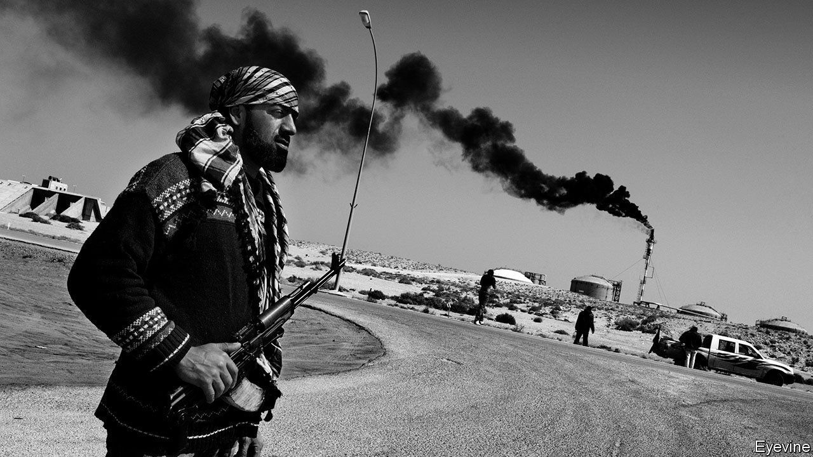

###### Black-gold rush

# The risks and rewards of commodity-traders 

##### In what may always be a mucky business, a few have cleaned up 

 

> Feb 27th 2021 


The World for Sale. By Javier Blas and Jack Farchy. Oxford University Press; 416 pages; $29.95. Random House Business; £20


THE COMMODITY-TRADERS who feature in “The World for Sale” are not the kind who yell orders at each other in the ring of the London Metal Exchange. Javier Blas and Jack Farchy, journalists at Bloomberg News, are instead interested in the small band of mostly private companies that move bulk commodities from there to here. It is a fascinating and revealing story, largely because of where “there” is: usually a place where many people would prefer not to do business, run by characters they would prefer not to do it with. A handful of swashbucklers became billionaires by overcoming such qualms.


The opportunities to make these riches came in three big waves. During the 1960s and 1970s commodity-traders were pivotal in breaking the established Anglo-American oil cartel known as the “seven sisters” and establishing a new one in OPEC. Fortunes were made in the wake of the free-for-all that followed the collapse of the Soviet Union. And after 2001 these figures were instrumental in the integration of China into the global trading order, supplying vast quantities of raw materials from Africa and elsewhere. Along the way, as the authors describe, some traders helped apartheid-era South Africa sidestep economic sanctions, sold oil for Saddam Hussein’s Iraq and funnelled dollars to Vladimir Putin’s Russia. There are tales in the book of breathtaking trades, such as shipments of rebel oil from war-torn Libya or deals bartered amid the brutal “aluminium wars” in the Russia of the 1990s.


The wonder is that so few firms, owned by a tiny number of people, were able to grab such a hold on global commodity-trading with so little oversight. Vitol, a Dutch trading house, became the largest independent oil-distributor under Ian Taylor, its British boss, in part by being venturesome in former Soviet republics. Many of the industry’s branches sprang from a single tree—Philipp Brothers, a trading outfit based in America but with roots in Hamburg, at which a young Marc Rich made his name as a trader.


Rich saw more clearly than others how emerging Middle Eastern petro-states would reshape the oil market. He set up Marc Rich &amp; Co in 1974, after a breach with the Philipp Brothers’ brass over the profits from a bet on Iranian oil. He became the model for a new style of commodity-trader—a bold risk-taker on personal terms with unsavoury leaders. His firm in turn spawned Trafigura and Glencore, a mining giant that listed in London in 2011.


“The World for Sale” has an elegiac air. Rich died in 2013; Taylor in 2020. Ivan Glasenberg, the hard-charging boss of Glencore, will retire this year. Deeper factors are at work, too. The rapid growth in China’s economy in the first decade of this century, which spurred a commodity “super-cycle”, will not be repeated. And public disquiet over the ethics of dealing with shady regimes is growing. Rich spent two decades as a fugitive from American justice because of his business with Iran; other commodity-traders have since had expensive brushes with the law. America has used the dollar’s role as a global currency to enforce economic sanctions more effectively.


Meanwhile the suppliers and customers of the traders have become more astute. The super-profits of the middlemen were in part based on superior private knowledge. It is much harder to make so much money from arbitrage now that information flows so freely.


Still, the instinct to buy low and sell high will endure. Peddling stuff dug up from the ground may always be a mucky business, but if it becomes too unrefined for Western tastes, others are bound to step in. As Messrs Blas and Farchy say, the leading hawker of Iranian crude is now Zhuhai Zhenrong, a Chinese trading house. “The Chinese”, Taylor told the authors in 2019, “probably are willing to take much more risk than we are.” The seeds of a sequel to this gripping book lie somewhere here. ■

