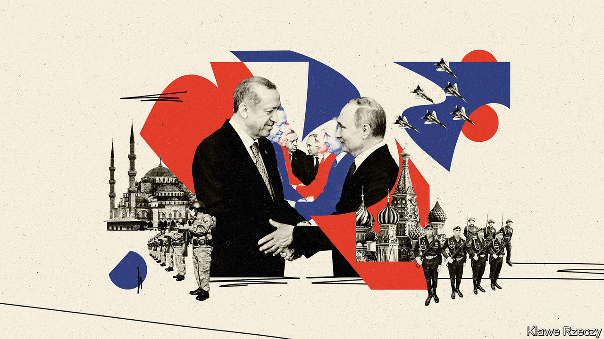
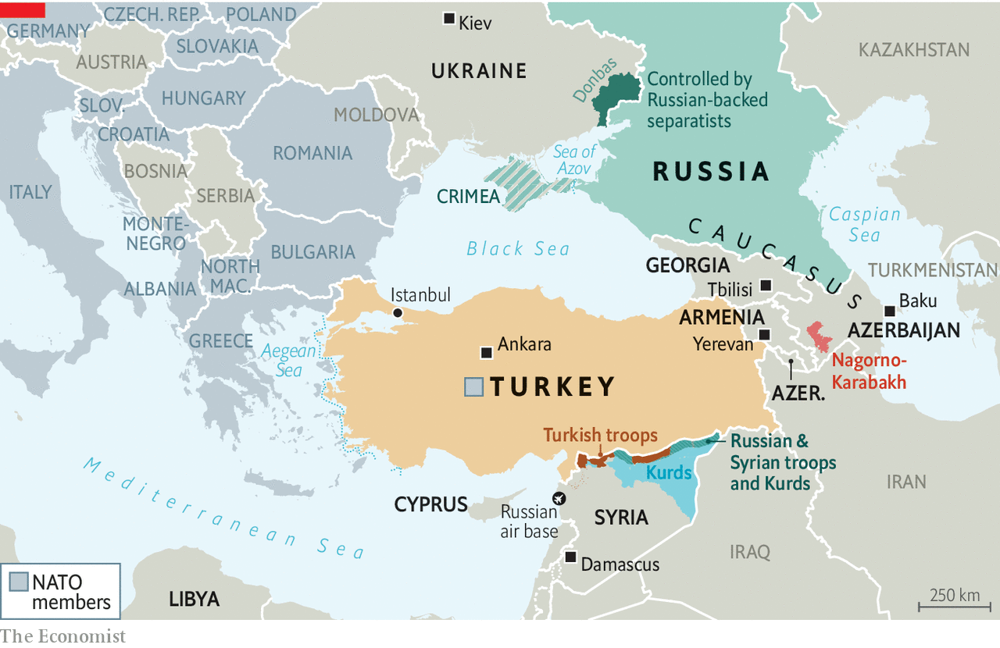
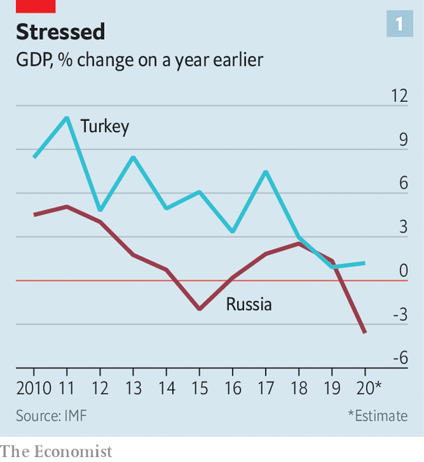
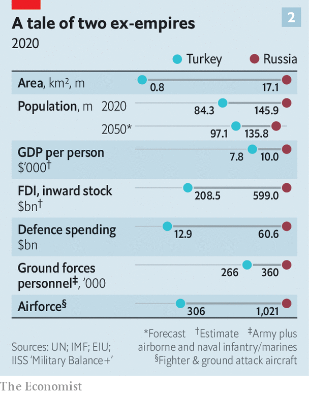

###### The odd couple

# Putin and Erdogan have formed a brotherhood of hard power 

##### But the bond is brittle 

 

> Feb 23rd 2021 


THE KREMLIN has accused NATO of trying to overthrow Vladimir Putin. It has portrayed Alexei Navalny, Mr Putin’s most prominent challenger, as America’s agent. It has called the European Union, which condemned Mr Navalny’s poisoning and subsequent imprisonment, an “unreliable partner”. But there is one NATO country, and candidate EU member, that Mr Putin is happy with: Turkey. Recep Tayyip Erdogan, Turkey’s president, has said nothing about the mistreatment of Mr Navalny or the arrests of thousands of Russians who protested against it. 


His silence is testimony to a remarkable entente that has developed between the two authoritarian leaders. It is an improbable relationship. Deep historical rivalries divide Russia and Turkey, and their interests collide, sometimes violently, in many areas. Yet the two men share a bond in hard power that is reshaping regional politics and posing awkward problems for Turkey’s Western allies.


Historically, Russia and Turkey have gone to war a dozen times, though not since both empires were transformed by revolution at the end of the first world war. The continent-spanning colossi had continually rubbed up against each other in areas where their interests overlapped, and in many ways they still do. They have, for instance, recently been sparring over the civil wars of Libya and Syria. In September they faced each other closer to home in the South Caucasus, which Russia sees as its backyard. With Turkey arming and instructing a Turkic-speaking Muslim Azerbaijan and Russia standing behind Christian Armenia, many worried that a conflict over Nagorno-Karabakh, an ethnic Armenian enclave within Azerbaijan, would spread into an even bigger war. 


Yet even as Turkey’s drones pummelled the Russian tanks used by the Armenian side, Mr Putin praised Mr Erdogan as someone he could do business with. “Working with such a partner is not only pleasant but also safe,” he told an audience of foreign experts at the Valdai Discussion Club in October. Mr Erdogan, in turn, saluted Mr Putin by testing the S-400 missile system that Turkey had bought from Russia. In November they ended the fighting by striking a bargain that gives Russia a military presence in Nagorno-Karabakh and Turkey an economic stronghold in the South Caucasus.


That deal represents one of the biggest geopolitical shake-ups since the end of the cold war, when Russia and Turkey were on opposite sides. It also carries a message about the use of hard power and the reality of a multipolar world. “They both understand that it is not the balance of forces that matters, but the readiness to use them,” says Andrey Kortunov, head of the Russian International Affairs Council. America may have had a superior army, but its reluctance to become engaged in Syria left Russia and Turkey in charge of that war-battered region. And after nearly 30 years of fruitless talks over Nagorno-Karabakh, it was Turkey’s military backing and Russia’s acquiescence that helped Azerbaijan regain territory and shake up one of the least soluble conflicts in the Caucasus. 


To Mr Putin, this was a demonstration of a new multipolar order, something he had been advocating since 2007, when, at the Munich Security Conference, he first took issue with the post-cold-war order with its “one centre of authority, one centre of force, one centre of decision-making”. Russia’s mission was to constrain America’s new hegemony.


Nagorno-Karabakh was not the first time Russia had collaborated with Turkey to minimise the influence of Western powers. In the aftermath of the Bolshevik revolution and the collapse of the Ottoman empire, Kemal Ataturk briefly saw Lenin as an ally against the imperial West and the Bolsheviks saw Turkey as an accomplice in their quest for world dominance. They supplied Turkey with arms to fight the Greeks and the British, and the Turks allowed the Bolsheviks to take control of the oilfields of Azerbaijan and establish their rule in the South Caucasus. The deal between Ataturk and Lenin in 1921 that fixed Turkey’s north-eastern border and limited its presence in the South Caucasus has held ever since. 


Last year’s war over Nagorno-Karabakh was a mirror image of that deal. It is now Mr Putin who is wooing Turkey in his confrontation with the West, hoping to use it as a wedge in NATO, while Mr Erdogan is projecting Turkey into its former spheres of influence. The warmth is all the more remarkable given that Turkey is the only NATO country to have collided with Russia militarily in recent years. In 2015 Turkey shot down a Russian warplane that had violated its airspace after flying over Syria.

 


Russia responded by imposing sanctions against Turkish products, ordering Russian tourists to stay away from Turkish beaches and bombing ethnic Turkmen fighters in northern Syria. Turkey found it impossible to pursue Islamic State (IS) and the militants of the Kurdistan Workers’ Party (PKK) on the Syrian side of the border. To rub it in, Russian officials and media outlets accused members of Mr Erdogan’s family of buying oil from IS. As one Turkish official later said, “We played hard, and they played harder.” 

The thaw


What changed? The relationship began to improve in the summer of 2016, when Mr Putin commiserated with the Turkish president after an abortive coup in Turkey that killed some 270 people. “Putin called immediately,” says a Turkish official. “Like the guy or not, he was smart enough to show solidarity.” Most Western leaders were slower to do so. Mr Erdogan travelled to Russia, where he signed a gas-pipeline deal and agreed to resume work on a Russian nuclear plant in southern Turkey. The two pilots who had shot down the Russian plane in 2015 ended up in prison, charged with being involved in the coup. 


“The fighter-jet crisis was a turning-point in how Turkey dealt with Russia,” says Emre Ersen, a Russia expert at Marmara University in Istanbul. “After NATO didn’t run to Turkey’s help, Turkey understood that the only way to advance its interest in Syria was by agreement with Russia. That agreement still holds.”


Since 2016 Mr Erdogan has held more face-to-face meetings with Mr Putin than with any other leader. Russia has turned from being Turkey’s opponent in Syria’s civil war into its most important partner there. Turkey has been able to carry out its military operations in northern Syria only with Russian consent. Meanwhile, Russian news outlets have made inroads among Turkish audiences. Mr Erdogan’s inner circle now includes a group of “Eurasianists”, who are open to co-operation with Russia and China and hostile towards Europe and NATO. Turkey’s government and its propaganda machine now play up tension with the West as much as they tend to play down tension with Russia. 


The decision to buy the S-400 air-defence system is the most consequential element of the new relationship so far. Two years ago Mr Erdogan called the purchase “the most significant deal in our history”. The system has not come cheap. The price Turkey paid included $2.5bn for the hardware itself, expulsion from America’s F-35 programme and the accompanying loss of $9bn in contracts for the Turkish arms industry. In December America imposed additional sanctions against Turkey’s defence-procurement agency.


Mr Erdogan may have been desperate for a weapons system that could counter the kind of threat that arose in the coup in 2016, when Turkey’s own F-16s bombed his palace. Many of his supporters believe, improbably, that America had a hand in that coup. In February his interior minister accused it of orchestrating the violence. There were also rumours that Russian military intelligence tipped off Mr Erdogan about an imminent threat to his life. 

Into the American vacuum


In Syria, the Turks say they had no choice but to do business with Russia, as America shied away from confrontation with the regime, drawing red lines but failing to take decisive action. Turkey also bristled at America’s decision to outsource the ground war against IS to the Kurds. Turkish officials say America not only allowed Russia to emerge as the main power-broker in Syria but alienated Turkey by teaming up with the PKK’s local offshoot.


Occasionally clashes between Turkey and Russia still occur, as when, a year ago, a Turkish convoy got hit by Russian jets in the service of the Syrian army. The strike killed at least 36 Turkish soldiers. Yet Turkey was careful not to confront Russia directly and blamed the attack on Syria’s president, Bashar al-Assad.


For his part, Mr Putin was equally accommodating, and allowed Turkey to take revenge and pummel Syrian positions with combat drones while Russian jets stayed grounded. As far as Mr Putin is concerned, using Turkey to undermine NATO from within is even more important than helping Mr Assad in Syria. The same motive partly explains Russia’s acquiescence in Azerbaijan’s war over Nagorno-Karabakh, when Turkey helped the Azeris. Mr Putin has managed to convert Russia’s role as a mediator there into getting military boots on the ground, in the shape of peacekeepers, to supervise the new deal. Turkey has won both prestige in the region and a promise of a transport corridor through Armenia to Baku, which could join up with China’s Belt and Road Initiative. The West got nothing.


Trade and investment also play a part in binding Turkey to Russia. Because Russian energy exports make up the bulk of their trade, Turkey has a gaping $13.4bn deficit with Russia. “But we shouldn’t underestimate business ties,” says Behlul Ozkan of Marmara University. “Turkish construction companies close to the AK [Mr Erdogan’s party] are getting big tenders.” Between 2010 and 2019, Russia was by far the biggest market for Turkish contractors, with over $40bn in completed projects. 

Mutual support


Those ties have come to matter especially because both leaders are presiding over struggling economies (see chart 1). In Turkey inflation and unemployment have remained in double digits since 2018. In less than four years, the Turkish lira has lost half its dollar value. Russia’s stagnant economy and a six-year-long decline in real incomes have fuelled broad discontent with the Kremlin. Both Mr Putin and Mr Erdogan have fallen back on the idea that each of their countries is a “besieged fortress” surrounded by enemies, and resorted to aggression abroad to distract attention from troubles at home.

 


Broader trends are at work, too. Turkey and Russia share a sense of bitterness about being excluded from Europe. Turkey’s attempts to join the EU have been rebuffed for nearly six decades. The belligerent and authoritarian Turkey of today clearly has no place in the club. But such is the mood in Europe, and such the fear of a Muslim nation of over 80m people, that Turkey would probably not be allowed in, even if it became a thriving democracy. 


Both autocrats share a nostalgia for empire. Mr Putin portrays himself as a patriot who is rebuilding parts of the Soviet empire, and has waged wars against Georgia and Ukraine. He strives to keep what he sees as client states, most recently Belarus and Armenia, on a tight leash. Mr Erdogan has placed his country’s Ottoman past in the service of a more aggressive foreign policy, making noises about restoring Turkish rule over Greek islands close to its Aegean shores, and confronting Greece, Cyprus and France in the gas-rich eastern Mediterranean. He fancies himself the voice of the Muslim world.


“Erdogan has the kind of personal relationship with Putin that he doesn’t have with many Western leaders,” says Mr Ersen. “Both are strongmen who are not challenged at home, and each knows the other has the power to implement the decisions they reach.” Mr Erdogan knows the deals he cuts with America risk being derailed by independent bureaucracies, public opinion and Congress. With Mr Putin, he does not need to worry about any of that.


Mr Erdogan has also been an attentive student of Mr Putin’s embrace of foreign policy by fait accompli. Russia bloodied Turkey’s nose in Syria and captured valuable turf to its north by annexing Crimea. “Erdogan recognised the value of hard power,” says Suat Kiniklioglu of the German Institute for International and Security Affairs. After Crimea, Turkey’s leader realised that aggression is not always punished. “Ankara sees weakness, disagreement, indecisiveness and confusion in the West, and sees this as an opportunity to intervene in its neighbourhood,” says Mr Kiniklioglu. Mr Erdogan has started to take a few pages out of Mr Putin’s handbook. Russia sent “little green men” and mercenaries to Crimea, the Donbas and Libya. Turkey deployed hundreds of Syrian mercenaries to join the fighting in Libya, and then in Azerbaijan, possibly through a private security company. Russia uses gas to exert pressure over European governments. Turkey uses migrants and refugees.

 


There are, of course, big differences between the two men and the countries they lead. Following a constitutional coup that scrapped the limit on his presidential terms, Mr Putin has moved much closer to dictatorship, though anger at the imprisonment of Mr Navalny may yet loosen his grip. Mr Erdogan’s power is less firmly entrenched. Turkey’s biggest conglomerates are run by members of the secular class, who accommodate the president but do not love him. Mr Erdogan has locked up many of his opponents, defanged the media and taken control of the courts, but still has to deal with tightly contested elections. His party’s support in the polls has been slipping. Two years ago in local elections it lost control of Istanbul, Turkey’s economic motor, and Ankara, its capital. 

Vive la différence


Russia and Turkey are still far from, and may never conclude, a true alliance. “We’re not talking about a strategic partnership,” says Onur Isci, head of the Centre for Russian Studies at Bilkent University. “I don’t think Turkey has the luxury of risking the collapse of its whole institutional relationship with the West.” Although the two have co-operated in Syria, they remain on opposite sides of the war. The same is true in Libya and the Nagorno-Karabakh conflict. 


The two powers also have largely incompatible interests in Georgia and Ukraine, both of which Turkey would like to see as members of NATO. That is an absolute no-no for Russia, which waged wars to keep both countries apart from the West. As a result, Georgia and Ukraine now both look to Turkey as an important counterforce against Russia, a role that Mr Erdogan has been happy to exploit. Turkey has beefed up its economic and defence relationship with Ukraine. In 2019 it sold Ukraine half a dozen of its combat drones, the first such purchase by Ukraine’s army. “Turkey is not the Turkey of 30 years ago,” a Turkish official says. “Our defence and economic capacity has improved. We don’t see ourselves as speaking with Russia from a position of weakness.” 


Russia and Turkey will look for common ground wherever they can, says Mr Ersen, but they will find it hard to reconcile their interests, especially in the Black Sea and the Caucasus, where Turkey’s position continues to be closer to the West’s than to Russia’s. “Regional problems”, says Mr Ersen, “are the soft underbelly of the Turkey-Russia relationship.” Their longer-term prospects diverge, too. Turkey’s demographic outlook and economic-growth prospects are much the brighter. Its population is growing; Russia’s is shrinking.


At present, Turkey is a country unmoored. It is increasingly estranged from the Western alliance. But its partnership with Russia is recent, thinly based, and reversible. Among the many matters competing for President Joe Biden’s attention, stopping Turkey’s drift away from the West and into Mr Putin’s arms deserves to be near the top of the list. ■


Correction (February 24th 2021): The first chart in this article originally included out-of-date economic forecasts. These have been updated.

