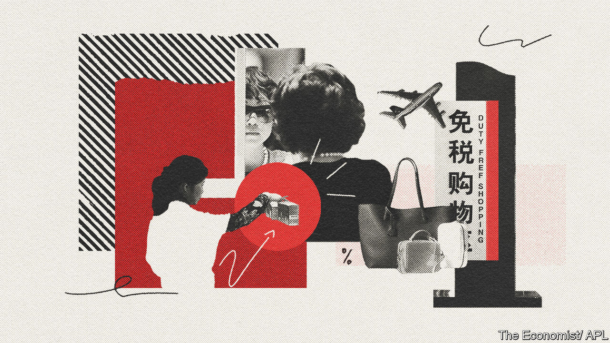
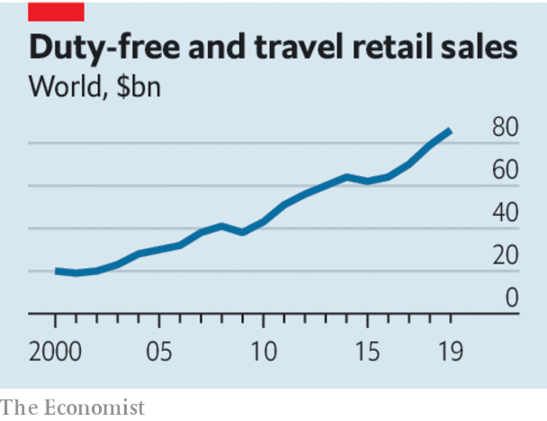

###### The shopping-industrial complex

# Time to end duty-free 

##### It hands most benefits to the well-heeled who frequently travel abroad 

 

> Feb 27th 2021 


IN “L’ENFER”, a recent novel by the French philosopher Gaspard Koenig, a university professor dies only to discover that hell is an eternity spent traipsing around airport duty-free shops. Others seem to enjoy the experience rather more. Travel retail has grown into a mastodon, with annual sales of $86bn before the pandemic hit. It is busy adapting by expanding beyond the airport terminal, notably in China (see ). As it does, its tax privileges are becoming ever more indefensible.


The premise underpinning duty-free is that the mere act of crossing an international border should exempt travellers from some taxes that non-travellers are subject to. This was a questionable wheeze even when European airports lobbied for it in the 1950s. Now it is untenable. Modern tax codes typically seek to dampen inequality, but duty-free shopping hands most benefits to the well-heeled who frequently travel abroad. Taxes could usefully nudge people to be greener. Duty rebates overwhelmingly fall into the pockets of people who fly and pollute. One goal of excise tariffs is to curb the harmful use of tobacco and alcohol, but airport shopping is explicitly designed to circumvent them. As duty-free shopping has ballooned, what was once a wrinkle has swelled into a tax-avoidance scheme for jet-setters.


Duty-free’s boosters argue that the income from shops is essential to sustain airports, which might otherwise need more taxpayer funding. Retail income, not all of which is exempt of duties, is indeed their biggest source of cash after fees paid by airlines. The figure is inflated by the astronomical rents that airports can charge retailers, skimming off up to 40% of their sales. But it is a textbook case of allowing an exorbitant privilege to generate unjustified profits which are then shared around opaquely. If airports need state help, especially after the pandemic, it should be paid transparently, not through tax dodges that distort economic incentives.

 


The pandemic will probably push the duty-free industry into even more dubious territory. Its business model is evolving as it seeks to cash in on its special status. You can increasingly buy duty-free goods online well ahead of a trip, then pick them up the next time you happen to be flying, with tax conveniently avoided. Once confined to airports, the principle that some people do not need to pay value-added taxes has spread in many places to tourist shops downtown. Shoppers often sidestep taxes on clothing, home electronics and smartphones, as well as bottles of oak-aged cognac and choice Cohiba cigars.


That is unfair to other retailers and to the non-travelling public. It is why Britain has eliminated most duty-free advantages and tax rebates for foreigners who shop there. Doom-ridden industry predictions about imploding business models and a collapse in retail revenues are reminiscent of the shrill warnings when EU countries ended duty-free shopping for those travelling within the single market in 1999. In fact, there was not a collapse in European cross-border travel—which has thrived.


Closing the duty-free loophole does not mean airports will stop behaving like shopping centres with departure gates tacked on. Weary flyers will still be condemned to pick their way through a maze of perfume spritzers as they emerge from security checks. Airports will continue to announce flight-departure gates ever later in order to encourage passengers to linger in the shops even longer. Bored travellers with hours to kill hardly need the incentive of a tax backhander to top up on chocolate or buy those noise-cancelling headphones. It is past time to call time on duty-free. ■

