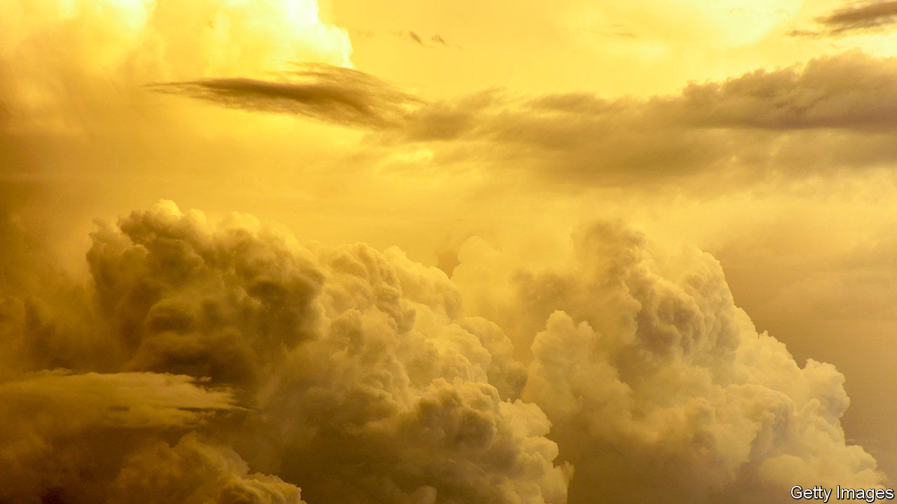

###### Floating a trial balloon

# Dusting the upper atmosphere could help counter climate change 

##### An experiment to test the idea could soon start in Sweden 

 

> Feb 27th 2021 


IF ALL GOES well, a balloon will soon rise from Esrange Space Center in Kiruna, Sweden. It will drift high into the upper atmosphere, where nothing will happen. The balloon will then return to Earth. Nevertheless, a collection of environmental groups—including the Swedish branches of Greenpeace and Friends of the Earth, and the Centre for International Environmental Law—is trying to stop it.


The campaigners are against the flight because of what comes next. The balloon is a test flight for something called the Stratospheric Controlled Perturbation Experiment, or SCoPEX, which is being run by the University of Harvard. The idea is that a future flight will release a small amount of calcium carbonate dust into the stratosphere, in order to help researchers learn more about solar geoengineering.


Geoengineering is the grand (and still mostly hypothetical) idea of deliberately fiddling with the Earth’s systems to try to counter climate change. SCoPEx plans to test an idea called stratospheric aerosol injection (SAI), in which fine dust is injected into the upper atmosphere to boost the amount of sunlight reflected back into space. In the coming days, an advisory committee, also based at Harvard, will decide whether the initial flight can go ahead.


Opponents worry about two things. The first is known as moral hazard. If solar geoengineering works, it could reduce pressure to deal with climate change at its source by cutting greenhouse-gas emissions. The second concerns something called “termination shock”. In order to keep temperatures low, the reflective particles would have to be topped up indefinitely. A sudden stop could result in very rapid warming. Raymond Pierrehumbert, a physicist at the University of Oxford, says solar geoengineering is too risky even to research outside of computer simulations.


Not all environmentalists are opposed. The world is likely to miss the target, set in the Paris agreement, of keeping warming to 1.5°C. “We’re not well-served by not understanding what these technologies represent,” says Steven Hamburg of the Environmental Defence Fund, an American organisation. Mr Hamburg favours small-scale geoengineering research. Other green organisations, including the Natural Resources Defence Council, have also tentatively endorsed exploring the idea.


Exploration is likely to carry on in any case. Once a taboo, geoengineering is being taken increasingly seriously. A recent report of the Intergovernmental Panel on Climate Change suggested that SAI could help keep warming below 1.5°C. The National Academy of Sciences, Engineering and Medicine in America has developed a research plan for solar geoengineering; that country’s government flagged $9m for research into the subject this year. Both China and India have launched research programmes of their own. Activists will continue to oppose experiments. But balloons will likely fly anyway. ■

