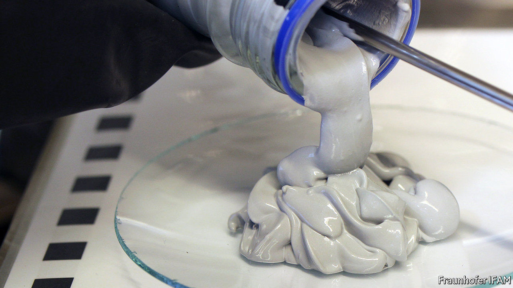

###### Toothpaste in your tank

# Hydrogen goop could be a more convenient fuel than hydrogen gas 

##### At least, the Fraunhofer Institute hopes so 

 

> Feb 27th 2021 


ON PAPER, HYDROGEN looks like a dream fuel. Coal, oil and natural gas generate planet-warming carbon dioxide when burned. Hydrogen produces pure water. Hydrogen crams more energy into less space than batteries do (though, admittedly, less than petrol or diesel do). And an empty tank can be refilled with hydrogen much faster than an empty battery can be refilled with electricity.


In practice, things are trickier. Storing meaningful quantities of hydrogen gas requires compressing it several hundred-fold. Liquefying it is another option, but one that requires cooling the stuff to -253°C. Either process requires rugged tanks. Over time, hydrogen gas can infiltrate metals, weakening them and potentially causing cracks. Tanks must be built from special materials designed to resist this breakdown.


There may be a better way. Researchers at the Fraunhofer Institute for Manufacturing Technology and Advanced Materials in Germany, led by Marcus Vogt, think that supplying hydrogen as goop rather than gas offers a way around some of its limitations. They have been experimenting with a chemical compound that can be pumped into a cartridge and then persuaded to give up its hydrogen on demand.


Their invention, which they dub “Powerpaste”, bears a passing resemblance to toothpaste. Its main ingredient is magnesium hydride, a compound that, when introduced to water, reacts with it to form hydrogen and magnesium hydroxide (a substance more familiar as milk of magnesia, a stomach-settling antacid). The escaped hydrogen can then be diverted into a fuel cell, where it reacts with oxygen from the air to generate electric power. The magnesium hydroxide waste is emptied from the reactor automatically.


Dr Vogt’s scheme offers several advantages over batteries, petrol and more conventional ways of handling hydrogen. One is the storage of more energy per litre, and per kilogram, than either batteries or petrol can manage. A second is ease of refilling, which is simply a matter of swapping an empty cartridge of paste for a full one, and topping up the water, which is stored in a separate tank. A third advantage is that, unlike a battery, the paste does not gradually lose its stored energy if it is left on the shelf.


Moreover, the paste itself is non-toxic, as are the reaction’s by-products. But there are plenty of subtleties to work through. Left to its own devices, magnesium hydroxide reacts only slowly with water because the reaction forms a barrier on the material’s surface that inhibits further chemistry. To overcome this, Dr Vogt and his team have found a chemical additive that greatly accelerates the reaction. They have also found a way to ensure that the reaction can be controlled precisely enough to supply only as much hydrogen as is needed at any given moment.


The paste is unlikely to up-end the clean-car industry, where battery-powered vehicles have already established themselves as the dominant technology. But Dr Vogt nonetheless hopes that his invention may find niches. One early use could be in small vehicles such as scooters, or in flying drones where weight is at a premium. It is hard to scale down the sorts of heavy-duty tanks needed to store elemental hydrogen, he says. Powerpaste could thus enable longer ranges for scooters, and flight times for drones measured in hours rather than minutes. Miniature stoves aimed at campers are another idea.


A pilot plant in Brunswick, a city in Lower Saxony, will be able to produce four tonnes of the stuff per year when it is finished later this year. And heavier-duty uses are certainly possible, if that is what customers would like. Dr Vogt has already built a small demonstration unit for the German army. ■

