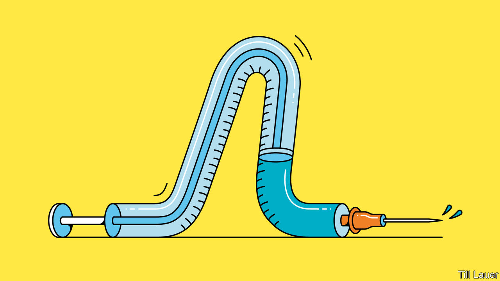

###### Banyan

# Countries that curbed covid-19 fast have been slow to vaccinate 

##### That means a return to travel as normal is a distant prospect 

 

> Mar 4th 2021 


AUSTRALIANS ARE proud of their country’s impressive if stringent handling of the coronavirus pandemic: just over 900 deaths to date out of a population of 25m, with a mere eight or so new cases each day. That achievement is one reason why the scene after the men’s final at the Australian Open tennis tournament late last month shocked so many. In her comments at the presentation of the trophy, before both local spectators and a global television audience, Australia’s tennis chief suggested it was a time for “optimism and hope”, with vaccinations “rolling out in many countries in the world”. Australia’s programme was to begin the following day. Yet instead of cheers, her remarks were drowned out by the boos of anti-vaxxers in the crowd.


The deputy prime minister, Michael McCormack, called the behaviour “disgusting” and sought to portray the jeerers as party-poopers. His boss, Scott Morrison, was injected before the cameras with one of the 60,000 shots in the country’s first shipment of vaccines. Most of the rest are for front-line health and quarantine workers. The government promises swift progress, after an admittedly slow start.


Yet reluctance to receive vaccines is an issue. Anti-vaxxers have marched in Melbourne and Sydney. In many countries, vaccine acceptance has risen sharply along with the prospects of getting a jab. But a study by Imperial College London of global attitudes towards covid-19 vaccines found that Australia was one of four out of 15 rich countries in the Americas, Asia and Europe where vaccine acceptance fell between November and January. Strikingly, the other three are also in Asia: Japan, Singapore and South Korea. They too have impressive records handling the pandemic, with just 7,984, 1,612 and 29 deaths respectively. These countries’ relatively slow roll-out of vaccines compared with Britain and America, let alone Israel, may soon turn them from laurel-winners to laggards in the fight against covid-19.


Misinformation, conspiracy theories and distrust of Chinese vaccines have contributed to the hesitancy. But so too, argues Tikki Pangestu of the National University of Singapore, has an awareness that new and seemingly improved vaccines keep appearing. Singaporeans of a certain age say that, given the virus’s ongoing mutations and the possibility that antibodies may not work for ever, they would rather hold off until they really need a jab—and then get the very latest and best. Others worry about possible side-effects. In South Korea half of those polled say they would rather see what happens elsewhere before receiving a vaccine. With cases low and normal life resuming, the risks of delay strike many in Singapore and South Korea as negligible.


This foot-dragging is mirrored by governments. South Korea pinned early hopes on home-grown vaccines, putting in orders for foreign-made ones only in November. In Japan the government has a rocky history of lawsuits over possible side-effects from measles and mumps shots. It does not want to look as if it is rushing things. In fact, rather absurdly, it has demanded extra clinical trials of covid-19 vaccines on Japanese people specifically as a condition of approval. The vaccination of health-care workers began only last month. The elderly will not get jabs before April. Most of the rest of the population will not start being vaccinated until midsummer. That hardly improves the chances of holding a normal Olympics in Tokyo in July.


Shortages of supply, largely beyond governments’ control, will also cause delays. Singapore’s prime minister, Lee Hsien Loong, warns that there will not be enough vaccines for everyone until the third quarter of the year. It may take until the end of the year to complete the vaccination programme.


Whatever the cause of the sluggish roll-out, it is of greater concern than might at first be obvious considering that the countries concerned have such low infection rates. In contrast to Europe and North America, success in curbing covid-19 means they have virtually no herd immunity. Moreover, Asian governments’ rapid travel bans suggest a high aversion to risk. That is unlikely to change. Even a mooted travel “bubble” between Singapore and Hong Kong is on hold. Dr Pangestu predicts that Singapore, for one, will remain “obsessive” about not quickly reopening its borders, even for inbound travellers with covid-19 “passports”. They are no guarantee that you are not infectious, after all. If Banyan had to bet on when Asian travel will resume, it will not be this year.

