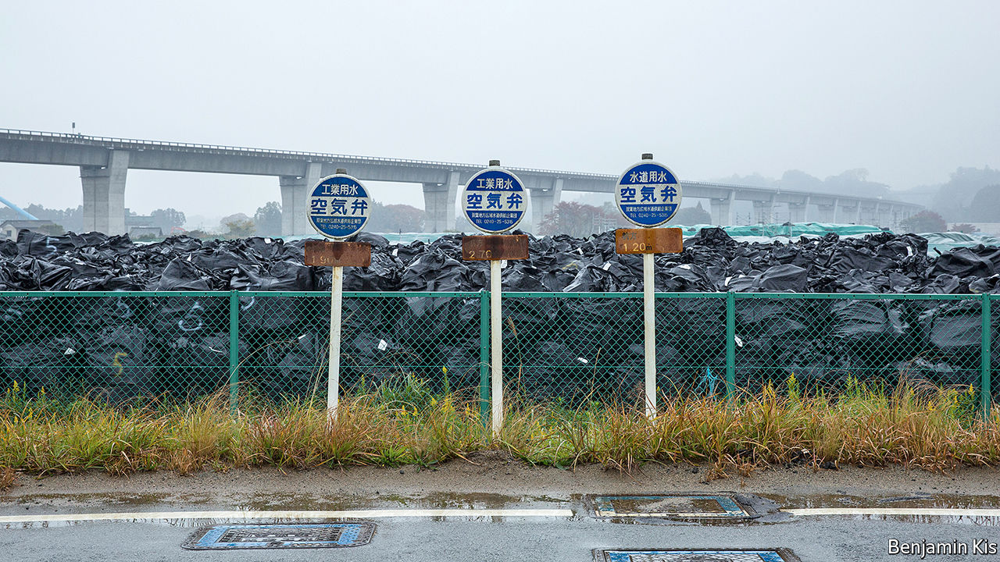
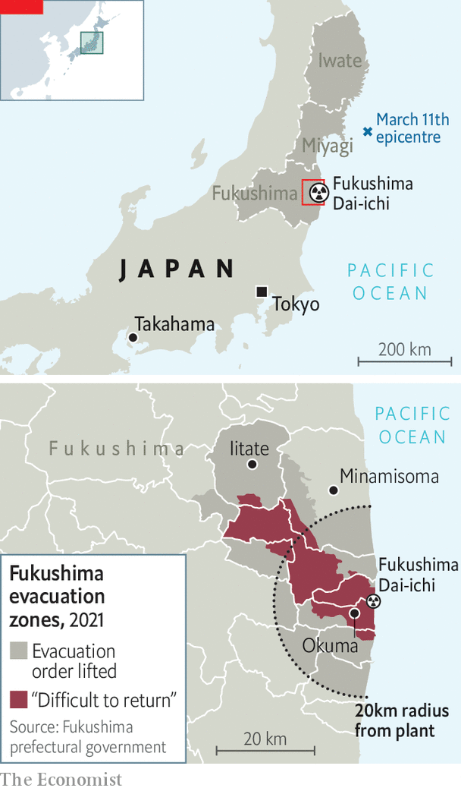
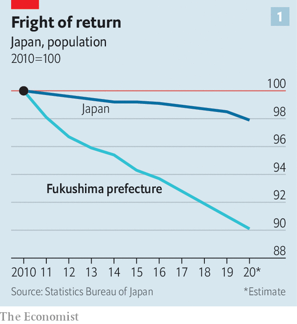
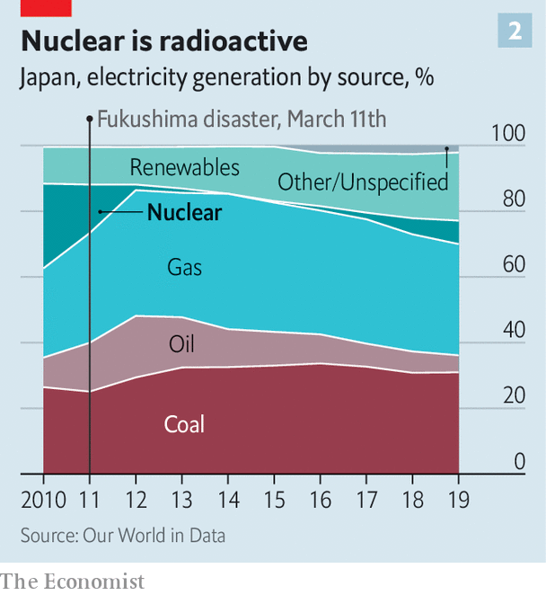

###### Nuclear decay

# The Fukushima disaster was not the turning point many had hoped 

##### Instead of spurring reform, the nuclear accident bred disillusionment 

 

> Mar 6th 2021 


IN THE HILLY village of Iitate, in Fukushima prefecture, stands a new community centre built with parts pulled from abandoned buildings. Windows from one, doors from another. A chalkboard from a beloved school with no children to attend it. One cloudy day last autumn, a crowd gathered to celebrate its opening. As an elderly woman in a green kimono sang folk tunes, her voice riding a beat or two behind the music, the audience, a mix of locals and Tokyo-ites involved in the centre’s design, feasted on chestnut-filled rice balls.


Iitate is a farming district once known for its fine beef and dried radish. In 2010 it qualified for membership of a club called “Most beautiful villages of Japan”. Yet its recent history has been far from bucolic. Some 35km to the south-east, across the verdant Abukuma mountains, stands the Fukushima Dai-ichi nuclear plant. Opened in 1971, it was one of dozens built around Japan to power the post-war economy. The government offered municipalities generous subsidies for hosting the plants, and promised people that they posed no risks. By 2011 Japan had 54 working reactors, providing a third of the country’s electricity.


At 2:46pm on March 11th of that year, an earthquake shook Japan’s north-eastern coast. The quake triggered a tsunami, sending waves as high as 40 metres crashing along 500km of coastline. Homes and roads were obliterated. Though the plant withstood the waves, its back-up generators were flooded, halting the essential flow of cooling water around its six reactors. Within days, three of them had melted down, spreading radiation across the region and panic around the world.


Thousands fled their homes. A few of them went first to Iitate, but the wind carried radioactive particles in its direction. Eventually the authorities ordered the evacuation of Iitate, too. Residents were allowed to return six years later, but only 1,500 have done so—a fraction of the 6,200 who called it home before the disaster. “The radiation effects are not visible, but I hope you can see how deeply it is felt,” says Tao Yoichi of Resurrection of Fukushima, the NGO that organised the construction of the community centre.


The earthquake literally reshaped the country: Japan’s biggest island moved 2.4 metres to the east. At the time, a similarly seismic shift in Japanese society was predicted. Politicians painted efforts to rehabilitate Fukushima as an emblem of a broader revival after a period of economic stagnation and demographic decline. Commentators spoke of 3/11, as the disaster came to be known, as a historical turning point, a shared experience that would shape a generation, a shock that would reinvigorate sclerotic institutions and open closed minds. Japan’s “post-war” period had given way to a new, “post-disaster” era, went one popular coinage. Kurokawa Kiyoshi, chairman of the parliamentary committee that investigated the disaster, spoke of 3/11 as a possible “third opening”, akin to the abolition of the shogunate in 1868 and Japan’s defeat in the second world war.


Ten years after 3/11, the third opening has yet to materialise. “I expected that Japan would finally start to change and I pinned hope on that prospect—but I’m afraid I was proven to be wrong,” says Funabashi Yoichi, chairman of an independent investigation into the accident. “The first instinct was just to restore, not to reform.” Mr Kurokawa agrees: “No, the crisis did not change Japan”.


It was, perhaps, too much to expect a revolution. The 3/11 disaster revealed internal failings, mostly of an intractable, structural sort, but also resilience. And though it battered Japan, it did not amount to complete defeat, as in the second world war. By chance, it occurred during only the second brief period in Japan’s post-war history when the Liberal Democratic Party (LDP) was not in power. The association of the Democratic Party of Japan (DPJ), in office from 2009 to 2012, with the disaster helped to discredit the idea of reform and political alternation. “Nuclear policy was implemented for many years by the LDP, but the DPJ had to take responsibility [for the disaster],” says Nakabayashi Mieko, a former MP with the DPJ. “Afterwards, people thought that while democracy in Japan was important, stability should have priority.”


“There’s been some change, but nothing at the pace commensurate with the promise,” argues Richard Samuels, author of “3.11: Disaster and Change in Japan”. A new regulator brought stricter oversight to the nuclear industry. But the LDP remains wedded to nuclear power despite public scepticism. Disaster preparedness has improved. But the same flaws that handicapped the response to the disaster—weak central authority, lack of co-ordination among ministries, poor communication, bureaucratic inflexibility—persist. And the political impetus for reform has dissipated, as the LDP has regained power, the DPJ has disintegrated and apathy has set in.


Miyagi and Iwate, the two other prefectures that suffered most from the earthquake and tsunami, have largely recovered. Fukushima itself has struggled. A small area is still uninhabitable. Kowata Masumi’s husband’s family had lived for more than 200 years in the same house in Okuma, one of the two towns next to the plant, growing persimmons, weaving silk and brewing sake. It is now in the “difficult-to-return” zone (see map), subject to 50 times more radiation than is typically considered safe. Former residents are allowed to make short visits in protective gear, but not to stay overnight. Ms Kowata, one of Okuma’s town councillors, found a monkey in her living room on one such trip, “wearing our clothes like the king of the house”.

 


For the most part, however, the problem is no longer contamination. Only 2.4% of the land area of the prefecture remains off-limits to residents. Only 36,811 people, or 2.1% of the population, are still unable to return home. Just one worker has died from direct radiation exposure. Cancer rates in the region have not spiked. Ambient radiation in most of the prefecture is comparable with other cities in Japan and around the world. The health risks are much less acute than what was feared in the disaster’s aftermath. 


In retrospect, it was the chaotic evacuation that probably harmed public health most. In Fukushima prefecture 2,317 people died as a result of it, mostly because of disruption to medical care or suicide. That is more than the 1,606 who perished during the earthquake, tsunami and nuclear meltdown themselves. Some researchers argue the government should not have ordered a large-scale evacuation at all, or should have limited it to weeks rather than years.


Yet it would have been hard to tell a fearful population, faced with the invisible threat of radiation, to stay put or return quickly. The meltdown destroyed confidence in experts. The lack of candour from officials in the early weeks and months after the disaster sapped trust in the authorities, pushing citizens to fill the gaps themselves. “There were so many things that weren’t convincing, so we decided to get our own data,” says Kobayashi Tomoko, an inn-owner and radiation monitor from Minamisoma, a city north of the plant. Even when the government lifted evacuation orders years later, putting an end to compensation payments for residents of those areas, some protested against what they saw as a ploy to force people to return under unsafe conditions. “Sensitivity to radioactivity depends on mindset, it’s difficult to treat as matter of policy,” says Iio Jun of the Reconstruction Design Council, a government advisory panel set up after the disaster. “There are more emotional elements.”


In the past decade the government’s efforts at reconstruction have focused on infrastructure and decontaminating land. Official presentations teem with graphics showing rebuilt roads and railways. Fully 96% of the planned public works have been completed. Millions of tonnes of waste from the disaster have been removed, including millions of cubic metres of radioactive topsoil. Recovery, by these measures, is progressing well. The Olympic Games (originally scheduled for 2020, but delayed until this summer owing to covid-19) are meant to be the culmination of the area’s rehabilitation. The government has promoted them as the “Recovery Olympics” and plans to begin the torch relay in Fukushima at a stadium that became a base for disaster relief in 2011. The flame will pass through Okuma, Iitate and Minamisoma on its way to Tokyo.


Yet the emphasis on physical reconstruction misses the point. “People’s hearts and spirits are not only not recovering, they’re being lost even more,” laments Sakurai Katsunobu, who was mayor of Minamisoma during 3/11. Rates of depression and anxiety among residents of Fukushima are more than double the national average. Diseases such as diabetes and hypertension have become more common, presumably because of continuing anxiety and disruption. Families have been separated, livelihoods lost. “Real recovery is not about making buildings, not about physical things,” says Ms Kowata.


“Who is this infrastructure actually being built for?” asks Mr Sakurai. Many of those ordered to evacuate in the aftermath of the disaster, as well as others who fled the region of their own accord, have stayed away. In the areas where evacuation was ordered, only a quarter or so of the population has returned, mostly the elderly. As elsewhere in rural Japan, the prefecture’s population had been falling anyway, dipping by an average of 100,000 people in the nine years preceding the disaster. But 3/11 has accelerated the decline: in the nine years since, the population has fallen by an average of 180,000 a year (see chart 1).

 


Rebuilding communities has proved far trickier than repaving roads. “Ten years is just the starting point,” says Mr Tao of Resurrection of Fukushima. “Only now are villages beginning to be able to think about the future.” Many have shifted from trying to get former residents to return towards attracting new arrivals. There have been successes. Near the community centre in Iitate, a group of young artists has converted a former school into studios. In Minamisoma, Wada Tomoyuki, an entrepreneur, runs a co-working space and small-business incubator where most of his partners are newcomers who wanted to escape office-bound city life.


Yet progress is slow. Mr Wada launched Odaka Worker’s Base in 2014, hoping to assist 100 new businesses to help tackle local problems; so far, 15 have set up shop. The government touts a higher-tech future along the Fukushima “innovation coast”, a cluster of research and development centres. But most are engaged in projects connected to disaster relief or the nuclear plant’s decommissioning.


The decommissioning itself “casts a heavy, dark shadow over the future”, says Uchibori Masao, Fukushima’s governor. The removal of 900 tonnes of melted fuel from the three reactors that failed—the most radioactive part of the wreckage—has yet to begin. TEPCO, the utility that owns the plant, thinks it will take 30-40 years, but even that may be optimistic. Last year, the Nuclear Regulation Authority (NRA), the new regulator set up after the accident, reported higher than expected levels of radiation on the temporary caps placed over two of the reactors. Such findings complicate plans for decommissioning. The fate of the decontaminated soil, which has been piled in black bags around the region, remains unresolved too. This year the bags are being taken to “interim storage facilities” in the “difficult to return” zone, meaning dumps in uninhabitable areas. By law, the soil must be sent outside the prefecture by 2045, but the government has yet to work out where to take it.


The most pressing problem is the contaminated water that has seeped into the plant or has been used to cool spent fuel. There is already more than 1m tonnes of it, and storage space will run out next year. TEPCO filters it to remove all radioactive particles bar one isotope, tritium. The government wants to tip the filtered water into the ocean—standard practice at nuclear plants around the world. Yet fishermen and farmers fear this will make people loth to buy their wares. Activists worry that the tanks hold nasty surprises. After years of insisting the water contained only tritium, TEPCO revealed in 2018 that it would have to re-filter most of it, since it had not been treated properly and was more dangerous than had been admitted.


Such episodes have fed mistrust of the government’s assurances about public health in Fukushima. The screening of food from the prefecture is thorough and safety standards are high. The Fukushima Agricultural Technology Centre, a government body, tests 100-200 samples a day. Workers in rubber gloves chop up peaches, mushrooms and rice and feed them into devices that detect radiation. The last elevated result was six years ago. Independent monitors also judge local food to be safe. Yet products from Fukushima are still generally cheaper than those from elsewhere.


The enduring mistrust extends to nuclear power in general. Before 3/11 more than two-thirds of Japanese wanted to preserve or even expand it. The government wanted nuclear plants to generate half of Japan’s power by the middle of the century. A majority is now against it, including bigwigs such as Koizumi Junichiro, a former prime minister from the LDP, and Kan Naoto, who was prime minister at the time of the disaster. “I had supposed Japanese engineers were very high quality. I thought it was unlikely that human error could cause an accident in Japan,” says Mr Kan. “My thinking changed 180 degrees.”


The current government has not, however, given up on nuclear power. Abe Shinzo, prime minister from 2012 to 2020, was keen on it, but during his tenure, since most reactors were mothballed for stricter safety inspections, Japan grew notably more dependent on fossil fuels (see chart 2). To this day only nine of Japan’s 54 reactors have been allowed to restart. They provided just 6% of the country’s electricity last year. Nearly half of the rest are to be shut down; the others are in various forms of administrative limbo.

 


The current prime minister, Suga Yoshihide, has promised to make Japan carbon neutral by 2050. So he wants to build more wind farms and solar plants—but also to restart more of the idled nuclear reactors. “Zero carbon by 2050 means we need nuclear,” argues Toyoda Masakazu, who chairs the Institute of Energy Economics, a think-tank in Tokyo. Some towns are eager to go nuclear again. “After five or six years, people started thinking about how much risk we can bear in terms of economic growth,” says Nose Yutaka, mayor of Takahama, which recently became the first town to approve the restart of a nuclear plant that is more than 40 years old, the standard regulatory lifetime in Japan.


The nuclear industry insists it has learned the lessons of 3/11. TEPCO says that the expectation of perfection, which stifled the reporting of problems, has been swept away. It and other power companies have poured billions of dollars into new seawalls, filter systems and other safety features. Local governments have drawn up proper evacuation plans. “Before Fukushima, it was assumed that if government officials are creating plans, accidents are bound to happen, so no one made plans,” Mr Nose says. “Now we have one.” The existence of risk is not a reason to abandon a technology, argues TEPCO’s Anegawa Takefumi: “In ancient times, Prometheus gave us fire, and many people die from fires, but we accept that.”


Anti-nuclear activists hold that the risks of using nuclear power in Japan, one of the world’s most seismically active countries, are prohibitive. “Using technology that has potential to destroy your society is insane—that’s the risk we’re talking about,” says Shaun Burnie of Greenpeace, a pressure group. The sudden promotion of nuclear power as climate-friendly strikes many in Fukushima as cynical. “We shouldn’t have to choose between climate disaster and nuclear disaster,” says Muto Ruiko, a local anti-nuclear campaigner.


There is plenty of scope, anti-nuclear campaigners point out, to generate more renewable energy. After 3/11 the government introduced incentives for renewables and liberalised the electricity market. Though renewables now provide more than 20% of Japan’s power, their share would be higher still, argues Iida Tetsunari of the Institute for Sustainable Energy Policies, if the regional retail monopolies’ grip on the grid was loosened further and connections between regions expanded. He says a reform that came into force last year, obliging the big utilities to manage generation and transmission as separate units, has had little effect. “Local utilities people still use the same name-card, the same email address,” says Mr Iida. “The grid must become more independent.”


Plans released late last year foresee 50-60% of generation coming from renewables in 2050, with nuclear or fossil-fuel plants with carbon-capture technology providing the remainder. A clearer picture is expected this summer, when the Ministry of Economy, Trade and Industry releases a new triennial strategy for power generation. The minister, Kajiyama Hiroshi, has expressed support for more nuclear power. Even those who favour a renewable-powered Japan in the long term may accept a handful of restarts now, if that means closing coal-fired plants more quickly. Getting new reactors built would be much trickier, however, seeing that most Japanese people are against nuclear power.


In either case, oversight will fall to the NRA, which was set up specifically to prevent the sort of chumminess with utilities that allowed the failings at Fukushima Dai-ichi to go undetected or uncorrected. Fuketa Toyoshi, the NRA’s chairman, is careful not to get embroiled in politics: “We believe we have to be independent of discussions in energy policy.”


Unfortunately for the NRA and for policymakers, one seismic change that has endured since 3/11 is a loss of faith in institutions in general. A yearly survey by Edelman, a public-relations firm, found that the share of Japanese expressing trust in their government plunged from 51% before the disaster to 25% after. It now stands at 37%. “This is the key problem: the loss of trust,” says Azby Brown of Safecast, an NGO in Tokyo that spearheaded independent efforts to monitor radiation after the disaster. “Trust is not a renewable resource. Once you lose it, that’s it.” ■


Dig deeper


 (Mar 2021)

