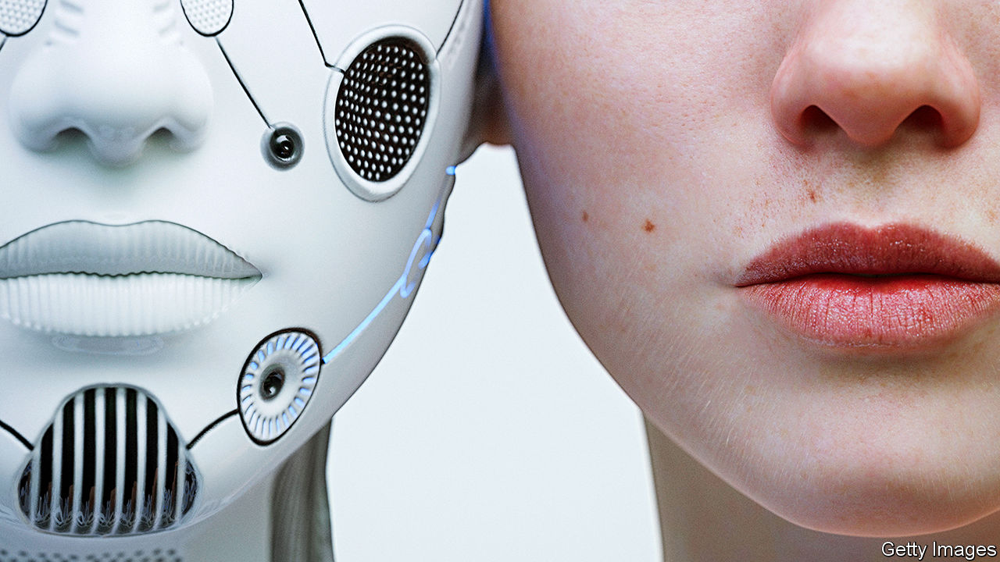

###### More than human

# Kazuo Ishiguro’s rich meditation on love and morality 

##### “Klara and the Sun” is his first novel since winning the Nobel prize 

 

> Mar 6th 2021 


Klara and the Sun. By Kazuo Ishiguro. Knopf; 320 pages; $28. Faber £20


IN “THE BURIED GIANT”, published in 2015, an elderly couple make a perilous journey through a war-ravaged post-Arthurian Britain, a land mysteriously afflicted by widespread amnesia. Sir Kazuo Ishiguro’s slippery allegory about the aftermath of conflict, and the value of forgetting as well as remembering, confounded some critics. It was seen as a puzzling left-turn into fantasy—a tag the author rejected, prompting accusations that not only had he raided a downmarket genre, he had done so ungraciously.


These arguments fell away when Sir Kazuo, now 66, won the Nobel prize for literature in 2017 (he was knighted two years later). But they may resurface now that he has turned to science fiction—or rather turned back to it, following his boarding-school dystopia “Never Let Me Go” (2005), which contemplated human cloning. Set in an overheated, rigidly stratified America, “Klara and the Sun”, his first post-Nobel novel, is a coming-of-age tale in which sophisticated solar-powered androids—entirely human in appearance and known as AFs, or Artificial Friends—are purchased by wealthy parents as company for their offspring. These children are taught remotely via smartphones and are genetically modified, or “lifted”, in a potentially fatal procedure intended to guarantee future entry into an elite university.


One of the book’s pleasures is that it trusts the reader to infer such details. What makes the subtly sinister setting doubly strange is that it is refracted through the partial understanding of the narrator, an especially sensitive AF named Klara, who recounts her bittersweet experience serving a mysteriously ill teenager, Josie. In a distinctly unrobotic bout of magical thinking, she begs the sun—the source of her energy—to cure Josie, vowing in return to combat air pollution. Keeping her bargain requires a furtive and quixotic quest and help from Josie’s loyal friend, Rick. Unlike Josie, Rick has not been “lifted”, one of many points of slow-burn conflict.


Sir Kazuo’s characteristically unassuming style draws the reader into a richly layered plot. His speculative scenario of technological innovation is also a domestic satire on aspirational parenting. Philosophical questions of faith and mortality mix with storylines involving boy trouble and mother-daughter strife. Josie’s sickness is a metaphor for the pressures of a hot-housed adolescence, yet the story holds attention on its own terms, too.


The effect ultimately resembles a cross between “Never Let Me Go” and “The Remains of the Day” (1989), with Klara in the place of Stevens, the butler whose first-person narration provided a between-the-lines portrait of morality among the English upper crust in the interwar years. As a rebuke to the hyper-engineered society that created her, Klara’s paradoxically humane conduct lends the book a melancholy beauty. Her devotion to a form of true love may be artificial, but, tragically, it is more than her flesh-and-blood counterparts can offer one another. ■

