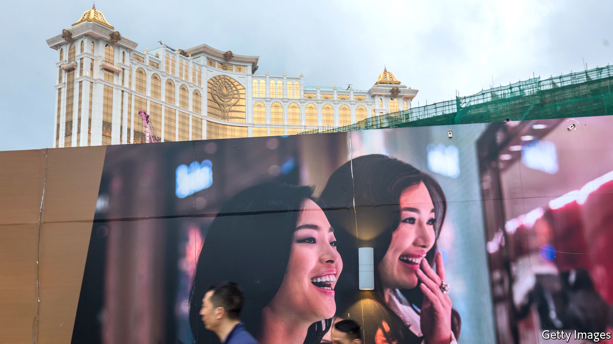
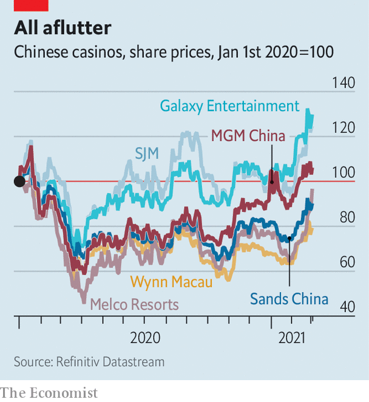

###### All aflutter

# Are Galaxy Entertainment and MGM China a winning bet? 

##### Investors think so, the casinos’ heavy pandemic losses notwithstanding 

 

> Mar 4th 2021 


WHICH ECONOMY contracted most sharply last year? That dubious honour almost certainly belongs to Macau, a former Portuguese colony that is now part of China. On March 5th the autonomous region’s statistical agency is expected to announce that GDP fell by at least half from 2019. Unsurprising, perhaps, given that the covid-19 pandemic has dealt a blow to Macau’s sole engine of growth: casinos. Gross gaming revenue in Macau, the only place in China where casinos are legal, plummeted from $36bn in 2019 to $7.5bn last year. The first two months of 2021 brought little respite.


Yet despite collapsing revenues and heavy pre-tax losses, share prices of Macau’s six casino operators have held up remarkably well (see chart). Three of them are worth more than they were before the pandemic. Recently, after reporting that annual revenues had fallen by three-quarters, the biggest, Galaxy Entertainment, saw its market value swell to $42bn. Investors also reacted with a collective shrug when MGM China, a listed subsidiary of Las Vegas-based MGM Resorts International, disclosed a similar drop in its top line.


Why are investors feeling lucky? First, Macau expects a speedy recovery in visitors from mainland China, who account for seven in ten non-Macanese punters. For much of 2020 virus-induced travel restrictions stemmed their flow. Last month Macau exempted all mainland visitors from quarantine. Today the casino hub is the only jurisdiction with which the mainland has a two-way travel bubble.

 


The second reason for thinking the odds of recovery are good relates to a new directive from the central government in Beijing. Last summer it created a “blacklist” of overseas gambling destinations that were “endangering the personal safety and property of Chinese citizens”. A second blacklist of prohibited destinations was added in January. Neither list has been made public—perhaps because the government concluded that international leisure travel is still impractical and thus did not feel compelled to say more. But most gambling-industry watchers assume that Macau has been spared. Indeed, some believe that the blacklist may have been drawn up specifically to shelter the city. Either way, one long-term effect could be the repatriation of the demand for gaming.


Macau may need to overcome a countervailing force. A new law that took effect in mainland China on March 1st prohibits any individual or group from “organising Chinese citizens” to partake in overseas gambling, on pain of imprisonment. Unlike the blacklist, this regulation appears to apply to all jurisdictions outside the mainland, including Macau. Casinos there often rely on agents in mainland China to organise such jamborees. They will now be forced to keep a lower profile. Still, investors appear to be betting that enough individual Chinese like a flutter. They greeted the new law with another shrug. ■

