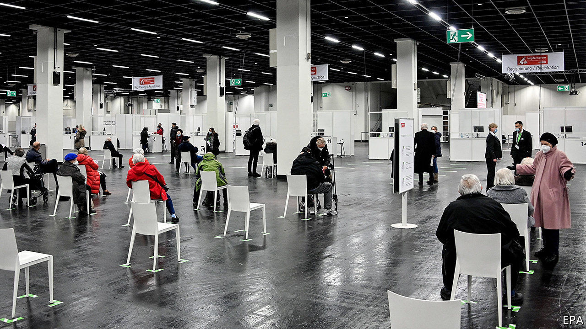

###### DAX vaxxers

# Companies take charge of Germany’s vaccination drive 

##### A sluggish public vaccination campaign spurs Deutschland AG into action 

 

> Mar 6th 2021 


GERMANS ARE used to being top of the class. Early in the pandemic, when Germany controlled its outbreak better than most of the West, they felt they were. In vaccinating citizens against covid-19, by contrast, the country has been a laggard. One in 20 has received a shot, compared with nearly a third of Britons, a sixth of Americans and, as Die Welt, a daily, recently grumbled, even a tenth of Moroccans.


German bosses are losing patience. Many workers at the industrial firms that dominate corporate Germany are vulnerable to covid-19 because factory or construction jobs cannot be done from home. Nearly all companies in the DAX 30 blue-chip stockmarket index, as well as countless CEOs of smaller firms, are therefore preparing to launch their own immunisation drives. They include BASF and Bayer (in chemicals), BMW and Volkswagen (carmaking), Deutsche Wohnen and Vonovia (property development) and RWE (energy).


The vaccines will come from the government, which has the doses but apparently not the capacity to get them quickly into arms. Firms are buying ultra-cold freezers for shots that need such storage. The jabs will be administered by company doctors. Germany has between 15,000 and 20,000 of them (not counting nurses), many more than other European Union countries, America or Britain. About one-third of them are employed directly by firms and the rest run practices that serve employers in their area.


Anette Wahl-Wachendorf of VDBW, an association of company doctors, hopes that from April such medics will be able to dispense jabs alongside family physicians and 400-odd public vaccination centres. They may reach perhaps 45m employees and their relatives, she reckons. That is more than half of all Germans.


“As soon as we get the vaccine, we will get started,” promises Rolf Buch, boss of Vonovia. His firm has already set up centres that will, starting this month, test employees who wish to return to the office for the virus. These venues will be used to vaccinate its 10,000 employees and adult members of their immediate families, in keeping with official guidelines on who gets priority.


German labour law allows companies to give bonuses to workers who get vaccinated for any illness (though not at this time to make vaccination mandatory). Such carrots are common in America, where Aldi and Lidl, two big German supermarkets, are offering workers payments of up to $200 to roll up their sleeves. Neither grocer, nor any other big German firm, is currently planning to use such incentives at home, for fear of the controversy this might cause (see ). Still, Mr Buch expects the vast majority of his staff to accept the offer of free shots. Those who decline may be barred from office parties and other group activities.


Once Mr Buch is done with Vonovia employees and their families, he is willing to turn the company’s centres over to the general vaccination effort. Other bosses are starting with the broader population. In early December, before the first vaccines were approved for use in the EU, business folk in Bremen, a city in north-west Germany, launched a campaign to convert an exhibition centre next to the central railway station into a giant vaccination site. Kurt Zech, a hotel-and-construction tycoon, contributed furloughed staff. Mercedes, a carmaker, threw in tables and chairs. Another company donated laptops. A software firm adapted its programs for use in a call centre that helps residents to schedule appointments.


Thanks to the pushiness of Bremer businesspeople, up to 16,000 of their fellow burghers a day will get jabbed from mid-March, more than ten times what the local government had planned. Their goal is to have 70% of the city’s adults inoculated by the end of July, months ahead of the government’s schedule. ■


Dig deeper


All our stories relating to the pandemic and the vaccines can be found on our . You can also listen to , our new podcast on the race between injections and infections, and find trackers showing ,  and the virus’s spread across  and .

