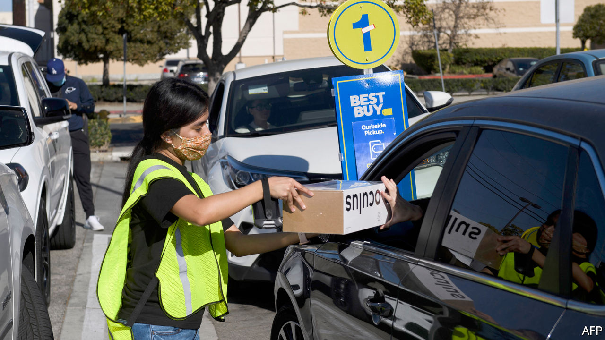

###### Drive-through rules

# How to get hybrid shopping right 

##### More retailers are experimenting with socially distant collection 

 

> Mar 6th 2021 


FROM DRIVE-IN cinemas to drive-through restaurants, Americans love doing things without getting out of their cars. During the covid-19 pandemic they have taken to shopping in a similar fashion, too. Kerbside pickup, where buyers’ vehicles pull up to retail outlets and dedicated staff help load online orders into the boot, helped supermarket chains notch up a banner year. One in two American shoppers used kerbside or in-store collection last year, according to a survey by ShipStation, a maker of shipping software.


No big retailer in America can do without kerbside pickup. Those that had it before the pandemic, including Target, Walmart and Kohl’s, have expanded their offerings. On March 2nd Target reported record digital sales, which accounted for two-thirds of revenue growth last year. These were powered by such “drive-up” purchases, which ballooned more than six-fold in the final quarter of 2020. Shops that lacked kerbside operations hurriedly created them from scratch. Some analyses have found that around 60% of American retailers now have the service, twice the share 12 months ago.


Even malls, which were struggling before the pandemic added to their woes as self-isolating consumers moved en masse to online purchases, are giving it a whirl. Sarah Fossen, head of marketing at Rosedale Centre, a mall near Minneapolis with 150 retail tenants, recalls starting a service with parking space set aside for kerbside pickup at two entrances, only to discover that there was sufficient demand to add such space at all five main entrances.


Successful efforts get a number of things right, says Tom Enright of Gartner, a research firm. Some of the imperatives are straightforward (install clear signs, offer sufficient parking space). Others require retailers to make bigger changes; since they do not have to lug stuff to their car themselves, for example, kerbside shoppers often buy bulkier crates of bottled water or bigger bags of pet food. A bit of technological nous comes in handy. Some retailers are, for instance, using location tracking in their apps to know when exactly customers might arrive, so as to minimise waiting times, says Jean Chick of Deloitte, a consultancy.


Some waiting will be inevitable. But, says Mike Robinson, who used to run digital operations at Macy’s, a big department-store chain, the period in line need not be wasted. Lingering customers could be enticed with other offerings, from promotions to new products, in the same way that you might grab a chocolate bar while waiting at the cashier. It is “the perfect time” to engage shoppers, Mr Robinson says.


Many shops still have to crack important aspects of this transition. Most are not equipped for returns or exchanges and lack a seamless way for customers to add and pay for last-minute items. Retailers could improve the experience with pop-up tables in the parking lot stocked with popular items. As Mr Enright notes, “If kerbside is going to replace an in-store experience, it has to bring a lot of those in-store experiences out into the parking lot.” ■


Dig deeper


All our stories relating to the pandemic and the vaccines can be found on our . You can also listen to , our new podcast on the race between injections and infections, and find trackers showing ,  and the virus’s spread across  and .

