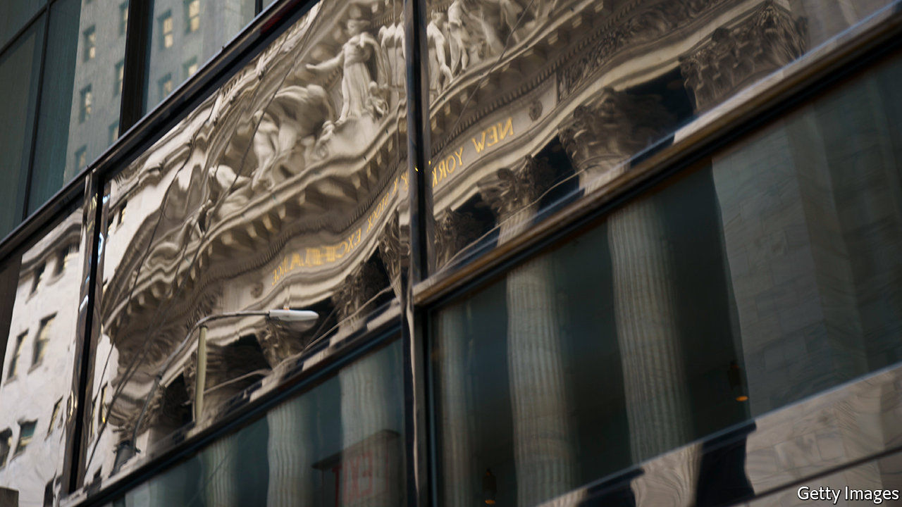
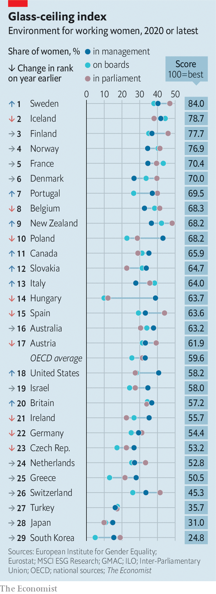

###### More cracks appear

# Is the lot of female executives improving? 

##### Our glass-ceiling index shows some progress in some places. But not enough 

 

> Mar 6th 2021 

 


WALL STREET’S glass ceiling cracked at last on March 1st, as Jane Fraser took charge of Citigroup, becoming the first woman to head a big American bank. That cracking sound has also been echoing across the rest of America Inc. Last year Carol Tomé became boss of UPS, a package-delivery giant. In January Rosalind Brewer became only the third black woman ever to run a Fortune 500 company (Walgreens Boots Alliance, a pharmacy chain). A month later Thasunda Brown Duckett was picked to run TIAA, a big pension fund.


America ranks below the average for the OECD club of industrialised countries in The Economist’s annual glass-ceiling index of female empowerment, owing to poor marks on parental leave and political representation. But it has a high share of women in management (41%) and on company boards (28%). In both cases America outpaces egalitarian Germany, which in January enacted a quota for female board members (and where the shares for management and boardrooms are 29% and 25%, respectively).


Most countries have a long way to go. Just one in three managerial positions across the OECD’s 37 members is occupied by a woman. A recent study by SIA Partners, a consultancy, found that in Britain bias against women in senior corporate hiring remains systemic.


At least signs of progress can be seen even in traditional laggards like Japan. Mori Yoshiro had to resign as chief of the Tokyo Olympics in February after he complained that women talked too much in meetings. A woman replaced him.

