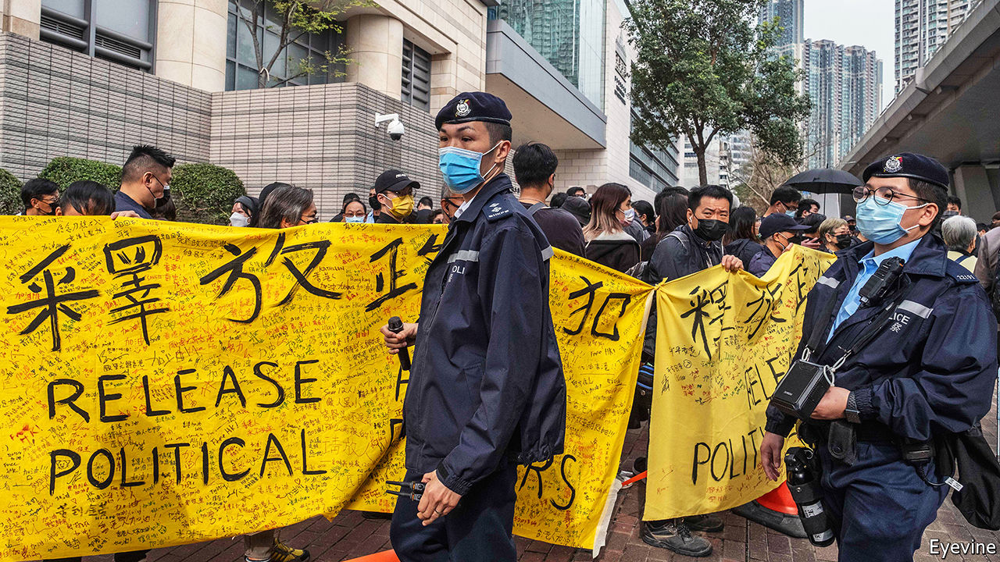

###### The law kicks in

# Hong Kong’s new security bill is being put to its biggest use yet 

##### Forty-seven activists have been charged in a single case 

 

> Mar 6th 2021 


SINCE CHINA imposed a draconian security law on Hong Kong last year, protests in the city—already dampened by pandemic-related controls—have been rare. But on March 1st hundreds of people gathered outside a court to demonstrate against the largest case so far related to the security bill. They held banners calling for the release of “political prisoners” and chanted slogans that were popular during the unrest that engulfed the territory in 2019. Students at a primary school nearby stood outside their classrooms, shouting in solidarity. It was a rare act of defiance in a city that, to many residents, feels crushed.


A day earlier, 47 people had been charged for alleged misdeeds as part of the case. They included some of Hong Kong’s best-known pro-democracy activists, such as Leung Kwok-hung, a veteran campaigner commonly known as “Long Hair”; Lester Shum, a politician; Benny Tai, an academic, and Joshua Wong, whose then-teenage face became emblematic of the “Umbrella Movement” of 2014 (he is already in prison for a protest-related offence). They have been accused of crimes such as conspiracy to commit subversion by plotting to overthrow Hong Kong’s government.


The case relates to an informal primary ballot that was held last year to select pro-democracy candidates for elections to the Legislative Council. This sensible-sounding effort was seen by the government as an attempt to gain control of the council and paralyse its work. (The elections were due to be held in September but were postponed for a year, purportedly because of the pandemic.) If convicted, the defendants face sentences of up to life in prison.


The proceedings that began on March 1st relate to applications for bail—the trial itself may not begin for several more weeks. Under the security law, there is a presumption that bail will be denied, so even this stage has involved protracted debate in court and a gruelling ordeal for the defendants. They have had to endure sessions lasting many hours that have eaten into normal times for meals and sleep. The physical toll has been evident—several of them have received hospital treatment. On March 4th 15 members of the group were granted bail. They will remain in custody pending an appeal by the prosecution, which argues that they could pose a threat to national security if released.


No national-security trial has yet been concluded. So this one will be watched for signs of how the new law—which has the hallmarks of Chinese mainland-style legislation, with its vaguely defined political terms—works in a judicial system steeped in British legal tradition. Dominic Raab, Britain’s foreign minister, has described the case as “deeply disturbing”. America and the European Union have called for the release of the 47 activists. On March 2nd Hong Kong’s Department of Justice said that prosecutors’ decisions had been made “without political considerations” and no one should interfere in them. But a few days before the 47 were charged, Xia Baolong, a central-government official who oversees Hong Kong affairs, had said that “anti-China elements” should be “severely punished under the law”. He had named two members of the group: Mr Wong and Mr Tai. The Communist Party may be an exception to Hong Kong’s rule. ■

