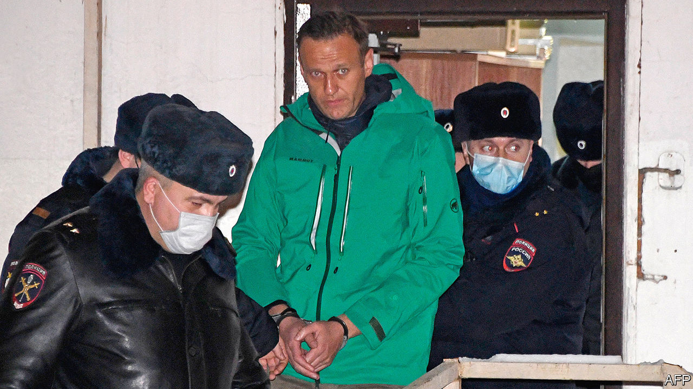

###### Prisoner of confusion

# How the Kremlin outwitted Amnesty International 

##### Russia hoists a human-rights group by its own woolly language 

 

> Mar 6th 2021 


ON MARCH 1ST Russian news announced that Alexei Navalny was moving to a new prison, Penal Colony No. 2, notorious for psychological torture. Two days later his lawyers found him in a different, and less ghastly, jail. Russia’s justice system likes to keep people guessing.


The Kremlin says Mr Navalny, Russia’s main opposition leader, is a common criminal, as well as being a Western agent. Its propagandists tout his (plainly bogus) fraud conviction. Their struggle to convict him in the court of public opinion has received a boost from an unlikely source: Amnesty International, a global human-rights group.


On February 23rd Amnesty said it had decided to stop calling Mr Navalny a “prisoner of conscience”, a term first popularised by Amnesty itself. The reason given was that he had made some xenophobic comments nearly 15 years ago. Amnesty had not planned to publicise this decision, but an internal memo had leaked.


Kremlin megaphones went wild. Day after day they quoted Amnesty’s verdict that Mr Navalny’s comments constituted “advocacy of hatred”. “I very much understand Amnesty International which talks about hatred from Navalny’s side,” crowed Dmitry Kiselev, Mr Putin’s operatic propagandist-in-chief. The head of RT, a state broadcaster, called Mr Navalny a Nazi.


This propaganda coup was made easier by a shift in philosophy at Amnesty. In 1961 Peter Benenson, the group’s founder, defined a “prisoner of conscience” as anyone who is locked up for expressing an opinion “which does not advocate or condone personal violence”. For decades, this definition worked well. Amnesty’s campaigns helped bring about the release of legions of dissidents, including many in the old Soviet Union. But a new generation of activists decided that it was not enough to eschew violence. Since 1995, to merit the label “prisoner of conscience”, a dissident must also not have used hateful language.


Two videos Mr Navalny made, in 2007 and 2011, failed that test. At the time he was trying to build a broad coalition of liberals and nationalists to oppose Mr Putin. To this end, he sought to persuade patriotic voters not to back violent ultra-nationalists, who were then on the rise. In one video he condemned physical attacks on illegal immigrants, and said Russia should deport them instead. In another, he referred to Islamist militants as “cockroaches”. 


Mr Navalny has long ago publicly expressed regret for using disparaging language about other ethnic groups, but has not specifically disavowed the videos. His activism now consists largely of pointing out how corrupt the Putin regime is. This rattles the Kremlin, which is why it tried to assassinate him last year. It is also why its propagandists worked so hard, after Amnesty named Mr Navalny a prisoner of conscience in January, to persuade the group that he isn’t. 


Amnesty was flooded by almost identical complaints about Mr Navalny from “concerned citizens”. Many cited a Twitter thread by Katya Kazbek, a freelancer for RT, highlighting the old videos and calling Mr Navalny “an avowed racist”. The complainants urged Amnesty to abide by its own rules and strike Mr Navalny off its list of prisoners of conscience.


It did—and, by doing so, raised questions about those rules. The old definition of a prisoner of conscience was clear: a dissident who neither commits nor advocates violence. The new one is fuzzy. What counts as “hate speech” changes rapidly, and varies from place to place and listener to listener. If Amnesty disqualifies anyone who has ever said anything that is currently deemed hateful, it hands despots a powerful tool. Dig up the worst thing a dissident has ever said, and watch a Western human-rights group tie itself in knots.


Amnesty says it still considers Mr Navalny a political prisoner, even if he is not a prisoner of conscience, and calls for his release. The distinction is lost on many. Boris Akunin, a novelist, wrote to Amnesty: “Instead of protecting a man who was first almost killed and then unjustly imprisoned by a dictatorship you struck him a further blow. You closed the doors of his cell even tighter, making it harder for us all to fight for the man’s freedom. By adhering to the letter of your protocol you failed the spirit of your mission.” ■

