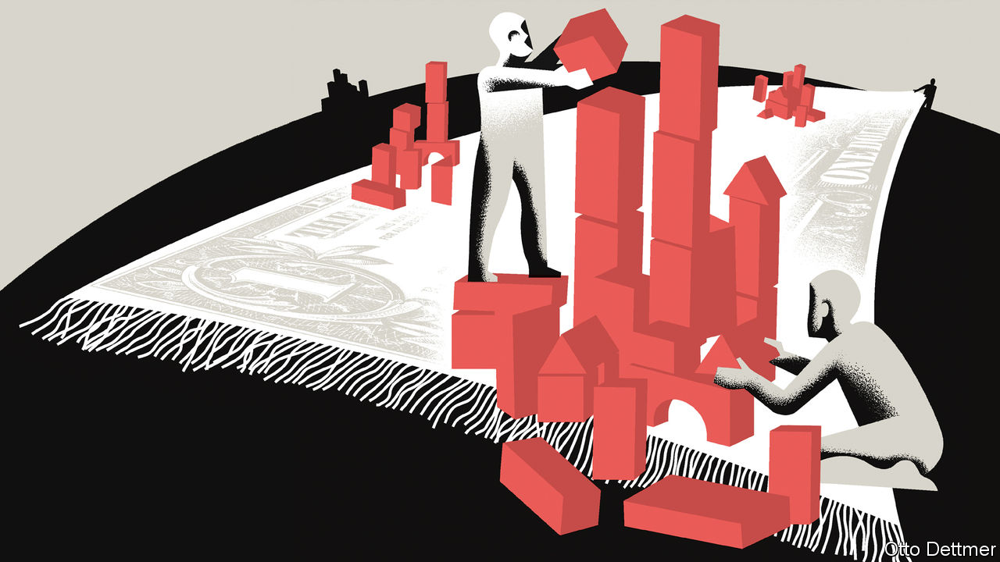

###### The fragile four

# Which emerging markets are most exposed to a Treasury tantrum? 

##### Some countries may be victims of their own success 

 

> Mar 6th 2021 


THERE ARE few greater honours than becoming finance minister of your country. But there are better and worse days to start the job. Chatib Basri became finance minister of Indonesia, the fourth-most-populous country in the world, on May 21st 2013. That was only a day before the start of a financial sell-off known as the “taper tantrum”. Yields on American Treasuries rose abruptly after Ben Bernanke, then chairman of the Federal Reserve, spoke about reducing (or tapering) the Fed’s bond purchases. Higher American yields shattered the appeal of emerging markets, undermining their currencies, bonds and shares. “I had very little time to adjust,” Mr Basri noted in 2016.


Policymakers in emerging markets now fear a second such tantrum. As Treasury yields jumped at the end of last month, a broad index of emerging-market shares fell by over 7% in little more than a week. This is “shaping up to be a bruiser”, wrote Robin Brooks of the Institute of International Finance, a bankers’ group, on Twitter. Markets have calmed down in recent days. But if they again lose their composure, which emerging economies will be worst hit and why? 


One way to identify future casualties is to look at the characteristics of past victims. Back in 2013 Indonesia was one of an unfortunate group of emerging markets dubbed the “fragile five” by James Lord of Morgan Stanley, a bank. The group, which also included Brazil, India, South Africa and Turkey, were all struggling with inflationary pressure, an overvalued exchange rate and a conspicuous current-account deficit (which measures a country’s trade deficit among other things). A few months into the tantrum Indonesia reported that its deficit had increased to 4.4% of GDP. The “market went into shock”, Mr Basri recalls.


Similar factors were combined into a “vulnerability index” by the Fed’s own economists in 2014. For the most part, the worse a country scored on the index, the more its currency fell in the taper tantrum. This kind of evidence has prompted Fed officials ever since to argue that the sensitivity of emerging markets to the Fed’s words and deeds depends a lot on economic fundamentals in the emerging markets themselves. 


To the Fed’s critics, that can sound like blaming the victim. But it is also a hopeful message. It implies that emerging markets have some control of their own fates. They are not “purely passive objects of the effects of Fed policy decisions”, as Mr Bernanke put it in 2015. Mr Basri has recounted the numerous measures he and other policymakers introduced to make Indonesia less fragile. They narrowed the country’s current-account deficit by raising interest rates, tightening credit regulations and cutting fuel subsidies, despite the political damage that would ensue. Cabinet discussions were very “dynamic”, Mr Basri writes. 


Indeed, judged by the criteria of 2013, emerging markets today look far less fragile than they once were. Inflation is lower (only 1.4% in Indonesia) and “exchange-rate valuations have cheapened up considerably”, says Mr Lord. Their current accounts are also “much improved”. Indonesia’s is now in surplus, as are India’s and South Africa’s.


These past indicators of fragility, however, may not be appropriate for 2021. The pandemic has depressed demand and curtailed imports, which has temporarily narrowed current-account deficits around the world. But the fight against covid-19 has also dramatically widened another kind of deficit: the gap between government spending and revenues. Budget deficits averaged over 10% of GDP across the fragile five last year, according to the IMF. Fiscal sustainability “has become the key macro area of concern for some emerging markets”, Mr Lord says.


Bond strategists at HSBC, a bank, published an alternative ranking of vulnerable emerging economies on March 2nd. The least resilient, according to their scorecard, are Brazil, Indonesia, Mexico and South Africa. These economies have all been prone to current-account deficits in recent years, even if the pandemic has flattered the latest figures. And sizeable government debt in South Africa and especially Brazil leaves them exposed to any jump in interest rates, which are now unusually low.

The fairweather four


These are not the only potential sources of vulnerability. When American yields rise and the dollar strengthens, countries that have borrowed heavily in hard currencies find their debts harder to bear. But the trouble need not end there, according to Valentina Bruno of the American University in Washington, DC, and Hyun Song Shin of the Bank for International Settlements (BIS). Any deterioration in the creditworthiness of one borrower in an international lender’s portfolio can limit the risks it is willing to take on other emerging markets, even those that mostly borrow in their own currency. Boris Hofmann and Taejin Park of the BIS have shown that a rising dollar is a particular danger to emerging markets that have sold a large share of their bonds to foreigners. One reason why Mexico is on HSBC’s worry list and Turkey is not is that foreigners hold 46% of Mexico’s local-currency government bonds and less than 7% of Turkey’s.


These findings create a headache for conscientious finance ministers in emerging markets. If they strive to reform their economies to make them less fragile, they will become more attractive to foreign investors, who will then snap up a greater share of their bonds. But that could make them more vulnerable to a sell-off whenever global financial conditions darken. Indonesia’s reforms after the taper tantrum soon won praise from the IMF and attracted foreign buyers back to its bond market. But, Mr Basri admits, these inflows increased the vulnerability of Indonesia’s economy to a reversal when global markets wobbled again in 2015. Emerging economies are not powerless victims of the Fed. But they can be hapless victims of their own success. ■

