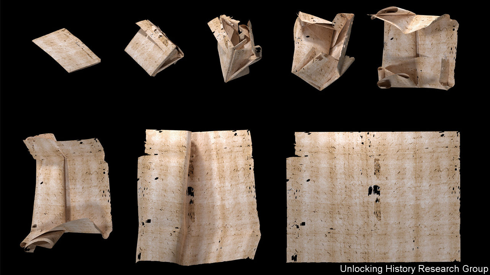

###### Origami in reverse

# Cracking the security on a trove of 17th-century letters 

##### Before envelopes, there was “letterlocking” 

 

> Mar 3rd 2021 


A MODERN CORRESPONDENT wanting to communicate privately can use computerised encryption. Three hundred years ago, origami would have been a better bet.


Before gummed envelopes became common in the 1800s, letters were posted with no security wrapper. Privacy-minded writers relied instead on cunning combinations of folds, tucks, slits and seals, a practice Jana Dambrogio at the Massachusetts Institute of Technology has dubbed “letterlocking”.


Some, like the “chapel fold”, in which the letter is turned into its own envelope and sealed, were the equivalent of simple padlocks. Others were subtler. The “dagger trap” relied on a concealed wax seal that would leave a telltale rip once a letter had been opened.


But information about the practice is scarce. Most historical letters survive in their opened form, leaving aficionados like Ms Dambrogio with little to go on but crease-marks and tears. The few that remain unopened present a different problem: how to read them without permanently damaging the letterlock. Now, in research published in Nature Communications, Ms Dambrogio and her colleagues have come up with a solution.


The letters in question are part of the Brienne Collection, a trove of thousands of undelivered 17th-century letters bequeathed to posterity by Dutch postmasters. The collection includes 577 unopened, letterlocked missives. To get at their letters’ contents while preserving the integrity of the locks, the team turned to X-rays and computers.


The key lay in knowing that the inks used at the time often contained iron. This meant that an X-ray microtomography scanner, of the kind usually reserved for distinguishing teeth or bone from soft tissue, could reliably distinguish the metallic letters from the paper background. Once the scan had also revealed the topography of the sheet, with the location of folds and creases mapped, the resulting model could be virtually unfolded by a computer to reveal the hidden text.


Though some imperfections remain—a hole left by a burrowing worm, for example, or the dry scratch of an ink-free nib—the legibility of the scans rivalled anything one would find in a research library, says Dr Starza Smith, a researcher at King’s College London. And although no spectacular secrets have yet emerged from the Brienne Collection, the technique seems to hold plenty of promise for future research into a fascinating historical practice.

