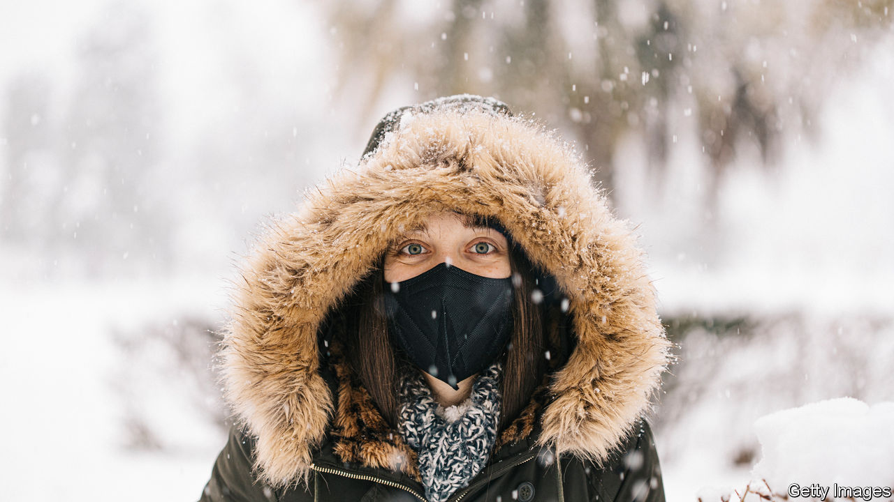

###### Helpful humidity

# Face-masks can give the immune system a helpful hand 

##### The key is humidity—and snot 

 

> Mar 6th 2021 


FACE-MASKS HELP reduce the spread of SARS-CoV-2, the virus that causes covid-19. Several studies have reported the more surprising finding that, even if wearers do become infected, their disease is usually milder. Now Joseph Courtney and Ad Bax, a pair of researchers at the National Institutes of Health in Bethesda, Maryland, think they may have worked out why. As they report in the Biophysical Journal, it comes down to humidity, the immune system, and the protective powers of mucus.


At first glance, there may not seem much of a mystery to unravel. Masks cut the number of infectious particles entering the nose and mouth. One might expect, therefore, that severe disease would be less likely. But it is not so. One vital factor which predicts disease severity is how far viral particles make it into a person's lungs. Cheap cotton face-masks struggle to block the smallest aerosols, which are the most likely to penetrate deeply. Dr Courtney and Dr Bax wondered if something else might explain their protective effect.


One of the body’s first lines of defence against airborne pathogens is known as the “mucociliary clearance mechanism”. Sticky mucus in the nose and respiratory tract snares viruses and bacteria. Little hairs known as cilia push the mucus into the throat. From there it is swallowed and potent stomach acids destroy the invaders. But this mechanism relies on the relevant body parts staying moist.


That is harder in winter, for as air gets colder, its capacity to hold water falls. Lower humidity tends to dry out the respiratory tract. This is one reason why many upper-respiratory viruses, such as influenza, flourish in the winter.


Dr Courtney and Dr Bax speculated that masks may help keep things damp. They reasoned that, as a person exhales, water vapour would condense on the inside of a mask. Then, upon inhalation, dry air passing through the mask would collect the deposited water and bring it back into the respiratory tract and lungs. That could be handing a mask-wearer's immune system a significant advantage.


Keen to test their idea, the researchers checked several masks at 37°C, 22°C and 8°C. They breathed into a sealed box packed with sensitive instruments, and worked out humidity levels in their upper respiratory tracts. They found that, although all masks increased humidity levels to some extent, the heavy cotton mask did best of all. In the hottest room it boosted the relative humidity of inspired air by over 50%, compared with breathing without a mask. In the cold room, that number rose to 300%. (The other masks recorded figures of between 150% and 225%.) That suggests that, besides filtering out at least some of the viral particles floating about in the air, masks help keep a person's snot levels healthily high. ■


Dig deeper


All our stories relating to the pandemic and the vaccines can be found on our . You can also listen to , our new podcast on the race between injections and infections, and find trackers showing ,  and the virus’s spread across  and .

