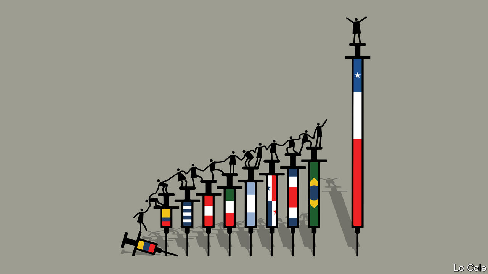

###### Bello

# Vaccination is going well in Chile. Why not its neighbours? 

##### Jabbing is politicised in much of Latin America 

 

> Mar 6th 2021 


EACH DAY this week some 100,000 Chileans aged 60 to 64 turned up to get their inoculation against covid-19. Having vaccinated nearly 20% of its adults, the sixth-best performance in the world, Chile is on track to meet its target of covering 80% of its 19m people by June 30th. After starting with health workers, the jabs are being applied in strict descending order of age, a different year each day, and to teachers, too.


This swift and orderly programme contrasts with the rest of Latin America. In vaccination as in other matters, the region displays its divisions, inequalities and problems of governance. In this case, sadly, they will cost lives. Colombia, Ecuador, Venezuela and several smaller countries have barely started jabbing. Mexico, with 2% of its people vaccinated on March 1st, is below the world average of 3.5%. In Brazil (4%) vaccination trails behind the new P.1 variant of the virus, which spreads faster than the original and seems to disregard prior natural immunity. This week the health secretaries of Brazil’s 27 state governments declared that the country is suffering “the worst moment” of the pandemic.


The slow roll-out is largely because of the worldwide shortage of vaccines, especially from Western drug firms whose supplies have gone mainly to their home markets. Argentina, Brazil and Mexico plan to make vaccines but have found it hard to source the active ingredients and vials. Part of the problem is government fumbling. Whereas the African Union made bulk pre-purchases, Latin America’s lack of regional co-ordination meant that countries raced against each other, points out Ernesto Ortiz of the Global Health Institute at Duke University. In that race, Chile did two things right: in mid-2020 it agreed with several pharma companies to host vaccine trials to encourage early delivery; and its immunisation programme has an up-to-date digital database. Many other governments have struggled with complex procurement negotiations.


The result is “patchiness”, according to Clare Wenham, a health expert at the London School of Economics. Different vaccines, different priority groups and different distribution plans could complicate opening up the region’s economies, she thinks. This patchiness owes much to political manipulation. Vaccine distribution in Brazil has been particularly haphazard, because the federal government of Jair Bolsonaro, a populist who denies the seriousness of the virus, has absented itself from the job.


In Mexico, another federal country, the government of Andrés Manuel López Obrador seized control of the vaccination programme from the states. With an important election due in June, it decided that 333 “highly marginalised” municipalities should get the vaccine first. Many are rural and less hit by the pandemic than the cities. Teachers have been jabbed before nurses, who are at higher risk.


This is queue-jumping on behalf of a political clientele. Elsewhere it is the powerful who have jumped queues. In Peru the health and foreign ministers resigned last month after it emerged that they were among 487 insiders who secretly benefited from sample doses provided by Sinopharm, a Chinese company, as a sweetener; another was Martín Vizcarra, who was ousted as president in November. Health ministers in Argentina and Ecuador left after similar scandals. These affairs have done no good for the credibility of democracy in their countries. They also “play against trust in vaccination programmes”, says Dr Ortiz. Polls suggest vaccine hesitancy has risen in Peru since last August.


Those vaccines currently available in the region come mainly from China and Russia, which have been quicker to deliver than their Western rivals. China trades a lot with and invests a lot in several Latin American countries. Vaccine diplomacy may give it soft power for the first time. As for Russia, it had almost disappeared from Latin America since the end of the cold war. Now it is back, and in a benign guise.


Vaccination is a marathon, not a sprint. By February 27th Latin American countries had ordered 550m doses of Western vaccines, compared with 213m from China and 72m from Russia, according to Duke University. Later this year, the Western doses should arrive in force. Eventually, both the scandals and the source of the early vaccines may be forgotten if the region acquires immunity and new variants are kept at bay. But it is more likely that the botched vaccination effort will have lasting political and diplomatic consequences.


Dig deeper


All our stories relating to the pandemic and the vaccines can be found on our . You can also listen to , our new podcast on the race between injections and infections, and find trackers showing ,  and the virus’s spread across  and .

