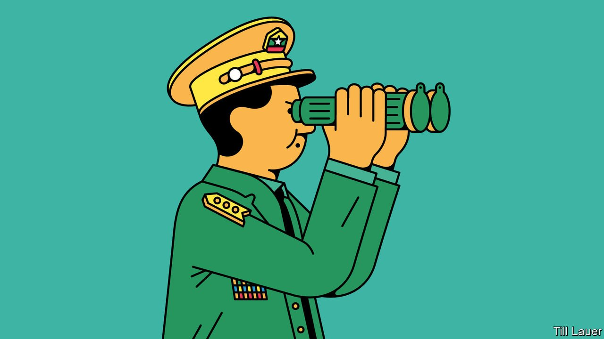

###### Banyan

# Myanmar’s generals have not thought their coup through 

##### They have no way forwards without extreme violence, but also no way back 

 

> Mar 13th 2021 


SIX WEEKS after the armed forces under General Min Aung Hlaing launched a coup d’état with calamitous implications for Myanmar, two factors become more salient by the day. The first is the scale of popular revulsion at the return to naked military rule.


Hundreds of thousands of Burmese have marched in protest at the coup. Huge numbers of civil servants, teachers, bus drivers and bank clerks and more are boycotting work. Savvy social-media types are highlighting the army’s abuses. Popular resistance to military rule appears stronger even than in 1988, when students led huge protests against it. As Thant Myint-U, author of “The Hidden History of Burma”, puts it, the spontaneous demonstrations are like antibodies responding to an endemic infection. The difference this time is the vehemence with which young Burmese refuse to revert to the tyranny and poverty their parents knew. They have come of age during the past decade of economic reform and semi-democratic government. The generals, as a refrain has it, are messing with the wrong generation.


That fewer people showed up on the streets in a general strike on March 8th is hardly surprising now that the army has started shooting. That is the second factor: the Tatmadaw, as the army is called, is increasingly willing to spill blood. In recent days soldiers have shot and killed some 60 civilians in Naypyidaw, the capital, Yangon, the commercial hub, and beyond. More than a third of the dead are teenagers. A 19-year-old, Kyal Sin, known as Angel, who had posted her blood type on Facebook in case anything happened to her, took to the streets in Mandalay in a T-shirt proclaiming “Everything will be OK”. Soon after she was dead from a sniper’s bullet to the head. Her fate exemplifies the Tatmadaw’s ferocity. Its sudden disinterment of her corpse to “prove” its innocence in her death exemplifies the grotesque lengths it will go to to justify its actions.


This could be just the beginning. The Tatmadaw is not the only army in the region that sees itself as embodying the state rather than as subservient to it. The Thai army next door shares a similar outlook. Yet in Thailand the monarchy, which military governments rely on for legitimacy, does not want to be associated with wanton bloodshed. When the army kills too many people, the king tends to withdraw his blessing, prompting military regimes to fall.


By contrast, when the Tatmadaw’s grip looks shaky, violence strengthens its hold, as in 1988. The army’s worldview is both paranoid and uncompromising. Sequestered in military cantonments inherited from the British, a powerful officer caste peers out at a hostile country. Admittedly Myanmar, or Burma as it was, has seen not a single year of peace since the Japanese dropped bombs on Yangon (then Rangoon) in late 1941. Independence in 1948 was accompanied by a communist uprising that almost reached Yangon. The conflict in Kayin (formerly Karen) state is the world’s longest-running civil war. A dozen more ethnic conflicts rumble on in the country’s borderlands.


As for the Tatmadaw’s lower ranks, they are hazed by their officers and at the sharp end of ethnic wars. Battlefield techniques include the rape of women and girls, and the use of civilians as human shields. These same brutalised infantrymen are now patrolling Myanmar’s streets.


Just as with earlier coups, the press has been muzzled: five media organisations were banned this week. But there are differences, too. General Min Aung Hlaing is less interested in cultural purity or autarky—obsessions of some of his predecessors, who shut the country off from the world. His concern, rather, is the Tatmadaw’s prerogatives. These include stakes in formal businesses as well as the drug, jade, timber and smuggling rackets at the heart of a predatory economy. Above all, as Mr Thant puts it, the army wants to “wind the clock back and rerun the politics of the past decade”, with far tighter control.


But by repressing the protests so violently, the Tatmadaw has made Myanmar a pariah again, and thus turned the clock back further than it intended, to the isolationist era that preceded the past decade of opening. With investment collapsing, the economy will struggle to recover from the coup. That will hurt the army, too. Yet retreat is not really an option: given the Tatmadaw’s behaviour in recent weeks, any civilian government would sweep away the prerogatives it intervened to uphold. The coup is not working out well for anyone.

