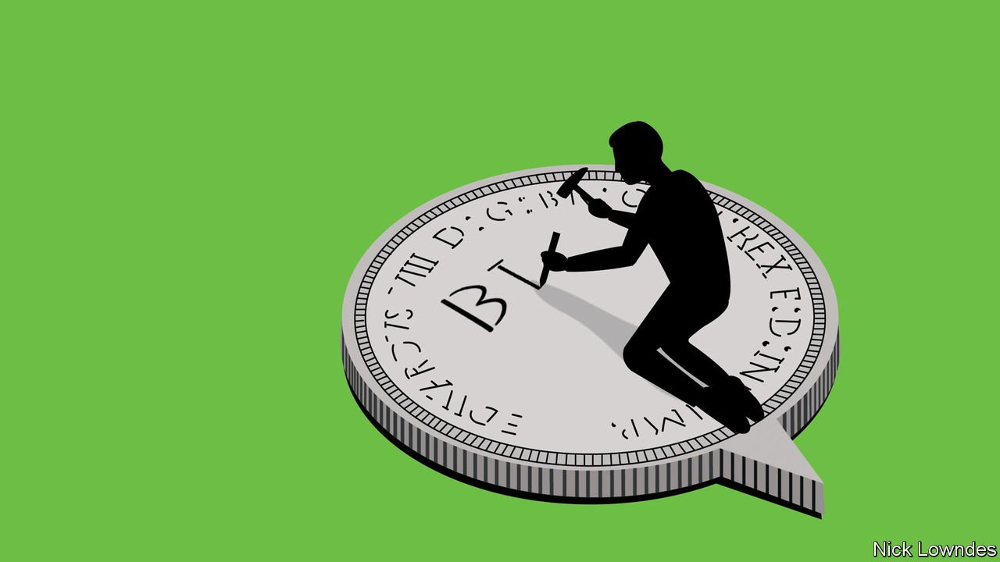

###### Johnson

# Making up new words is easy. Getting them used is harder 

##### Part of the secret is not to try too hard 

 

> Mar 13th 2021 


IF YOU WANT an obituary in the New York Times, there is one sure-fire way: coin a famous word. People have found their way into those pages under headlines that tout their minting of “workaholic”, “burnout” and “homophobia”, even over other big achievements. There is something immortal about adding to the lexicon.


“The Hidden History of Coined Words” by Ralph Keyes, an American author and former language columnist, is an engaging look at this endeavour. It turns out to be a lot harder than it sounds. You might think all that is needed is a catchy moniker for an important but as-yet-unlabelled phenomenon. Yet eager coiners fail far more often than they succeed. Why?


It helps to look at words that make it. Often they do so through happenstance—which sometimes confounds the coiners themselves. Take Fred Hoyle, an astronomer who rejected the theory that the universe had come about in a primordial cosmic explosion, which he derisively called a “big bang” in a radio interview in 1949. To his surprise, the name stuck, even surviving a concerted bid to replace it in 1993, when a contest was held to come up with something more creative. The 13,000 entries included “Buddha’s Burp” and “the Hubble Bubble”. Too clever by half, it would seem, as no winner was chosen. Carl Sagan, a celebrity cosmologist and judge of the contest, explained why: none of the entries bettered the “big bang”—words that featured in the headline of Hoyle’s obituary in the Los Angeles Times.


The number of such coinages—meant disparagingly, but then adopted defiantly before becoming neutral—is surprisingly large. “Impressionism” was named by a hostile critic. “Suffragette” was intended to demean certain suffragists. “Guy” came from Guy Fawkes, then took on a positive spin in America. “Pollster” is modelled on “huckster”; “Quakers” were christened for their trembling devotion. These are cautionary tales for those who, like mad scientists on screen, think they can control their creations.


Clayton Christensen of Harvard Business School gave “disruption” a new meaning in business, only to see it applied so widely that he came to wish he had said “type 1 innovation” and “type 2 innovation”, forcing people to read his works for an explanation. But, as Mr Keyes writes, nobody wants to have to read a book to use a word. Thomas Kuhn suffered a similar fate with “paradigm”, an old word that he retooled and popularised as “paradigm shift” in “The Structure of Scientific Revolutions”. He eventually considered it to have lost all meaning.


As with literal coins, neologisms almost always draw on existing material. Prolific minters like John Milton (“Satanic”, “earthshaking”, “pandemonium”), Charles Dickens (“penniless”, “the creeps”) and Washington Irving (“doughnut”) mostly shift words to a different part of speech, compound them or add prefixes and suffixes. Even Shakespeare, the most prodigiously successful English coiner, usually operated in this way. Indeed, in many cases even the best detective work cannot determine whether a given writer invented or merely popularised a word (often suspected to be unwritten slang).


Truly novel words often derive either from commerce (for trademark reasons, like “nylon” or “cellophane”) or from literature. “Quark”, which now refers to a type of subatomic particle, comes from James Joyce’s “Finnegans Wake”. “Nerd” was imagined by Dr Seuss (Theodor Geisel) in one of his children’s rhymes. “Blurb” was the name given in 1905 by Gelett Burgess, a humourist from San Francisco, to the puffery put on book jackets. Such coinages tend to be guided by sound, not meaning; in some cases their authors mean nothing by them at all. A sense of fun is one reason why comic strips, in particular, have been a rich source of new words, from “doofus” and “heebie jeebies” to “goon” and “jeep”.


By contrast, when serious people sit down to coin words for important phenomena, they often fail because, as Mr Keyes writes, “the effort shows”. Thomas Friedman, a New York Times columnist, frequently aims to popularise new terms. Few have caught on. His catchiest invention was “the Pottery Barn rule” of foreign-policy adventures: “You break it, you own it.” In a double irony, Pottery Barn (a housewares chain) was moved to clarify that it has no such rule; then the innovation somehow came to be attributed to Colin Powell, secretary of state when America invaded Iraq in 2003. It is tough out there for a neologist. There may be easier ways to earn an obituary.

