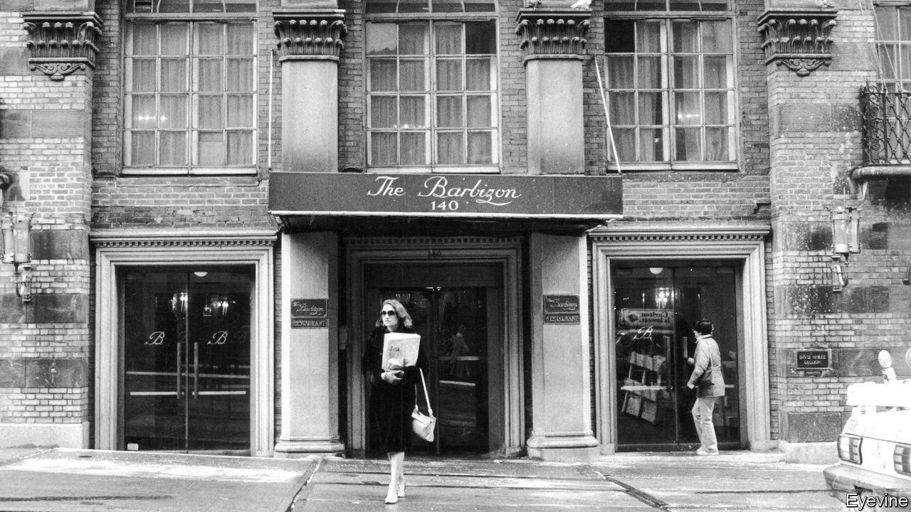

###### A room of their own

# When the Barbizon was New York’s smartest women-only hotel 

##### Its story is in many ways the story of American women in the 20th century 

 

> Mar 13th 2021 


The Barbizon. By Paulina Bren. Simon &amp; Schuster; 336 pages; $27. John Murray; £20


YOUNG WOMEN with ambitions too big for their small towns have long set their sights on New York. For those who could afford it, their first port of call for much of the 20th century was the Barbizon, the city’s most glamorous hotel for women. Rita Hayworth, Grace Kelly, Sylvia Plath, Joan Didion and countless others arrived on its doorstep on Manhattan’s Upper East Side, often in a yellow Checker cab, seeking sanctuary and a taste of freedom in a place that felt both thrilling and safe.


Built in 1927, as women were flooding into cities in search of jobs and some control over their lives, the neo-Gothic, club-like Barbizon became “the go-to destination for young women from all over the country determined to give their New York dreams a shot”, writes Paulina Bren of Vassar College in her colourful history of the place. Across decades in which women faced shifting, conflicting demands, the Barbizon was a smart, parent-sanctioned haven for female ambition and desire.


The story of the Barbizon is in many ways the story of American women in the 20th century. The hotel rose in a time of promise and prosperity, when women earned the right to vote, discarded their corsets and sought opportunities and entertainment outside the home. In the 1920s they attended college in numbers that rivalled men; many began earning salaries as secretaries in the city’s new skyscrapers. A secretarial school for “upper-crust young ladies” offered dormitory-style living at the hotel, with curfews, house mothers and a dress code of hats, gloves and heels.


Female employment swiftly became unpatriotic during the Depression (the jobs were meant for men), then patriotic during the second world war, then unpatriotic again in the early years of the cold war, when women who avoided the kitchen “became suspect”, Ms Bren writes. Through it all, the Barbizon offered a safe space for white, middle-class career women and a sorority-house atmosphere for ingénues in search of fame, fun and a husband. The front desk ensured they were presentable, with references attesting to their moral character. With advertising on the rise, many found work as models.


The post-war years were the hotel’s heyday. The rooms didn’t look like much, with their narrow beds and dainty desks, but for $12 a week ($15 for a suite with a bath) women had a place of their own with amenities including a swimming pool, library, afternoon tea (handy on a budget) and a coffee shop. Men were banned past the Italianate lobby, but many loitered “like vultures” there or nearby, including J.D. Salinger, who claimed he was a Canadian hockey player. On weekend nights the mezzanine lobby became a “lovers’ lane” where couples embraced in the shadows.


The Barbizon is not flattered in “The Bell Jar”, Plath’s novel of 1963 about the nervous breakdown she suffered a decade earlier after staying at the hotel as part of Mademoiselle magazine’s prestigious summer internship. Like the novel’s protagonist, Plath felt more caged than free, and spent her last night at the Barbizon tossing her carefully curated summer wardrobe from the roof. As with many of her generation, she “was neither able to comply with the demands made on women nor bravely shirk them”, Ms Bren says. She was one of scores of impressive interns who arrived at the Barbizon at the invitation of Mademoiselle from 1944 to 1979, and left changed.


By the late 1960s, the hotel began to seem fusty. The need for character references and the ban on trousers seemed outdated. Women were discovering that looking the “right” way and marrying the “right” man did not necessarily yield happiness; a women-only hotel came to seem cloistered and retro. By the 1970s the Barbizon had a desolate, Miss Havisham quality, and in 1981 the hotel began welcoming men. Finally, in 2007, after a renovation transformed it into a multimillion-dollar condominium building, the Barbizon was granted what its tenants always pined for: the possibility of reinvention. ■

