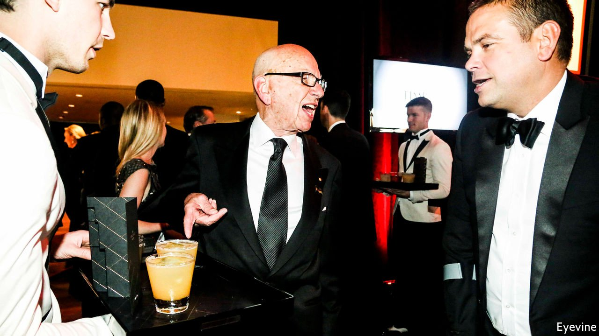
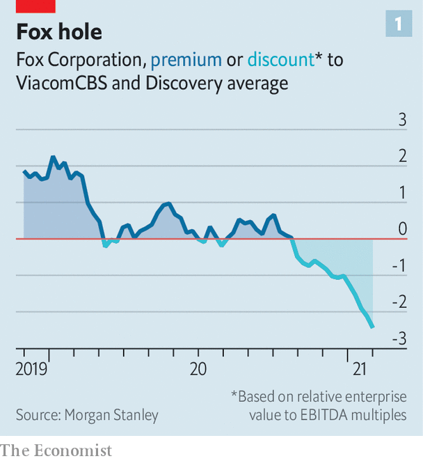
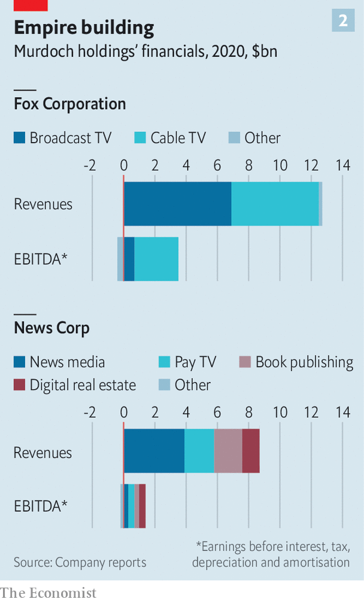

###### Next up

# Rupert Murdoch prepares to hand over his media empire 

##### As the mogul turns 90, investors and offspring get ready for a battle over its future 

 

> Mar 11th 2021 


BIRTHDAY PARTIES in pandemics are dreary, even for billionaires. But Rupert Murdoch’s 90th, which he celebrated on March 11th, should at least have been less stressful than his 80th. Back then British detectives were burrowing into a subsidiary of his firm, News Corporation, then the world’s fourth-largest media company, for evidence that its journalists had hacked phones and bribed police. Several convictions later, and after the closure of the 168-year-old News of the World, Mr Murdoch was hauled before a British parliamentary inquiry on what he called “the most humble day of my life”.


A decade on from the near-collapse of his empire, things are going rather better for the Australian-born tycoon. The phone-hacking scandal has receded. The choicest assets in his collection have been sold to Disney at the top of the market. Fox News is America’s most popular (if also its most despised) cable channel. And in a coup last month, Mr Murdoch forced tech giants to pay for linking to his content. “He has the money. He has huge amounts of political power. He has it all,” says Claire Enders, a veteran media-watcher.


As he prepares to pass it all on, the outlook is clouding over. Cable television is in hastening decline. A looming legal problem could prove even costlier than the phone-hacking affair. And the succession question—a decades-long saga which HBO, a rival network, cheekily dramatised—lingers on. Mr Murdoch is still the force that holds together a formidable commercial and political project. It may not stay intact without him.


The humbling experience of the phone-hacking affair turned out to be a blessing. It forced Mr Murdoch to split News Corporation in two, putting the lucrative TV and film assets into 21st Century Fox (which analysts nicknamed “Good Co”). The scandal-hit newspapers were quarantined in News Corp (dubbed “Crap Co”). As the firms were modernised and power devolved to Mr Murdoch’s sons, Lachlan and James, investors returned. In his boldest move, in 2019, the great consolidator of the media business realised that it was time to become prey rather than predator, and sold most of the 21st Century film and TV business to Disney for $71bn. Ms Enders and colleagues calculate that since 2011 the holdings of the Murdoch family trust, which has nearly 40% of the voting shares in each company, have appreciated more than sixfold.


The next chapter will be trickier. Start with Fox, the larger company, with a market capitalisation of $24bn. The pandemic has speeded the decade-long decline of American cable TV. Last year cable subscriptions fell by 7.3%, to levels not seen in nearly 30 years. Fox, whose gross operating profit in the last financial year was $2.8bn, has been insulated from this trend by its focus on news and sport, which streaming companies have yet to snatch. But something has changed. Whereas Fox used to trade at a premium to ViacomCBS and Discovery, two cable rivals, it now trades at a nearly 30% discount (see chart 1).

 


One reason is that the streamers are coming for sport. Amazon already covers the National Football League and is said to be seeking exclusive rights to some American-football games. Leagues want to reach young fans, and cannot get them on cable TV, where two-thirds of viewers are over 50. So cable companies are moving sport onto their own streaming services. Disney has ESPN+; Comcast announced in January that it would shut down its NBC Sports Network and shift programming to its Peacock service. Michael Nathanson, a media analyst, notes that without a streaming platform for sports, Fox is “the odd man out”.


Fox News, where Fox made about 80% of its money last year, has problems of a different sort. Its close relationship with Donald Trump’s White House generated record ratings, but alienated advertisers and some investors. “Any company you hold, you want to see behave ethically,” says one large shareholder. Fox is “in that grey area right now. It’s defensible, but it’s far less defensible than it was.” Smartmatic, an election-software company, is suing the company for $2.7bn for airing ludicrous claims that it rigged the presidential election. (Fox says it will fight the “meritless” lawsuit.) That sum would exceed the phone-hacking payouts.


Fox has reined in its support for Mr Trump, only to see viewers depart for right-wing upstarts like Newsmax and One America News. Fox News remains the most-watched cable channel in primetime. But viewership in February was down by 30%, year on year, even as that of its rivals, CNN and MSNBC, rose by 61% and 23%, respectively. One former Fox executive observes that, like Mr Trump’s Republican Party, Fox News was trapped into “super-serving” an ultra-conservative minority of its audience. Now it risks losing it, without attracting less kooky viewers.


Ironically, “Crap Co” is having a better time. Newspapers in America, Britain and Australia provide the largest chunk of its revenue, followed by Australian pay-TV and HarperCollins publishing (see chart 2). But a big new contributor to profits is its majority stake in REA Group and in Move, two online property advertising companies. News Corp’s share price has nearly trebled from its trough last April, thanks in large part to a surge in REA’s shares.

 


Like Fox, the newspapers have had to deal with a global shift of advertising online. Ten years ago the Murdoch companies were collectively the world’s third-largest seller of ads, says Brian Wieser of GroupM, the biggest media-buyer. Now they are outside the top ten. But the newspapers are further along the digital transition than Fox is. Online subscriptions account for three-quarters of the total at the Wall Street Journal; even the New York Post, a perennially loss-making tabloid, reported a modest profit in the last quarter of 2020. A recent deal with Google will see the tech colossus pay News Corp for content as a result of a law passed by the Australian government, which News Corp’s papers have backed. “The terms of trade for content are changing fundamentally,” Robert Thomson, News Corp’s chief executive, said on March 4th.


Still, with a market capitalisation of less than $15bn, News Corp is worth less than the sum of its eclectic parts. Mr Thomson insists it is on a “course of simplification”, having sold assets such as Amplify, an online education business, and Unruly, a video-ad platform. Many analysts think it should go further and separate the news businesses from the real-estate ones. At the moment, investors seeking growth are attracted by the property portfolio but put off by the legacy news brands, whereas investors looking for value like the newspapers but not the real estate.


Some also see a case for breaking up Fox. Mr Nathanson has argued that the firm should sell its broadcast-TV assets and sports channels, which the market seems to undervalue. Perhaps even Fox News could be spun off, if a buyer could be found: the brand is so controversial that it is all but unsellable, Ms Enders believes. A full leveraged buy-out of Fox could generate an annualised return on investment of roughly 25% over five years, calculates Morgan Stanley, an investment bank.


The biggest impediment to restructuring either firm’s portfolio may be Mr Murdoch himself. When power is eventually handed down, “a break-up story will gain momentum,” believes Brian Han of Morningstar, a broker. Will the next generation be willing to carve the empire up? And which of them will call the shots?

The son wot won it


Lachlan is already installed as chief executive of Fox and co-chairman of News Corp. At Fox he has backed Tubi, an ad-supported streaming service, sports-betting ventures and Credible Labs, a credit-scoring agency. None is an obvious fit with the core news business. Insiders think he would be reluctant to trim the legacy assets. Particularly in Australia, “there is a lot of history that [Lachlan] feels very deeply part of”, says a former News Corp executive. “It doesn’t lend itself to clear-headedness.” Lachlan has “stars in his eyes” and wants to build the family empire back up through acquisitions, believes one disapproving shareholder (who also fumes at Lachlan’s recent purchase of the most expensive house in Los Angeles).


Whatever he wants, Lachlan may not get his way. On Rupert’s death, control of the family trust will pass to his four eldest children. James, who resigned from the board of News Corp last year and now has little to do with his father and brother, has made clear his disapproval of the companies’ right-wing editorial line and does not seem attached to the legacy businesses. Elisabeth has warned of the dangers of “profit without purpose” in the media. With their elder half-sister Prudence, who keeps a lower profile, they could alter the course of both businesses.


If the future of the firms is determined not just by commercial logic but by family politics, that would be fitting. The assets in play are political as much as they are economic. The purpose of the Murdoch empire has always been to wield power as well as to make money. “What is Fox News for?” asks a former executive. “Fomenting insurrection.” Both Fox and News Corp may yet face one themselves. ■

