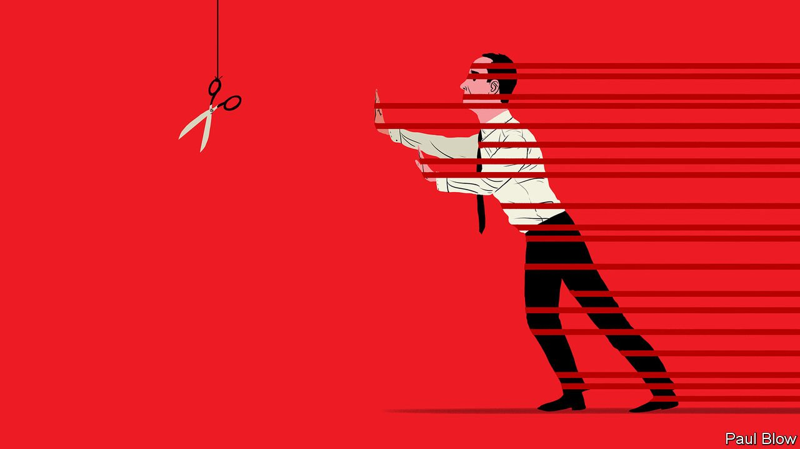

###### Bartleby

# The secret to cutting corporate red tape 

##### Getting rid of pointless rules and regulations 

 

> Mar 13th 2021 


A BANKER TAPED a picture, drawn by one of his small children, to his office wall. When he arrived at work the next morning, he found the picture was covered by a large notice, saying he was in violation of company policy which required personal items to be put away at night. Such a reaction was not just petty, it risked demotivating the banker completely. In short, it defied common sense.


Martin Lindstrom is a management consultant who spends his time battling the kind of corporate red tape that alienates customers, as well as employees. He has even persuaded some companies to establish special departments to fight this nonsense, sometimes dubbed “The Ministry of Common Sense”, which is the title of his latest book.


As Mr Lindstrom says, successful companies are able to put themselves in their customers’ shoes, and this leads to better service and sensible solutions. He once advised a credit-card issuer which had poor ratings for customer service. So he booked a restaurant for dinner with the executives, but got the fraud division to ensure their credit cards did not work. When one manager tried to pay for the taxi, he then watched their fury and embarrassment as they tried to get through to the call centre themselves.


The author came across another example of poor customer satisfaction at Maersk, a big shipping company. On investigating the matter, he found that call-centre employees were judged on the time spent per complaint. The firm changed the metric for judging success from time spent to other factors, such as issue resolution. Customer satisfaction nearly doubled. Later the company suffered a cyber-attack which meant that the headquarters lost contact with its ships. The chief executive issued a directive to staff to “do what you think is right to serve the customer”. This flexibility helped the company to survive the crisis and improved employee engagement.


Often the problem stems from new regulations being introduced without thinking through the implications. The pandemic has provided plenty of examples of new rules that lack common sense. On a flight last year, Mr Lindstrom flew from Zurich to Frankfurt. The crew asked passengers to fill in a form detailing where they were from and where they were going, in order that they could be traced in case others became infected. But there were only two pens on board so the writing implements were passed from hand to germy hand. When they left the plane the passengers were asked to keep six feet apart as they filed down the steps before they reached the bottom, whereupon they were crammed onto a packed shuttle bus.


When it comes to dealing with employees, budgeting rules are often the cause of frustration. Many companies insist that workers travel on a certain set of airlines, even when cheaper options are available, and insist they stay in certain chains of hotels, even though they may be many miles away from the site they are visiting. Mr Lindstrom recounts the story of a junior manager who had an executive shadow him for a day. To illustrate the problem, he decided to take the executive on a business trip. This required a 6.05am flight (the cheapest available); the executive agreed but took a business-class seat, which was against company policy. The executive then tried to read his emails on the plane—another breach of the rules, because the company required employees to access emails only when they were linked to a secure network. That regulation ensured they were out of reach for hours at a stretch.


Why can’t companies escape all this nonsense? Part of the problem is that bureaucracy has an innate tendency to multiply. Successful companies have only three or four reporting levels. Every reporting layer adds 10% to an employee’s workload, Mr Lindstrom estimates. And bureaucracy also means that employees’ time gets consumed by endless meetings, as Bartleby has often complained. Such gatherings should last no more than half an hour, says the author, who should clearly be hired by The Economist immediately.


In many companies, meaningful change could be achieved if the management just asked the staff. Most employees will be able to cite rules or practices that make it harder for them to do their jobs and to serve customers properly. Creating a special unit to push through the changes is a sensible idea, provided it has the support of senior management. That, of course, requires executives to have the common sense to appreciate that change is needed. Employees and customers can only hope they do.

