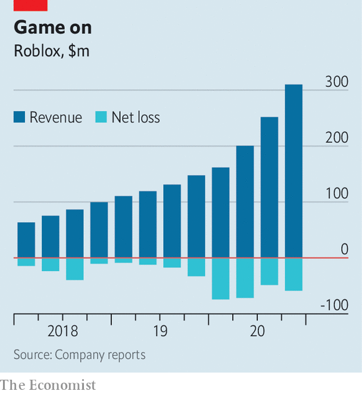

###### School’s out

# Will Roblox’s thriving virtual economy make it the next meme stock? 

##### Investors rush to get a slice of a firm whose games children love 

 

> Mar 9th 2021 


ONE PORTENT of a meme stock being born is when the company gets a pseudo-ticker on , an online forum on Reddit. Roblox, an American video-game platform, has earned the tag $SEARS. But Redditors aren’t mixing it up with a stodgy old department store. Roblox’s digital currency, Robux, sounds like Roebuck, of Sears Roebuck fame. Get it?


Roblox ticks other meme-stock boxes, too. The kids are into it, just as they were into , an ailing bricks-and-mortar gaming retailer whose share price has soared this year. Unlike GameStop, however, Roblox is all the rage with venture capitalists, Wall Street bankers and other supposedly hard-headed types. The firm’s private valuation soared from $4bn at the start of 2020 to $29.5bn in January, when it raised $520m. It is so flush with cash that it has decided to go public on the New York Stock Exchange via a direct listing, without drumming up fresh capital. Its shares ended their first trading day on March 10th 54% higher than the reference price, giving the firm a market capitalisation of $38bn.


Roblox provides sophisticated software tools to young, amateur developers. These creators—Roblox has 8m of them—produce multiplayer games and in-game merchandise for other youngsters. The company makes money by issuing Robux, which players buy with real dollars and spend on extras such as in-game experiences or avatar outfits and accessories. It keeps some of the revenue but forks as much as 70% over to developers in the hope of incentivising more and better content.


This, it hopes, will attract more players in need of more Robux. In 2020 Roblox’s developers collectively earned $329m; 300 individuals made $100,000 or more. The approach has fostered loyalty among developers. Creators like Alex Balfanz, a student who made millions and paid his college fees with “Jailbreak”, a hit game, plan to create for Roblox for a decade or more.


Use of Roblox soared after covid-19 cancelled school and real-world play dates everywhere. The site now boasts 20m gaming “experiences” that draw 37m daily active users globally. Three in four American children aged 9-12 are on the platform, as is one in two British ten-year-olds. In Roblox’s last fiscal year users bought and spent $1.9bn-worth of the currency.

 


Once the school gates reopen its rate of growth is, as Roblox has warned, likely to slow. By how much is anyone’s bet. Not that this will bother investors. Professionals like its growth story. Day-traders may like the meme-ness. Neither is much bothered about the firm’s net losses, which swelled to $253m in 2020 as it invests in expansion (see chart). As a result, Bernstein, a broker, reckoned that Roblox shares could fetch anywhere between $30 and $120 apiece when they started trading (they opened at $64.50).


Long-term success will depend on attracting an older audience. Roblox has penetrated the 8-15 age range. “Ageing up” is a priority for its co-founder and boss, David Baszucki. So is lifting the quality of games. Roblox’s exciting gameplay has pulled in a big audience but even ten-year-olds can see that the visual realism of many games is not up to the standard of professional studios. Still, Mr Balfanz argues that it will take just one big hit for Roblox to get traction with 20-somethings quickly.


Mr Baszucki touts other opportunities. One is China. Since 2019 Roblox has had a joint venture with Tencent. In December the Chinese gaming colossus received a licence to launch a local version of Roblox called Luobulesi. Another is advertising. Roblox largely eschews ads but in future wants the likes of Disney to build immersive, branded worlds on its platform.


Roblox holds interest for techies as well as investors. They want to see if the firm really is, as Mr Baszucki describes it, a shepherd for the “metaverse”, the idea of a persistent virtual world in which people meet, experience things together, make money and more. Futurists have speculated about such a possibility for years. The Roblox economy and its virtual music concerts, like one with Lil Nas X, a rapper, in November, could be a start. The company may look like child’s play, says Herman Narula, co-founder of Improbable, a virtual-worlds enterprise, but platforms like it may soon become “the primary way that many of us earn a living”. Perhaps. For the time being, it is likely to make tidy sums for its financial backers. ■

