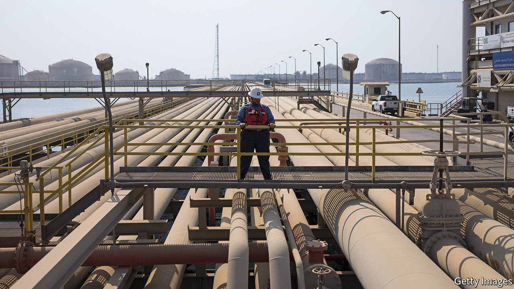
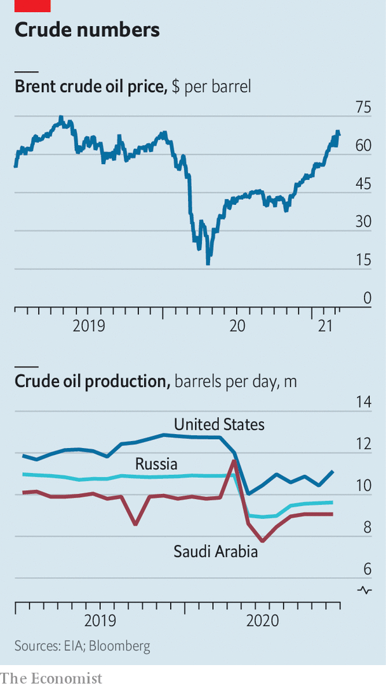

###### High and tight

# Oil markets prepare for lofty prices and restrained supply 

##### A failed attack on a Saudi refinery is only the latest event pushing prices up 

 

> Mar 8th 2021 


WHAT A DIFFERENCE a year makes. On March 6th 2020 Saudi Arabia and Russia  on a deal to restrain production. A price war ensued, with the two giants unleashing millions of barrels of crude just as covid-19 prompted lockdowns and demand dried up. Now Saudi Arabia and other producers are curbing output as demand rises. The price of Brent crude, the international benchmark, briefly climbed above $70 a barrel on March 8th for the first time since May 2019. It dipped a little thereafter, to $68 on March 10th.


The surge comes amid a broader  from copper to corn, as Chinese imports rise and supply remains constrained. But  has been particularly vertiginous. In April last year the price of Brent dipped below $20 a barrel and one American futures contract briefly became less than worthless. Since late October, however, Brent’s value has risen by nearly 100%. By the third quarter, analysts at Goldman Sachs, a bank, reckon it could reach $80.


Three successive events have helped jolt oil prices upwards this month. On March 4th the Organisation of the Petroleum Exporting Countries (OPEC) and its allies surprised the market by agreeing to extend production cuts to April. Then, on March 6th, America’s Senate passed a $1.9trn stimulus bill, which should boost economic activity in the country that remains the world’s most voracious consumer of oil. Fears of supply disruption have raised prices further. On March 7th Houthis (Shia rebels fighting the Saudi-backed government in neighbouring Yemen) tried to attack Saudi Arabia’s Ras Tanura, home to three giant oil-export terminals and a refinery that supplies a quarter of the kingdom’s fuel.

 


There was no damage to Ras Tanura, but the attack was the most significant since September 2019, when strikes briefly knocked out half of Saudi production. The latest attempt has rattled markets already anxious about America’s recent air strikes in Syria. In addition to the higher risk of disruptions to Saudi output, it looks less likely that America will quickly lift sanctions on Iran, a giant crude producer whose exports have been reduced to a trickle, smuggled out on ships with transponders switched off to evade detection. 


After the attacks in 2019 oil prices climbed briefly, note analysts at the Royal Bank of Canada, before subsiding amid confidence in ample supply. The market now looks much tighter. “‘Drill, baby, drill’ is gone for ever,” Abdulaziz bin Salman, Saudi Arabia’s energy minister, declared this month, referring to America’s shale industry. Texan oilmen may bristle at such a taunt, but investors will continue to rein in their capital spending. America may not reach its pre-pandemic levels of production until late 2023, reckons Rystad Energy, a research firm.


For now, OPEC and its allies look similarly restrained. Prince Abdulaziz remains particularly wary of raising production too soon. In addition to brokering the broader deal with OPEC and its allies, Saudi Arabia said it would extend its additional cut of 1m barrels a day through to April. Russia is slightly less cautious—it will increase output by a modest 130,000 barrels a day—but it has a new reason to keep prices up. Higher social spending means that the country now requires an oil price of $64 a barrel to balance its budget, up from an average of $51 in 2018 and 2019, estimates S&amp;P Global Platts, a data firm. 


For petrostates, there is a risk in keeping supply too tight. They want prices to remain high enough to balance their budgets, but not so high that they trip up the recovery in demand. The distribution of vaccines has hardly been smooth (though there are signs of progress: on March 4th more than 2.6m doses were administered in America). India’s oil minister, Dharmendra Pradhan, has asked OPEC and its allies to boost supply to lower prices and support the country’s economic recovery, a plea that has so far won little sympathy. The oil cartel meets again on April 1st. ■


 An earlier version of this chart had an incorrectly labelled scale. Sorry.

