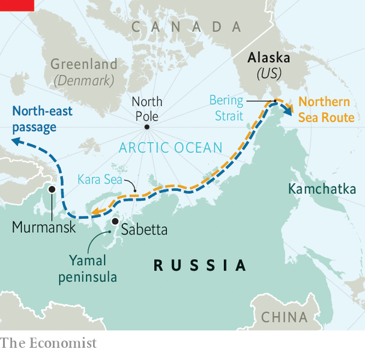

###### Polar silk road

# Warmer Arctic waters could turn the tides in LNG markets 

##### Russia begins to ship gas through the Arctic all the year round 

 

> Mar 11th 2021 


EXPLORERS TRIED for centuries to find a viable route through the Arctic to link Europe and Asia. ss Vega was the first to transit the north-east passage connecting the two, in 1879, but it was only in 1932 that a ship—the icebreaker A. Sibiryakov—made the trip in one go, without having to stop for the winter. What little commercial shipping there was along the route all but vanished after the fall of the Soviet Union. 


The discovery and extraction of vast liquefied natural gas (LNG) reserves on the Yamal peninsula in Siberia in the past decade has renewed interest in bulk transport on the waters of the high north. The warming of the Arctic, and the development of ice-strengthened tankers able to cleave their way through floes up to two metres thick, now make it possible to ship gas and other materials year-round, though especially cold winters may still hinder traffic. 


In January this year, thanks to a rise in Asian economic activity and high consumer demand, it was profitable for three vessels carrying LNG to travel between the Sabetta terminal on the Yamal peninsula and north Asian ports. As hydrocarbons begin their decline, Novatek, the Russian company that commissioned these shipments, is gambling on sustained or even growing demand from Asian and European markets. 

 


The three ships were new Arc-7 class tankers, with engines running on the same gas contained in their hulls. This makes them far less polluting than conventional ships powered by bunker diesel. Russia is especially nervous about maritime accidents after the 1989 Exxon Valdez disaster in Alaska, which was difficult to clean up and caused extensive environmental damage. Russian lawmakers raged against Nornickel, a miner of metals, after a diesel spillage last year, whacking it with a fine of 146bn roubles ($2bn)—the biggest environmental penalty ever imposed on a Russian company. If the Arc-7 ships did run aground or get crushed in the ice, there would be next to no slick and their cargo of LNG would evaporate.


Non-ferrous metals constitute some of the traffic along the Northern Sea Route (NSR), which runs from the Kara Sea to the Bering strait, but gas is fuelling the revival. And Novatek, which owns the LNG exploitation rights and infrastructure on the Yamal peninsula, is behind it.


Vladimir Putin’s government provided a leg-up to Novatek, including through generous tax breaks. These have accelerated Russia’s LNG capabilities. Novatek used to rely on Japanese expertiseto extract and compress gas in the extreme Arctic conditions. “Now Russia is fully self-sufficient in LNG technology,” says Alexander Sergunin of St Petersburg State University. 


Novatek’s main advantage is a much shorter sail to market. The NSR makes a voyage between some Asian and European ports about 4,000 miles shorter than the Suez canal route, saving an average of ten days at sea. New shipment hubs near Murmansk in the west, and in Kamchatka in the east, will further speed up conveyance. 


The idea is to use the Arc-7 tankers as ice shuttlesbetween Sabetta and these new hubs. Standard tankers, which are cheaper to build and operate, will then move the gas to customers. The distance between Murmansk and the big north European ports, and Kamchatka and the big north Asian ones, is about a quarter of the distance between the Middle Eastern LNG export hubs and the Asian or European hubs. Arild Moe of the Fridtjof Nansen Institute, a think-tank in Lysaker, Norway, notes that the Yamal peninsula could supply at least 70m tonnes of LNG a year by the end of the decade—almost as much as Qatar, the world’s biggest exporter, manages today. 


If the overseas bet does not pay off, there are always domestic consumers. Only 70% of Russia is on the gas grid. LNG is generally accepted as the preferred short-term replacement for diesel fuel in deep-sea cargo vessels. And the plastics and composites sector is growing, too. Russia is also working on a hydrocarbon diversification plan. Last year Alexander Novak, a deputy prime minister, launched a committee with big producers, including Novatek and Gazprom, to set the strategy. 


As for the route itself, container shipping currently attracts little interest. Because Russia imposes certain rules on transit through the NSR, ships must seek permission for passage. That annoys the Americans, who call for free movement in all waters. But the Panama and Suez canals are increasingly crowded; untenable tailbacks there, or a war in the Middle East, could perhaps tempt shipping companies north. By that time, Russia may have built a fleet of ice-strengthened behemoths. ■


For more coverage of climate change, register for The Climate Issue, our fortnightly , or visit our 

