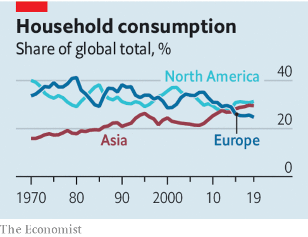

###### The transformation of retailing

# 21st-century consumers will change capitalism for the better 

##### New shopping behaviours should be welcomed, not feared 

 

> Mar 13th 2021 


AT THE DAWN of the 20th century the notion emerged that people were consumers, as well as being workers, neighbours and voters. These bag-carrying, stuff-accumulating shopaholics went on to transform the way the world works. Today you may tut at their hamster-on-a-wheel mindlessness and its environmental impact. Or you may celebrate their freedom to choose goods, experiences and ways of life. But you cannot dispute their economic and political clout. As we explain this week in our special report, a new species of shopper is emerging: less centred on America, more intent on ensuring that what they buy reflects what they believe, and technologically dexterous. This latest incarnation of the global consumer looks likely to change how capitalism works—for the better.


Today’s shoppers are no longer epitomised by Westerners stuffing mountains of groceries into the boots of their cars and loading up on monolithic, all-American brands. For one thing, they are increasingly Asian. Last year China and America were almost neck-and-neck as the world’s biggest retail markets. China’s two biggest online marketplaces, Alibaba’s Taobao and TMall, both do more third-party business than Amazon, the American juggernaut. Just as American consumers once popularised the shopping catalogue and the mall, now Asia’s shoppers are at the frontier of retail innovations, whether that is live-streaming, a store that sells a single book in Tokyo, or browsing by WhatsApp in India.


Another change is that all around the world the new shoppers are not just value-conscious, but also increasingly project their ethical and political values onto their decisions about what to buy. So, for example, they select firms on the basis of their environmental credentials and supply-chain standards. Shoppers are using their power to support trends from veganism to Xinjiang-free cotton. Fashion is increasingly conscious of its carbon footprint. Even Kraft Heinz, the hardest-nosed of Western food giants, is trying to rebrand itself as a force for environmental clean-up, as well as ketchup. It is a mistake to view these trends as mere virtue-signalling, or a fad. One way that capitalism adapts to society’s changing preferences is through government regulation and laws, which voters influence, at least in democracies. But the dynamic response of companies to the signals that consumers send is a force for change, too.

 


The final big change is digital—but not in the way you might think. Many people worry that dominant retail platforms like Amazon and Alibaba, reinforced by giant logistics networks, will snuff the life out of commerce, leaving shopping centres barren and destroying jobs. In fact the implications of technology, for producers and consumers, are more exciting and benign. More accurate and voluminous data about shopping patterns are breaking down the decades-long relationship between mass consumption and mass production. In its place is a more varied world in which the shopper can decide whether to buy online or in store, whether to shop via platforms or from individual brands, and whether to accept targeted ads or not. The store will not die, but producers and consumers will have a more direct relationship with each other. Increasingly, middlemen will be squeezed out of the supply chain. The boundaries between entertainment, communication and shopping will blur.


One result is a surge in creativity. Shopify, a Canadian-owned tech platform that gives brands the chance to bypass Amazon, sold $120bn of merchants’ goods last year, double the level of 2019. It hosts the first-ever sale by a first-time retailer every 28 seconds. In China Pinduoduo, an e-commerce firm started in 2015, may overtake Alibaba in its number of users this year, partly by enabling Chinese villagers to club together and buy groceries online. Companies like Nike are cutting their dependency on wholesalers and selling trainers via their websites and even vending machines. Giant retailers like Walmart are going “omni”—online and offline—and diversifying into new services for their digital customers. Even Amazon has opened its first cashierless grocery store outside America, in Ealing, in London.


The pandemic has boosted online retail, but make no mistake, the new generation of shoppers have yet to hit their stride. Worldwide e-commerce sales last year were $4.2trn. Consumer spending is above $65trn. The consumer was crowned king over a century ago but endless new aisles remain unexplored. ■

