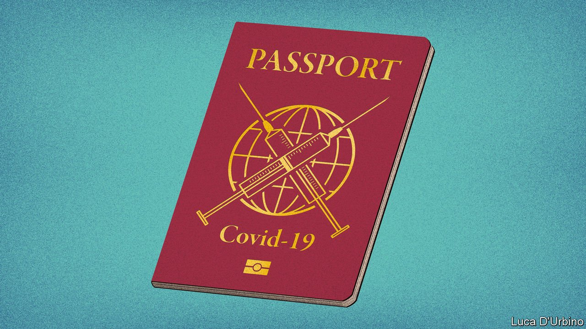

###### Needle to know

# How useful are vaccine passports? 

##### Identity schemes have a part to play in the return to life as normal, but only a modest one 

 

> Mar 13th 2021 


THE WORLD has stumbled through the pandemic by nationalising risk. In heavily infected countries the state has shut citizens in their homes for weeks at a time, letting them out only for exercise and to buy food. As vaccination spreads, and hospitals are less likely to be overrun, governments must gradually move choice back to the individual, where it belongs. How?


Information is part of the answer. This week the Centres for Disease Control and Prevention issued the first guidance on what vaccinated people can do. More is needed. True, covid-19 is still poorly understood and the risk for individuals will depend on their own circumstances. Yet, as our  in this issue explains, the data already cast some light on what puts you at risk if you are diagnosed with the disease. Age is closely tied to death, so do not visit your unvaccinated grandparents, however healthy they may be. Comorbidities can lead to a spell in hospital even for the young, so don’t imagine you are safe just because you’re under 35. More work like this will be needed for people to be able to make informed decisions about covid-19, just as they do in the rest of their lives.


There is a role for vaccine passports, too. America, Britain and the European Union are all studying how they might be made to work. Angela Merkel, the German chancellor, has spoken up for them. Israel, where vaccination is advanced, already has such a system.


Vaccine passports have their uses, especially in international travel, but at home they are unlikely to be as helpful as their supporters imagine. To see why, consider two extremes. When nobody is vaccinated, passports obviously serve no purpose. Yet, outside a dictatorship, they are not terribly useful at the end, when everyone who wants a jab has had one. If vaccines are free and widely available, unvaccinated people are choosing to risk infection. Those who cannot be vaccinated face extra risks from covid-19, just as they do from other diseases. Passports are most useful in the period when large numbers of people who want to be inoculated risk being infected because vaccine is scarce. That is also when passports are most unfair.


For international travel this window could remain open for years. Countries with a large tourism industry can use passports to help protect their people from visitors bringing in disease. Even if global vaccine distribution raises ethical questions, the passport system itself presents none that are new, because it is already established for diseases like yellow fever.


At home, however, the window may remain open for only a few months. Britain plans to have all adults vaccinated by the end of July. America will have enough doses to finish soon after. Even in Europe, where , a sweeping vaccine-passport system may not be worth the cost or the hassle.


Supporters argue that  are an incentive for people to be vaccinated. If they are well-designed, they need not pose a threat to personal data; nor need they become a platform that the state later uses to intrude into citizens’ general health. However, the more heavily passports are used as an incentive, the more they are oppressive. If you need one simply to get on a bus or buy a loaf of bread, you lose your choice to be vaccinated. Most employers should have no use for them. Better to encourage people to get a jab.


That leaves two reasons for passports at home. One is to enforce vaccination when infected people could harm those who have had their jabs in hospitals and care homes, for example—rather as some countries already require proof that those working with vulnerable people have no criminal record. The other is as an insurance policy against the possibility that boosters are needed, to deal with variants, say. Countries have often looked for magic solutions to stop the pandemic. The only one that promises to succeed is not passports; it is vaccines. ■


Dig deeper


All our stories relating to the pandemic and the vaccines can be found on our . You can also listen to , our new podcast on the race between injections and infections, and find trackers showing ,  and the virus’s spread across  and .

