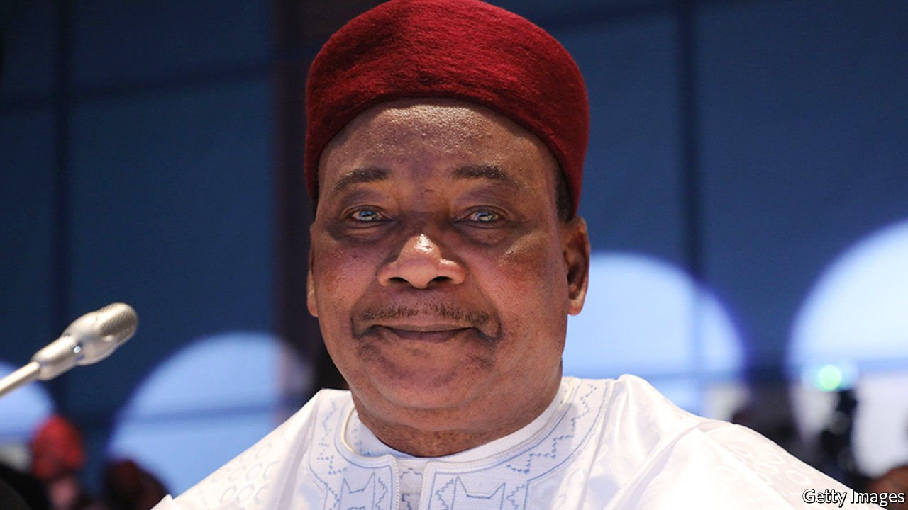

###### A gift seldom given

# Niger’s president wins the Ibrahim African leadership prize 

##### Mahamadou Issoufou is bowing out after two terms, but leaves a troubling legacy 

 

> Mar 8th 2021 


FEW PRIZES are as prestigious, or as seldom awarded. In 2006 Mo Ibrahim, a Sudan-born British telecoms billionaire, endowed an annual prize for good governance in Africa. It goes to a head of government who has run a sub-Saharan country well—and has left office gracefully when it is time to go. The winner receives $5m.


Alas, in the past 15 years Mr Ibrahim’s foundation has withheld the prize more often than it has granted it. Stepping down when constitutionally required to do is not hard, compared with what Nobel prizewinners for physics have to achieve. Yet depressingly few African leaders manage it. Since 2015 no fewer than 13 have sidestepped or weakened term limits to stay in power. That has narrowed the pool of potential Ibrahim laureates, who also have to have been democratically elected and demonstrated “exceptional leadership” while in office.


On March 8th a new winner was announced, the first since 2017: Mahamadou Issoufou (pictured), the departing president of Niger. The foundation cited his country’s progress in reducing poverty and spurring economic growth during his ten years in power. During this time the share of Nigériens who are extremely poor has fallen from about 48% to 40%. And although the country is ranked as the world’s poorest on a range of measures by the UN Development Programme, under Issoufou it has got more children into school and improved life expectancy. Between 2010 and 2019 GDP per capita increased by 16% in Niger, whereas in Africa as a whole it fell by almost 3%. Such progress is all the more impressive in a country that is caught between two —one in Mali to its west and another on its south-eastern border with Nigeria.


Yet Issoufou’s main achievement may simply have been his decision to leave office. In doing so he is responsible for Niger’s first-ever democratic transition of power. That alone is worth cheering in a country that has seen four successful coups since its independence in 1960.


The prize committee praised Issoufou, saying he has “championed African democracy and respect for constitutional rule in Niger and across the continent”. Critics sniped that picking him shows how low expectations have fallen.


Issoufou’s record on freedom is iffy. During a presidential election in 2016 his main rival, Hama Amadou, was locked up on the ludicrous-sounding charge of having smuggled babies from Nigeria for sale in Niger. Amadou denied wrongdoing and said the charges were trumped up, before jetting into exile in France. In his absence, a court in Niger sentenced him to a year in jail. He returned in 2019 to serve his time, but by then the government had changed the electoral law, banning anyone who had been sentenced to a year or more in prison from standing as a candidate.


With the main opposition candidate out of the race, the presidential election earlier this year was won by Mohamed Bazoum, a close ally of Issoufou. After the opposition alleged electoral fraud and protested against the result, the authorities cut off the internet and arrested Amadou, accusing him of instigating violence. At least two people were killed in clashes between the police and demonstrators.


Festus Mogae, a former winner from Botswana who now chairs the prize committee, points to insecurity and deep poverty in Niger and argues that neither he nor most winners faced such challenges. He argues that by stepping down democratically, Issoufou set a powerful example. “A seed has been planted,” he argues, which “will encourage the population to be more demanding of future leaders.” Even so, Mr Mogae concedes that Issoufou is “not on par” with previous prizewinners.


The aim of the Ibrahim prize is to encourage better governance, by offering honest, democratic rulers a comfortable retirement. In the past, by celebrating the likes of Nelson Mandela (an honorary laureate) and Ellen Johnson Sirleaf of Liberia, the foundation has indeed promoted the kind of leadership Africa needs. But this year’s award is more dubious. Where praise is not truly merited, it is perhaps better to withhold it. ■

