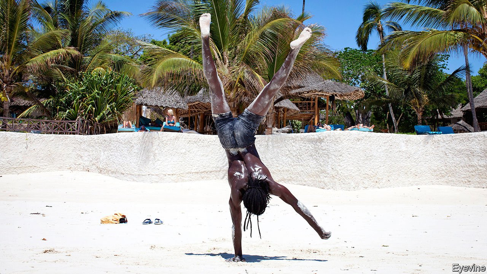

###### Keyboard surfers

# Remote working is a lifeline for Kenya’s beach resorts 

##### East African professionals are toiling by the sea 

 

> Mar 13th 2021 


ON BEACH BEDS under palm trees in Kenya’s Diani Beach, the usual throng of swimsuit-clad tourists dozing in the sun has been replaced by a more industrious crowd of laptop-bashers. Over the sound of the ocean comes the murmur of business jargon. Above the gurgling call of black-and-white colobus monkeys reverberates the cry of the anguished executive: “I’ll circle back by COB.”


When covid-19 struck, it dealt a grievous blow to Kenya’s tourism industry, which generates about 9% of GDP. With airports shut and many travellers in the rich world locked in their homes, the number of foreign tourists visiting Kenya slumped by almost three-quarters. Najib Balala, Kenya’s tourism minister, warned that the industry was on the verge of collapse.


Yet it has been thrown a lifeline from an unexpected source: urban Kenyans who were told to work from home, but instead chose to work from a beach house. Florin Iki, an artist and teacher, switched from teaching Italian and Spanish in person to doing so over the internet—from Lamu, an island on the north coast. “Nairobi is a very chaotic city,“ she says. “I could spend three hours in a matatu [minibus taxi] trying to get to work in time.”


The new working patterns are changing many things. Aurelija Juchneviciute, who owns the Heavenly Garden, a rental villa in Diani Beach, says that before the pandemic 90% of bookings were for short stays. Now 90% are long-term. The clientele has changed, too. Previously Kenyans made up only a fifth of guests. Now they are about half. When the first covid-19 lockdown was lifted, “a lot of people just escaped from Nairobi…to breathe,” she says. “Then they realise there’s good internet.”


Another change has been a jump in the number of visitors from other east African countries. These include Ugandans, who came to sit out violent presidential elections back home, as well as Ethiopians attracted by Kenya’s fast internet.


Local business owners who previously made a living selling to large hotels, or to visitors coming down on weekends, are now scrambling to supply the region’s new residents with fish, vegetables and even furniture. Local services are booming, too. Michael Wendo, a Diani-based yoga instructor, says he is now teaching regulars, rather than the occasional tourist. Telkom Kenya, a phone company, says internet subscriptions in the town have jumped by 50% since the lockdown was lifted. Not everyone is a winner. The region’s big hotels—with their high overhead costs—have struggled to compete with cheaper cottages and villas.


After the pandemic many of these trends may reverse. But some may leave more enduring cultural changes. For many years Kenyans would oscillate, along with economic cycles, between living in expensive cities, where there are jobs, and moving back to their ancestral villages, where costs are lower. Now they have a third option. One that offers kitesurfing, but not too much time with mum and dad. ■

