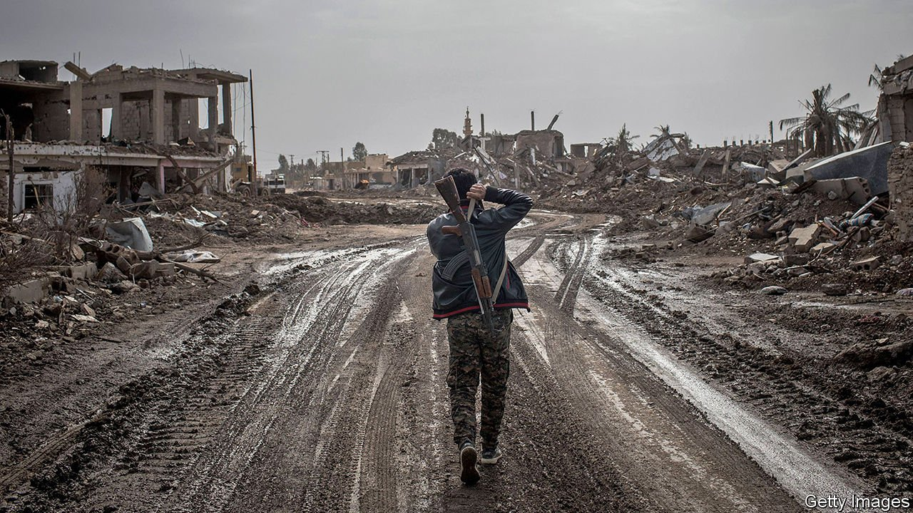
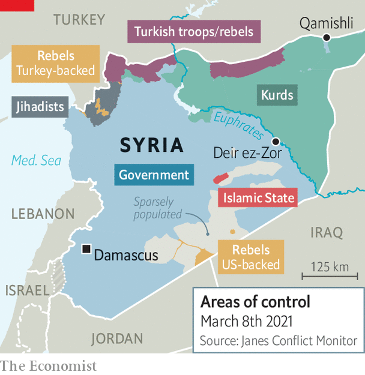
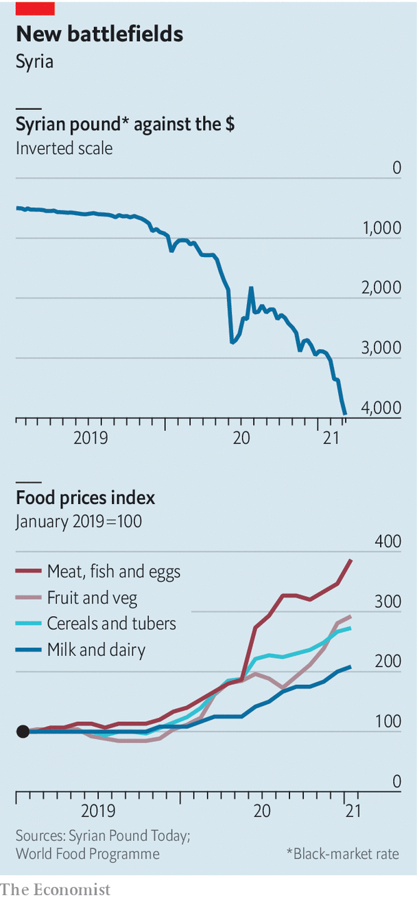

###### A country divided

# Ten years of war have broken Syria into pieces 

##### Will it ever be whole again? 

 

> Mar 13th 2021 


THE PRICE OF food has soared in Syria, leaving many of its people at risk of going hungry. Yet from his office in Qamishli, in the north-east, a trader describes how officials make it hard to bring wheat to market. His lorries must cross scores of checkpoints on their way to Damascus, the capital. Most demand fees. Kurdish forces charge by the tonne at the de facto border between the territory they control and that of President Bashar al-Assad.


On the other side the Fourth Armoured Division, controlled by the president’s brother, takes $3,000 per load. The trader must also bribe officials in Damascus and support government causes, lest he be detained as a terrorist. Sometimes the crossings are closed because one side wants to squeeze the other. It is easier and more profitable to sell wheat abroad, he says. “The politicians are starving the people.”


A decade ago Mr Assad launched a war on his people rather than accept their demands for democratic reforms. Hundreds of thousands have died in the conflict, which drew in foreign powers and destroyed much of the country. Half of the pre-war population of 22m has been displaced. Today a patchwork of agreements involving America, Iran, Russia and Turkey limits the fighting. Syrians travel the country to study, shop and visit relatives. But it is divided into enclaves, each with a foreign protector. Local administrations are becoming entrenched. They have their own militias, run their own economies and often favour one ethnicity or sect. “We’re seeing the Balkanisation of Syria,” says a UN official.


Mr Assad’s men have regained most big cities and hold around 60% of the land, up from around 30% in 2014 (see map). The Assad family has ruled Syria for over half a century. (Bashar’s father, Hafez, led before him.) A sham election in May or June, if it is held, would undoubtedly net the president a fourth seven-year term.

 


But these are pyrrhic victories. The Syrian economy is in worse shape than at any time in the past decade. The Syrian pound trades at about 1% of its pre-war value in dollars on the black market (see chart). Mr Assad’s government can afford to pay civil servants only $15 a month. Across the country people spend hours queuing for petrol. The causes of the crisis are many, including war, corruption, covid-related restrictions, American sanctions and the collapse of Lebanon’s banks, where rich Syrians stashed their cash. Mr Assad’s main allies in the war, Iran and Russia, offer little help—in part because they are suffering, too.

 


Mr Assad has no answers. In speeches he often ignores Syria’s big problems. It was announced that he and his wife, Asma, recently tested positive for covid-19. There has been a sharp rise in infections since mid-February. But only half of Syria’s hospitals are fully functional. And even the country’s vaccination plans are divided, with opposition groups negotiating separately with donors for jabs. Mr Assad seems more concerned with keeping his people, rather than the virus, in check. His snoops look for any hint of dissent. An otherwise-loyal journalist who wrote about hunger on Facebook was recently jailed.


Travel beyond the capital and Mr Assad’s government looks less in charge, even in the areas he nominally controls. Russian troops operate unchecked. Iranian-backed militias control the borders between regime-held areas and Iraq and Lebanon. Israel drops bombs on the militias from above. Syrians, meanwhile, look to their ethnic or sectarian brethren for the type of support that the government once provided. Druze tribes in the south, Arab ones in the east and even Mr Assad’s own Alawite sect on the coast increasingly fend for themselves. Clashes between groups are common. “If an Alawite comes here unarmed and alone, he’ll be killed,” says an Arab elder from Deir ez-Zor, in the east.


In the portion of Syria controlled by the Kurds, in the north-east, locals have ditched Arabic for Kurdish and the dollar is preferred. Syrians from outside the enclave seeking residency need a local sponsor. The Kurdish authorities do not like dissent either. Their forces hound critics and dragoon young people (Arabs included) into service. The region is suffering along with the rest of the country, but at least it has oil—and American protection. It sells the black stuff and wheat to Iraq. So the Kurdish administration in Syria can afford to pay salaries that are much higher than those in Mr Assad’s territory. Reconstruction material arrives from abroad. A plant refining vegetable oil opened last month, providing hundreds of new jobs.


Turkey has long feared that Syria’s Kurds would encourage its own Kurdish separatists. So since 2016 it has launched offensives inside Syria, taking its north-western corner and strips along the border. These areas have been largely cleared of Kurds and handed over to Sunni Arab rebels who share the Islamist leanings of Recep Tayyip Erdogan, Turkey’s president. Local officials are paid by Turkey, which also facilitates reconstruction. The territories use the Turkish lira and have been hooked up to the electricity grid that serves southern Turkey. A UN official likens the situation to northern Cyprus, which Turkey invaded in 1974 and still controls.


A more pragmatic Syrian president might have tried to cut deals with regional authorities, devolving power in an attempt to keep the country unified. But Mr Assad fears compromise will be taken as a sign of weakness, so instead he threatens more war. In speeches he has revived his father’s old tropes about the glories of Arab and Islamic civilisations—to the consternation of minority groups. State broadcasters denounce Syrians outside regime-held areas as terrorists and fifth-columnists. On March 1st the parliament in Damascus ratified a law stripping citizenship from anyone who fails to renew their identity card after ten years. It is aimed at those who have fled or broken free of Mr Assad’s rule. Many of them would like to return, but also want to see someone else in charge.■


For more about Syria, ten years on, read “” in our sister publication, 1843

