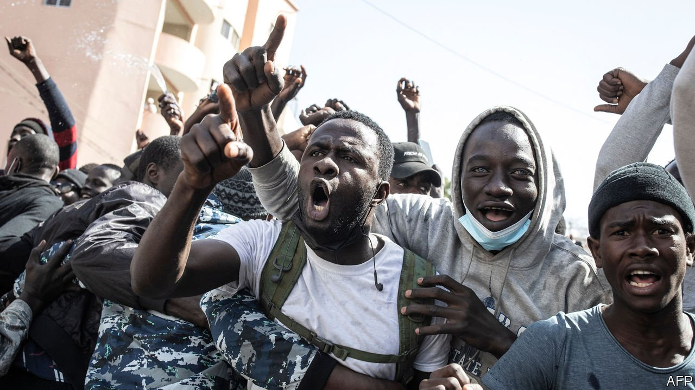

###### Botching the beacon

# The arrest of an opposition leader sparks protests in Senegal 

##### Demonstrators want to defend democracy and a two-term limit for the president 

 

> Mar 10th 2021 


STANDING OVER a smouldering barricade as riot police draw nearer, Mohamed Thiam, a protester in Senegal’s capital, Dakar, does not mince his words. Macky Sall, the president, “wants to impose a dictatorship”, he declares. “We will not accept it.”


Thousands of people took to the streets in Dakar and other cities after the police arrested Ousmane Sonko, the main opposition leader, on March 3rd. They battled the police, blocked roads and burned shops. For days after the arrest the smell of tear-gas wafted through the capital city.


Mr Sonko was arrested for public disorder while he was already on his way to court to answer a rape accusation (which he denies). The issue has sparked a fierce debate within Senegal. On the one hand are Mr Sonko’s supporters, who claim that Mr Sall uses the legal system to kneecap political rivals—two other opposition leaders have been jailed during his tenure. Mr Sall denies such charges are politically motivated. On the other hand are women’s-rights activists, who are angry that many Senegalese have pooh-poohed a rape allegation before it has been heard in court. Most of all, though, the violence has shaken the country’s status as a beacon of peace and democracy in the region.


Political violence is rare in Senegal, which has never experienced a successful coup or harsh authoritarianism. Although many demonstrators were peaceful, some hurled rocks at police, burnt tyres and attacked businesses, especially those linked to France, such as Auchan supermarkets, a French chain that competes with local shops, irritating their owners. At least eight people were killed in the clashes.


The government’s response to the protests was initially heavy-handed. Two television stations were suspended by the regulator for showing the protests “on loop”. Social media were throttled. Motorbikes were banned in Dakar. Near the courthouse in the capital police hurtled down streets in pick-up trucks, scattering protesters and blindly firing tear-gas. Worse, videos showed thugs in plain clothes shooting at protesters on March 5th.


Alioune Badara Cissé, a Senegalese official whose job is to calm conflicts, warned that the country was on “the verge of an apocalypse”. Senegal’s powerful Muslim brotherhoods publicly called for “peace and serenity”. Perhaps in light of this, on March 8th Mr Sonko was freed on bail, to the jubilation of his supporters. After his release he urged his followers to keep their protests peaceful.


This sudden eruption of violence in Senegal may have been caused partly by a build-up of frustration over the economy. In the six years before covid-19 struck, GDP was growing at 5% a year or more, among the fastest rates in Africa. But gains have not been evenly spread, with the rich capturing a disproportionate share of the growth. Even before the pandemic around one in five young people was unemployed.


This has created a well of resentment for Mr Sonko to tap into, with fiery denunciations of corruption and a feckless elite. As a revenue collector, he rose to prominence after exposing large tax-avoidance schemes. In presidential elections  he railed against France, the former colonial power, and condemned Senegal’s use of the West African , a common currency backed by the French treasury. Senegal has begun to vaccinate people against covid-19. But boosting economic growth and spreading its benefits more widely will be hard, especially since investors may be scared off by violence and arson.


The protests were also fuelled by worries about Senegal’s democracy, and fears that the constitutional bar against the president serving more than two terms would be flouted. Mr Sall has not ruled out running for a third term in elections in 2024. In 2016 he tweaked the constitution in a way that might let him do so.


Senegal has become less free. In 2019 the police arrested Adama Gaye, a journalist, on charges of offending the president with unflattering posts on Facebook. He was held for more than a month and has since gone into exile. In presidential elections that year, the constitutional council barred 19 candidates from running. Among them were Karim Wade, the son of a former president, and Khalifa Sall (no relation of the president), a former mayor of Dakar. Both had previously been convicted of corruption, but opposition activists say the law was invoked selectively to exclude them. Freedom House, an American think-tank, said the pair’s exclusion had marred the election. It changed Senegal’s rating from “free” to “partly free”.


Calm was restored after Mr Sonko’s release, but Dakar is still on edge. The Movement for the Defence of Democracy, an opposition coalition, has called for more demonstrations on March 13th. Mamadou Diouf, a 22-year-old student watching the protests, says the stakes are high. “Everyone fighting there today”, he says, “is fighting for their future.” ■

