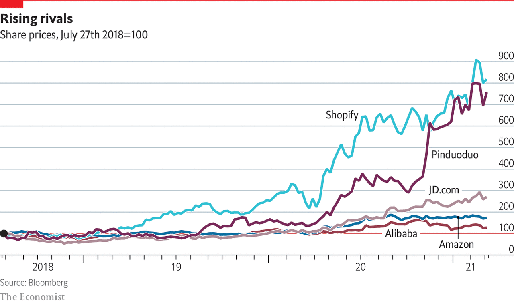

###### The marketplace

# E-commerce profits may become harder to make 

##### The Amazons and Alibabas are not as impregnable as they might seem 

 

> Mar 11th 2021 


THE E-COMMERCE company that retailers talk about most these days is neither Amazon, the American juggernaut, nor Alibaba, China’s biggest. It is Pinduoduo (PDD), a Chinese firm that started in 2015 as an online food supplier, but whose success has driven its market value above $200bn. Last year it was China’s fastest-growing internet stock, rising by 330%. 


PDD attracts attention for two reasons. One is its business model. David Liu, vice-president of strategy, explains that it has ridden the rise of smartphone penetration in China to create an e-commerce experience in which people club together to buy products from robot vacuum-cleaners to bananas. During the pandemic this has expanded into a fast-growing business across thousands of towns and villages, in which PDD’s users gather to bid for shipments of local farm produce at bargain prices. Some term this “community group-buy”. Mr Liu calls it “interactive commerce”. It is one of the hottest parts of the Chinese internet. 


The second is the way PDD has shattered the myth of an impregnable fortress surrounding the titans of online shopping. Until a few years ago, China’s e-commerce market seemed a two-way contest between Alibaba and JD.com, a rival platform. No longer. Elinor Leung of CLSA, a brokerage, expects PDD’s share of online retail in China to overtake that of JD in 2021. She expects the number of users to surpass Alibaba. And although PDD shells out huge subsidies to entice customers from poorer parts of China to its app, she thinks it may turn profitable this year.


Remarkably, it has done this less by displacing its bigger rivals than by tapping parts of the market they have been unable to reach. Although online sales of groceries have rocketed during the pandemic, less than a tenth of the 8.1trn yuan ($1.25trn) farm-produce market is bought and sold digitally. “We are continuing to grow the pie,” says Mr Liu. That lesson applies elsewhere too. However sewn up a market looks, there is opportunity for upstarts because e-commerce is at an early stage of development. 


The issue of competition in China has convulsed share prices because of the actions of antitrust authorities. In November 2020 the State Administration for Market Regulation published draft guidelines for platform companies aimed at maintaining orderly competition. In December enforcement of the 2008 antitrust law was strengthened, leading to new investigations and fines. These have included scrutiny of mergers and acquisitions, community group-buy schemes, price-discounting and discrimination against competitors. Ms Leung wrote in January that the chance of a forced break-up of Chinese internet platforms is remote, because of its impact on industry, the economy and consumers. But she expects more regulation, especially over customer data.

 


Robin Zhu of Bernstein says the crackdown means tech platforms may have to restrain aggressive sales practices such as selling goods at huge discounts. That may reduce growth, but jobs and innovation plus their support for consumer spending argue in their favour. Alibaba seems the biggest target, but PDD has also drawn fire. Alibaba is flying “closest to the sun”, Mr Zhu suggests, partly because of heat on its sister company, Ant Group. But he says up to a fifth of China’s retail sales flow through its doors. Chinese regulators stress their support for the platform economy, he notes, so a crackdown is unlikely to be devastating. 


The rampant competition in China’s retail market suggests no platform, however large, can expect fully to dominate it. Alongside PDD, Alibaba, JD and Meituan, a food-delivery firm, all target China’s lower-tier cities with community group-buy and other schemes. Alibaba’s Taobao Live platform has led the growth of live-streaming and video, in which influencers sell branded goods at huge discounts. But the explosive live-streaming market has attracted vigorous competitors, such as Douyin, sister to TikTok, a global social-media app. WeChat, part of a super-app owned by Alibaba’s rival Tencent, allows brands to sell on its site, and gives customers instant access to digital payments. Everyone is jostling for a share of online advertising. This is especially true in live-streaming, where it is easy to measure the bang for an advertiser’s buck through real-time data, says Michael Jais of Launchmetrics, a fashion-and-beauty analytics company. 


In Europe and America, by contrast, the view is that the game has been won by Amazon. The gap between Amazon’s e-commerce market share in America and that of Walmart, the next in line, is far bigger than Alibaba’s lead over the number two in China. Though Bernstein’s Mark Shmulik reckons Amazon earns little profit on its core retail business, its fast-growing cloud and online-advertising arms generate huge margins that it can plough back into retail expansion. It had $42bn of cash on its balance-sheet at the end of 2020. Marc-André Kamel of Bain, a consultancy, says Amazon may spend $100bn more on information technology over the next five years than each of the world’s top ten traditional retailers. It will also continue to invest heavily in logistics, putting more pressure on the likes of UPS and FedEx. 


Like Alibaba in China, Amazon has drawn regulatory heat. In October 2020 a congressional committee in America said it was looking at overhauling antitrust laws to counter the power of the big tech platforms. It drew attention to the dominance that Amazon has over third-party sellers on its marketplace, and its practice of selling its own goods in competition with them. In November the European Commission accused Amazon of violating competition laws by using non-public data from third-party sellers to benefit its own retail business.


Amazon says none of this is true. Although it stands tall online in America, by total sales Walmart is larger. Amazon dominates categories like books, but in groceries it is one of many. Trustbusters may have their eye on how it sells products on its website to compete with those sold by third parties, but this is little different from big retailers selling own-label products. Amazon also has political capital. Brian Nowak of Morgan Stanley says the jobs it provides, its support for small and medium-sized firms, and its technological prowess may all work in its favour.


The recent decision by Jeff Bezos, Amazon’s founder, to hand the chief executive job to Andy Jassy will not end the regulatory fire. But if the pressure rises, it could spin out Amazon Web Services, the world’s biggest cloud-computing company. As in China, as long as the pie is growing, new challengers may emerge. Some will come from big tech. Many online retailers pay Facebook and Google for their products to be found via search. Online advertising remains the strongest part of their businesses, but Facebook and Google are adding sales channels. Facebook has 160m small firms on its site. In 2020 it let them set up a single online store on its app and on Instagram, its sister platform. Last year Google scrapped commissions for retailers selling directly from its site.

 


Another source of competition will come from changes in online shopping. Smartphones may overtake personal computers in America and Europe for e-commerce. That will boost the popularity of “social commerce”, or commerce via social media and video. TikTok, a medium for promoting brand awareness, may let its most popular celebrities market products on its site, according to the Financial Times. The battle will extend to logistics and payment services. In America Amazon delivers more of its own parcels than the US Postal Service. But rivals like Walmart are developing subscription services like Amazon Prime that offer free delivery and other perks. 


Tax is another threat. In both East and West, tax authorities have their eye on the digital giants. In 2020 Amazon saw a big increase in its tax liability, yet the administration of Joe Biden is considering imposing higher taxes on America’s most profitable companies. European governments are levying digital-services taxes on tech firms in an effort to force them to pay more where their consumers are located. Some have drawn attention to the low business rates that e-commerce platforms pay on out-of-town warehouses, compared with those of retailers on the high street. Even China plans to raise taxes on its biggest tech firms. 


Ultimately, higher taxes, greater regulatory scrutiny and rising competition may make profits in e-commerce harder to come by. But even if they end up regulated like utilities, few will shed a tear. The e-commerce giants have had a fabulous run so far. ■

