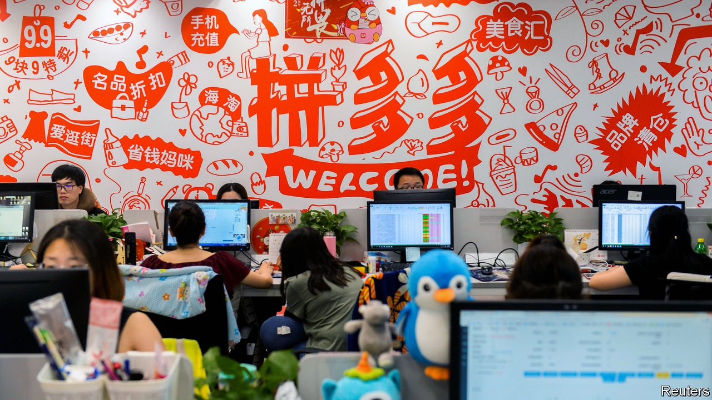

###### The travelling salesmen

# Independent retailers may choose multiple sales channels 

##### Alternatives to big tech are flourishing around the world 

 

> Mar 13th 2021 


THOUGH AMERICAN and Chinese tech platforms started the e-commerce gold rush, one Canadian company realised early on what money was to be made from selling shovels. That was Shopify, which supplies tools such as software, logistics and payments to allow firms to set up their own online stores rather than selling via giant platforms like Amazon. Its value, at $175bn, is only about a tenth that of Amazon. But in the past five years its share-price rise has outstripped that of “The Everything Store” more than tenfold. 


Harley Finkelstein, president of Shopify, is an evangelist for small retailers. Shopify’s more-than-1m merchants range from $1bn-plus brands like Allbirds to tiny startups that make their first sale on its platform every 52 seconds. Yet he believes that consumers will be the big winners from the transformation of retail, giving them more influence over how and what they buy. Not since John Wanamaker set up one of America’s earliest department stores in 1876, he says, has there been such a shift in favour of the customer.


Shopify may be the biggest e-commerce firm that most people have never heard of. Mr Finkelstein says it is “arming the rebels” by enabling independent retailers to survive and thrive via multiple sales channels, from Amazon to social media to bricks-and-mortar stores. Yet it is not the only fifth columnist. Across the world, regional platforms are competing fiercely to avoid American and Chinese dominance.


In Japan Amazon and Rakuten, a local e-commerce veteran, are in a battle for market leadership, but Softbank also plans to merge Yahoo Japan, an online shopping site in which it has a big stake, with Line, a messaging app, to make it a three-horse race. Amazon also has designs on South Korea via a partnership with 11street, owned by a local telecoms giant. But the market, led by Coupang, an online platform, is highly competitive. The South Korean affiliate of eBay, a big American platform, may be up for sale soon, making the contest fiercer still.


The Chinese tech giants Alibaba and Tencent have e-commerce stakes in South-East Asia via holdings in Lazada and Tokopedia, and Sea, respectively. In India, though the bulk of retailing still takes place in corner shops called kirana, e-commerce is a battle between Amazon, Flipkart (owned by Walmart) and JioMart, owned by Reliance, a conglomerate, with backing from Facebook, the American social-media giant. The Western firms are not just vying for a share of India’s vast retail market. They also want to learn how best to entice new smartphone users in emerging markets to shop online. That means more voice search, because of the plethora of local languages, as well as more video, says Leigh Hopkins, Walmart’s head of international strategy.


In Europe Amazon dominates, but marketplaces selling other people’s goods such as Berlin-based Zalando and Manchester-based Boohoo are mounting challenges. In Latin America Alibaba is the model, not Amazon. Buenos Aires-based Mercado Libre, the market leader in the region, does not sell its own products, unlike Amazon. Like Alibaba, it has a strong digital-payments arm. Yet Amazon is strong in Mexico, where it goes head to head with Mercado Libre, and competition between the two is growing in Brazil. Amazon is named after the country’s longest river. So far its business in Brazil does not live up to the name. But that is a rare exception. 

