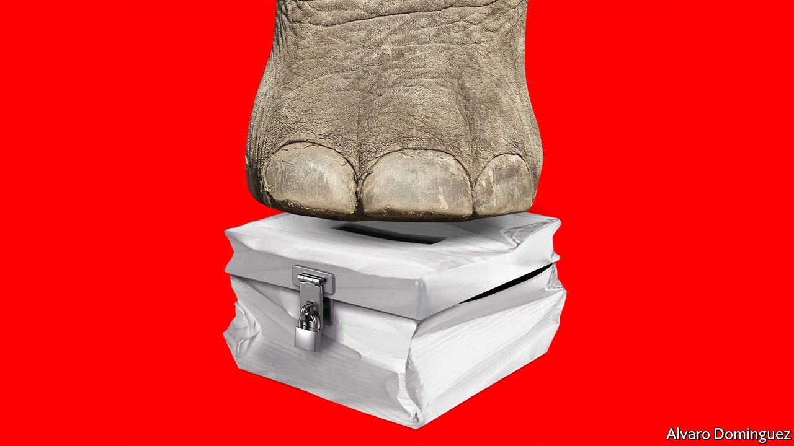

###### Heads we win, tails you cheated

# America’s battle over election laws 

##### The conflict over democracy has escalated since Donald Trump’s exit from the White House 

 

> Mar 13th 2021 


AFTER THE Republicans lost the presidential election in 2012, a period of gloomy introspection set in. The party commissioned an excoriating report. “Devastatingly, we have lost the ability to be persuasive with, or welcoming to, those who don’t agree with us,” it declared. The lesson the Republican Party learned from 2020 is different. There has been no comparable period of inquiry. Instead, the party has found another culprit for its disappointments—widespread election fraud—that it is now committed to rooting out.


Instead of commissioning an autopsy, the Republican National Committee has formed a committee on election integrity. “That is the number-one issue,” says Allen West, the chairman of the Texas party. “I think all Republicans are united on election integrity.” Proven voter fraud is vanishingly rare, constituting an estimated 0.0025% of all votes cast. Nevertheless, in Texas and almost every other state, Republican legislators have introduced 253 bills this year to tighten voting rules with the aim of eliminating fraud.


Donald Trump remains in charge of the Republican Party. “He is the leader of the conservative movement. He is the leader of the America First movement. And I truly hope that on January 20th, 2025, he’s once again the leader of our country,” says Jim Jordan, a Republican congressman from Ohio. The vast majority of Mr Trump’s supporters—81% according to polling by YouGov—still believe his claim of a stolen election. Voters and activists agree that changes to voting laws are necessary. “They want to be sure we have good, clean, solid elections and, and there’s no hanky-panky,” says one county Republican chairman in Texas. The logic is circular. To revive confidence in elections, which Mr Trump almost singlehandedly undermined during his presidential campaign, Republicans must now change the election rules.


In Georgia, where Republicans were embarrassed by losing the presidential race and both Senate seats, they are close to passing laws that would require photo ID in order to vote by post, eliminate no-excuse absentee voting, limit the time when secure drop boxes can be used and move back the deadline for requesting an absentee ballot. Most controversially, their proposal would also disallow early voting on some Sundays. This might seem curious for a fraud-prevention measure, as there is no convincing evidence that fraud is more likely on the Lord’s day than on others. It does so happen, however, that Sundays usually see heavy turnout for Democratic-leaning black voters, because they head to ballot boxes en masse directly after church. On Sundays 37% of early voters in the state are black, compared with just 27% on other days.


The effort is most extreme in states where Republicans have recently lost federal elections but still control state government. In Arizona where, as in Georgia, Republicans have complete control of state government, 22 separate bills have been filed aimed at restricting voting in various ways. One measure would require all absentee ballots to be notarised. Another would require them to be returned in person, rather than through the post. Those on the permanent early voting list who did not vote in four consecutive elections would be removed from it, according to another proposal. Two bills would bar automatic voter-registration and registering to vote on the same day as an election—redundantly, since neither practice actually exists in the state.


Knife-edge elections have become more common in America. Even marginal changes in voter behaviour—suppressing opponents’ turnout by a percentage point, or slightly boosting that of sympathisers—could thus prove decisive. So far, however, it has proved difficult to game the results so neatly. Back in 2012, when voter ID rules were becoming fashionable, a senior Republican in Pennsylvania got into trouble for publicly saying that new rules in the state would “allow Governor Romney to win” the state. Mr Romney lost to Mr Obama by a not-particularly-close five points.


Contrary to Democratic doomsaying, which often equates the passage of vote restrictions with certain electoral defeat, political scientists who try to assess their impact often find no clear partisan effect. This is partly because turnout is a volatile and noisy indicator. If black turnout declines when Barack Obama is no longer at the top of the ticket, it would be wrong to attribute the whole of the drop-off to a recent vote restriction. “The effects of these laws are difficult to detect, and relatively small in terms of direct effects,” says Bernard Fraga, a political scientist at Emory University and a leading scholar on the subject. He notes that restrictive measures may generate lots of attention and activism, resulting in a counter-mobilisation boosting turnout among those affected—the sort seen in successful Democratic efforts to register black voters in Georgia.


Recent research by a squad of political scientists examined whether unrestricted absentee ballots benefited one party by considering a natural experiment. In Texas, 65-year-olds need no excuse for requesting an absentee ballot, whereas 64-year-olds do. Although the researchers found a modest increase in turnout, as expected, they found “at most a muted partisan effect” in the final election tallies.


State lawmakers assume otherwise, though. In 2019 Republicans in Pennsylvania joined Democrats to pass a sweeping law, known as Act 77, that created no-excuse mail-in voting and extended deadlines for registering to vote. The working theory then was that easier absentee voting would increase turnout among elderly voters, who lean Republican. Then came the election in 2020, when Mr Trump insisted that mail-in voting was used to commit massive fraud and steal his victory. Republicans in the state have now introduced legislation aiming to repeal Act 77.


“What we identified was the no-excuse mail-in votes, specifically, had been targeted and had been exploited,” says Mike Puskaric, a Republican state representative who voted for Act 77 in 2019 and introduced the legislation seeking its repeal. Mr Puskaric alleges that activists registered homeless people at 25 or 50 addresses and then collected ballots from them; that solar-powered video cameras monitoring drop boxes for ballots failed; and that the results were marred because there were 205,000 more mail-in ballots received than requested (the Associated Press wrote in December that this allegation was false).


The fact that it is hard to tailor election rules to favour Republicans does not mean that doing so is harmless, though. “It’s fundamentally anti-democratic to restrict the franchise. This is classic democratic backsliding,” says Lee Drutman, a prominently pessimistic political scientist. The efforts also reinforce the belief that Democrats can win elections only through the fraudulent votes of dead people or illegal immigrants, conspiracies that further corrode belief in democracy.


The second area of concern is practical. Republicans are experimenting with voting-rules changes that, as with state-level experiments to develop increasingly arduous abortion restrictions, may eventually yield a winning formula. Courts have constrained the most egregious schemes. Before it was struck down as unconstitutional, one law in Kansas required not merely a driving licence, but a passport or birth certificate in order to register to vote. “It’s going to be a lot tougher to bring that kind of challenge against something that just makes voting harder, but not necessarily altogether impossible,” says Dale Ho of the American Civil Liberties Union (ACLU), who led the case against the Kansas law.

Nation states


Few developed countries have such devolved, and therefore disparate, election rules as America. Local discretion means that in a state like Vermont a felon can vote while still in prison, but in a state like Mississippi he may not ever recover the right after his sentence is complete. This enduring localism results in a recurring pattern, notes Alex Keyssar, a historian at Harvard. The battle over voting rights has always proceeded in fits and starts, with the federal government repeatedly stepping in to correct for perceived inadequacies in state administration. After the civil war Congress passed the 15th Amendment, finally guaranteeing the right to vote for African-Americans; the modern regime of the Civil Rights Act and Voting Rights Act was installed at the end of Jim Crow.


The contemporary example of this pattern is a bill proposed by Democrats known as HR 1, which seeks to harmonise state voting rules and pre-empt the ongoing Republican efforts to modify them further. “The project of the modern Republican Party is not to compete on the merits of its unpopular policy ideas, but rather to disenfranchise large swathes of the American electorate,” argues Mondaire Jones, a Democratic congressman from New York. “This bill is their public enemy number one.”

 


HR 1, which passed the House of Representatives on March 3rd on a straight party-line vote, contemplates sweeping changes to election rules. The bill would require states to allow universal mail-in voting, 15 days of continuous early voting (to avoid Sunday shenanigans of the Georgian variety) and automatic voter-registration. It would also limit the use of voter-ID requirements. Felons would be allowed to vote after serving their sentences.


If passed, the legislation would stop most Republican efforts to change state rules for federal elections. It is unclear whether any of these changes would actually damage Republican chances of winning, for the same reasons that it is hard to discern the effect of changes to state laws. But a relatively unremarked-on provision, to abolish the practice of partisan , would be immediately consequential.


The ambitions of HR 1 do not end there, however. The 791-page bill devotes roughly half of its attention to reforming campaign finance, including the creation of a public-financing scheme for matching small-dollar donations at a generous rate of six to one which, however well-intentioned, could be called ancillary. Other provisions fall a bit short of guarding sacrosanct voting rights. The ability of paid political operatives to collect sealed absentee ballots and return them en masse (which critics call “ballot harvesting”) would be enshrined in the law, for example. The ACLU, though a long-time champion of expanding access to voting, has objected strongly on free-speech grounds to some of its disclosure rules on donations to non-profits.


The largest obstacle to HR 1, now that it has passed the House, will be the . If the bill is stalled, that would uncomfortably recall the filibusters of southern Democrats, who tried to stop the civil-rights bills of the 1960s. Advocates who wish to break the filibuster once and for all, or at least make it less obstructive, think that the legislation will be their best opportunity to do so. The weight of all the extraneous and questionable measures may hamper their argument, however. A skinnier bill aimed solely at curtailing efforts to restrict the vote would stand a better chance of becoming law.■


Dig deeper


 (Mar 2021)

 (Mar 2021)

 (Mar 2021)


We are also  in its first 100 days

