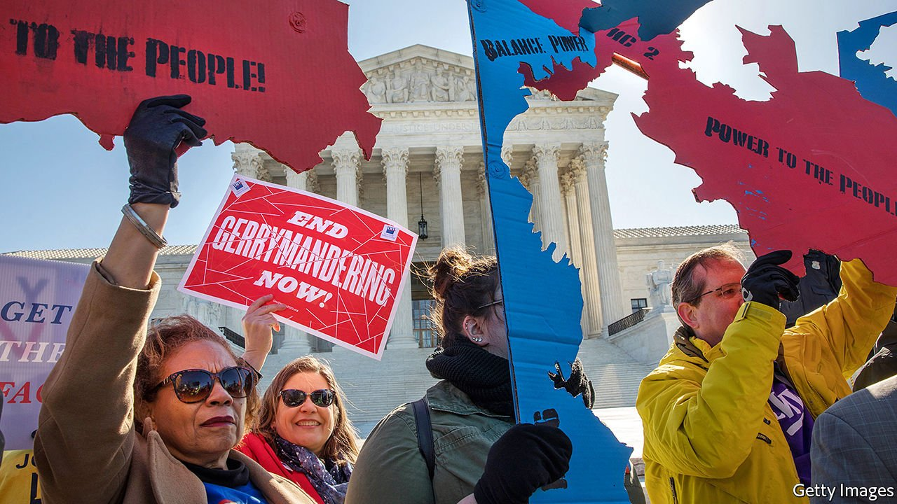

###### House that?

# How the 2020 census may help Republicans regain power in Washington 

##### Reapportionment, gerrymandering and the Supreme Court could help the Republicans take back the House 

 

> Mar 13th 2021 


EVERY TEN years the Census Bureau attempts to track every person in America. The count, required by the constitution, is inherently democratising, for each individual sees themselves reflected in a countrywide sum of inhabitants. Among other things, the resulting numbers in each state are used to divvy up federal tax dollars and draw boundaries for congressional districts, a process known as apportionment. But this year, because of complications from covid-19, the numbers will be late. The bureau has announced that the apportionment estimates will not be released until September, whereas they would usually be sent out in March.


The delay will complicate redistricting plans in almost every state. Most have deadlines to pass new plans for congressional and state legislative districts by the end of the year. But drawing new boundaries will be hard in this compressed time-frame. In many instances, the delay raises issues that will have to be resolved in court. But when state legislatures do eventually get round to drawing maps for their states, lawmakers around the country are poised to tilt the scales towards the Republican Party—just as they did last time.


To begin with, the reapportionment of congressional seats is likely to favour Republicans nationally. According to Election Data Services, a political consulting firm that specialises in redistricting, Texas and Florida, the biggest Republican states, are poised to gain three and two seats in Congress respectively. California, New York and Illinois, all Democratic strongholds with declining populations, are each likely to lose between one and two seats. This alone could tilt the balance of power in the House of Representatives—which Democrats controlled by a slim four-seat majority after last November’s elections—towards Republicans, if mapmakers in the South have their way.


This is reminiscent of the redistricting battles of 2011. After the Tea Party movement swept Republicans to power across America in 2010, the GOP used its dominance of the process to pack Democratic voters into fewer districts than they deserved based on their share of the vote. Republicans were able, for example, to pass a plan that gave them nine of 13 House seats in North Carolina and a 13 of 18 in Pennsylvania, even though voters in both states are, in effect, evenly split between Democrats and Republicans.


The Brennan Centre for Justice at the New York University School of Law found that this process of drawing biased districts, referred to as “gerrymandering,” won Republicans at least 16 more House seats than they would have won if the maps had been fair. Democrats also engage in gerrymandering, but are less blatant about extracting advantage; the Brennan Centre estimates that they redrew the congressional map in Maryland to gain only one more seat than they should have got.


In Texas, Florida, North Carolina and Georgia redistricting is controlled by the states’ Republican-dominated state legislatures. In the past, this one-party rule over redistricting gave rise to claims that the states’ plans were drawn to dilute the power of racial minorities or of Democratic voters. In all four states, challenges to state or federal districts after reapportionment in 2011 made their way through the judiciary; in Texas, Florida, and North Carolina, the courts upheld the complaints and ordered mapmakers to draw new, fairer maps before the next elections.


When the previous round of gerrymandering took place, there were still some restrictions on how contorted mapmaking could be. But in 2013 the Supreme Court struck down the portion of the Voting Rights Act (VRA) of 1965 that required a number of southern states to receive “pre-clearance” from the federal government before implementing new state and congressional district boundaries. The decision in Shelby County v Holder held that section 4(b) of the VRA was unconstitutional, since it was based on data that were 40 years old and was preventing states from exercising power over their own elections, a power given to them by the constitution.


Given the relaxing of restrictions on gerrymandering across the South; the near-certainty that these states will gain an extra six congressional districts after the census release; and their unified Republican control, it is not unreasonable to think that Republicans could simply draw themselves the extra five seats they need to take back the House of Representatives in the 2022 mid-term elections. The Brennan Centre also considers South Carolina, Alabama and Mississippi to be at high risk of passing partisan gerrymanders.


Were the Republican Party to gain a majority while receiving fewer votes than their opponents, that would be the third time in 50 years the House had a Republican majority that received fewer votes than the minority (an advantage not enjoyed by Democrats since 1942). That would add to the impression that what a majority of Americans vote for—and what they actually get—are two different things.■

