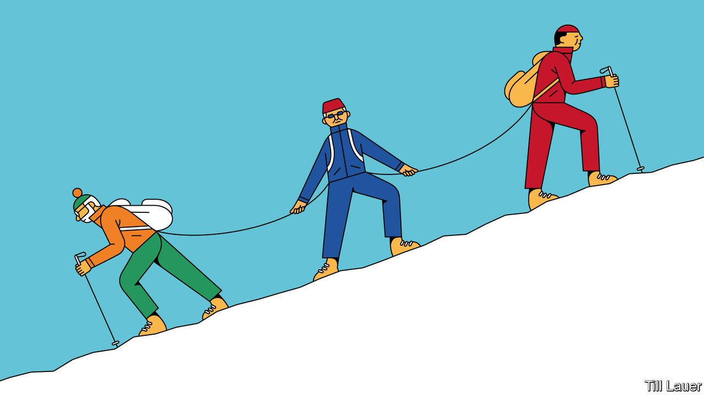

###### Banyan

# China and India take opposite approaches to a crisis in Nepal 

##### China is meddling, whereas India is taking an uncharacteristic step back 

 

> Mar 20th 2021 


DIRT-POOR, landlocked and squeezed between two overweening neighbours, Nepal needs political stability more than most countries. Yet only turmoil has reigned since the prime minister, Khadga Prasad Sharma Oli, dissolved Parliament in December.


Mr Oli took that step amid feuding with his arch-rival in the ruling Nepal Communist Party (NCP), Pushpa Kamal Dahal, a former guerrilla known as Prachanda (“the fierce one”). The party was formed in 2018 through a merger of Mr Oli’s Communist Party of Nepal (Unified Marxist-Leninist) and Prachanda’s Communist Party of Nepal (Maoist Centre). Prachanda seems to have expected a stint in charge. Yet Mr Oli enjoyed being prime minister too much to hand over to him, so Prachanda’s partisans joined calls for a no-confidence motion that Mr Oli was likely to lose. The dissolution aimed to avert that.


In February, however, the Supreme Court ruled the move unconstitutional and ordered that parliament was to be reinstated—leaving Mr Oli’s position shakier still. Then, in early March, in a ruling guaranteed to shatter any remaining comity within the NCP, it declared the party’s name invalid. (The judges said it had already been registered by yet another left-wing party.) The NCP has in effect split back in two.


The differences are not ideological. Prachanda long ago abandoned Maoist revolution, signing up to representative government following the abolition of the monarchy in 2008. He backed a new constitution in 2015 that promised to devolve power to the provinces. Mr Oli was once inspired by leftist revolutionaries in India and spent 14 years in jail for his part in the murders of landlords. Today he embodies the conservatism of the big landowners and the elites of Kathmandu, the upland capital. He has withheld much of the constitution’s promised devolution, especially from the lowland Terai region. He espouses a kind of Hindu nationalism, declaring that the god Rama was born in Nepal rather than in the city of Ayodhya in India, as most Indian Hindus believe. Mr Oli’s friendship with China is an expedient response to past meddling by India’s government, rather than an expression of solidarity with the Chinese Communist Party.


What happens next is hard to say. Mr Oli hopes for the support of the second-biggest opposition party, Janata Samajbadi Party Nepal. It may co-operate, but only if it secures the release of one of its MPs, who is serving a sentence for his part in the deaths of seven policemen during violent protests in Terai in 2015. As for Prachanda, he hopes to persuade several Unified Marxist-Leninist MPs to cross to his camp; but in a Monty Pythonesque twist they insist his party drop its Maoist tag. The biggest opposition party, Nepali Congress, is biding its time. Its veteran leader, Sher Bahadur Deuba, might ally with either Mr Oli or Mr Dahal—provided he becomes prime minister.


The uncertainty unsettles Nepal’s giant neighbours. Yet India, for once, is not interfering, says Amish Raj Mulmi, author of “All Roads Lead North”, a history of Nepal’s relations with India and China. As the historical hegemon and Nepal’s biggest trade partner, India has a habit of meddling. In 2015 its prime minister, Narendra Modi, backed the people of the Terai in their complaints that the new constitution gave them less representation than they had been promised. He cut off Nepal’s supply of fuel, nearly all of which comes from India. The brusque move pushed Nepal further into China’s arms. India has learned its lesson: it recently sent its army chief on a conciliatory trip to Kathmandu.


Under President Xi Jinping, meanwhile, China has become meddler-in-chief. Its promises of big investments in electricity, roads, telecoms and a railway make Nepalis worry about a growing dependency. China has pressed Nepal to rein in the Tibetan exiles living there, while Chinese undercover agents have organised the deportation of dozens of Chinese nationals. China’s selfless Communist Party has even trained Nepali cadres in Xi Jinping Thought.


Above all, senior Chinese officials have thrust themselves between the ruling party’s warring factions. Some Nepalese denounce that as an unconscionable intervention—and a mockery of China’s much-ballyhooed tenet of non-interference. To Mr Mulmi, however, it reflects clumsiness: China has “put all its eggs” in the basket of the NCP and is now scrambling to stop them being scrambled. By contrast, by doing little, India is handling the crisis more deftly.

