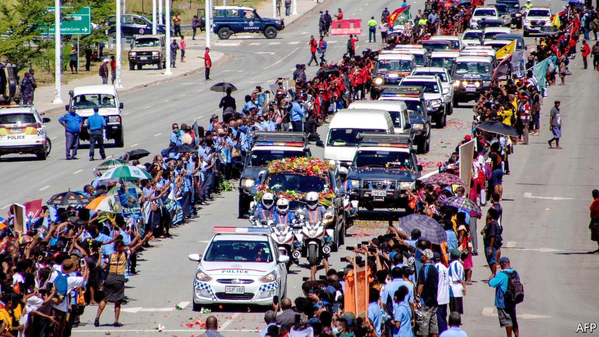

###### Mourning sickness

# Covid-19 is sweeping through Papua New Guinea 

##### No one knows how many cases there are because there is so little testing 

 

> Mar 20th 2021 


ALL ACROSS Papua New Guinea, people have been gathering by their thousands at haus krai events (wakes, in the local pidgin) for Sir Michael Somare, their first prime minister. In a country divided by rugged topography, around 800 distinct languages and a weak state, he was a unifying figure. But even as grief has swept the nation in the three weeks since his death, so has covid-19. In fact, the commemorations may be contributing to the outbreak.


Official statistics suggest that the pandemic has inflicted no more harm on the 9m people of Papua New Guinea than it has on the 5m people of New Zealand, with barely 2,000 recorded cases and a few dozen deaths. But more than half of those cases have come in the past month. Moreover, PNG, as the country is known, has one of the lowest testing rates in the world. Health authorities in the Australian state of Queensland, who recently processed 500 swabs from PNG, found that half were positive—an alarmingly high proportion. The prime minister, James Marape, says the surge in cases is “staggering” and that a quarter of the population may be infected.


The centre of the outbreak is the capital, Port Moresby, but cases have been reported in 19 of PNG’s 22 provinces. The disease may have spread from the Indonesian part of the island of New Guinea, which has recently suffered a surge in cases of its own. Two provinces near the Indonesian border, Western and West Sepik, have the most known infections after Port Moresby. But covid-19 is being reported in even the most remote and inaccessible regions, including in the jagged highlands and at the opposite end of the country from Indonesia, on the islands of New Britain, New Ireland and Bougainville. 


PNG is poorly equipped to deal with the outbreak. The median age is only 22, which helps a lot. But many locals suffer from other illnesses that increase their covid risk, such as diabetes and tuberculosis. The country has only 500 doctors, fewer than 4,000 nurses and no more than 5,000 hospital beds. At least 60 staff at the biggest hospital, Port Moresby General, have tested positive.


The outbreak is causing alarm not just within PNG, but in neighbouring Australia. The Torres Strait islands of northern Queensland are separated from New Guinea by a channel of just 4km. An emergency was declared last week at a hospital in the city of Cairns in northern Queensland, in part owing to a spate of infections detected among Australian workers returning from a mine in PNG.


Australia, at least, has the resources to curb infections. It plans to start a vaccination drive in the Torres Strait islands next week. It is also sending doctors and donating vaccines to PNG. But PNG has another porous maritime border to the east, with the Solomon Islands. That country’s 650,000 people have made it through the pandemic with just a few imported cases and no local transmission. But they are probably even less equipped than PNG to deal with an outbreak. ■


Dig deeper


All our stories relating to the pandemic and the vaccines can be found on our . You can also listen to , our new podcast on the race between injections and infections, and find trackers showing ,  and the virus’s spread across  and .

