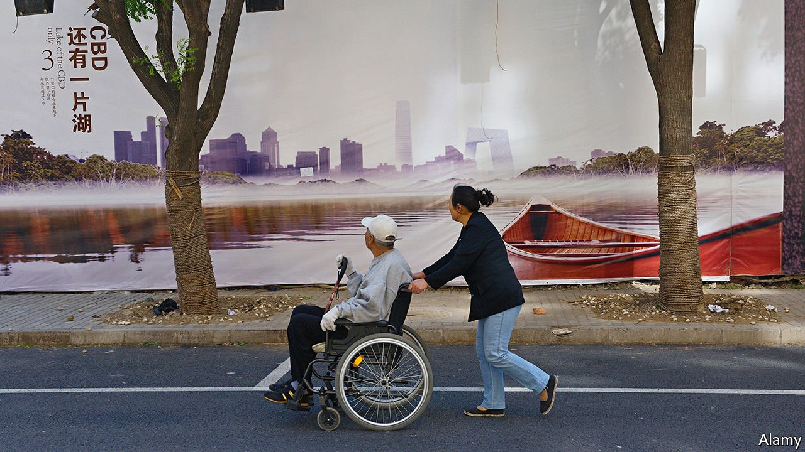
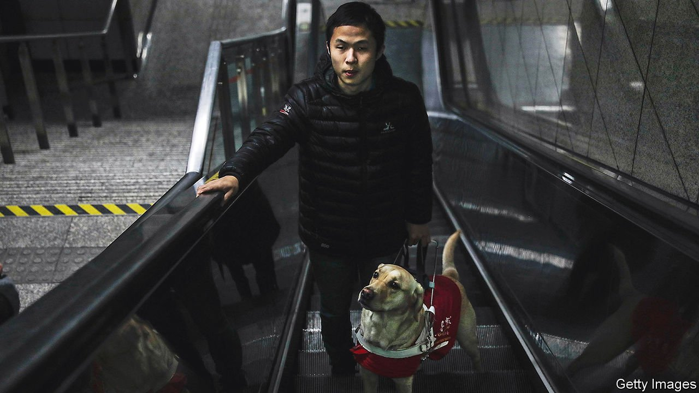

###### The unseen

# Campaigners in China struggle to improve the lot of the disabled 

##### Long ostracised, growing numbers of disabled people are demanding their rights 

 

> Mar 20th 2021 


FEW PEOPLE relish a visit to the dentist. For those who are autistic, it can involve unusual torment—some people with the condition have extremely sensitive mouths. Most of China’s autistic people avoid going. But bad teeth can also make them miserable. So last year the Shenzhen Autism Society, an NGO in the southern Chinese city, launched an attempt to make dental treatment less scary for some.


The programme has helped about 45 autistic people aged between four and 40 to conquer their fears. Participants have been encouraged to engage in pleasurable distractions while waiting, and to spend time getting comfortable in the dentist’s chair before procedures begin. With younger ones, their parents’ mouths are sometimes examined first. One nervous father summoned up the courage to undergo a treatment that his son needed, too. Watching this encouraged the autistic boy to allow the same to be done to him.


In China, such grassroots efforts to improve the lives of the disabled are rare. But NGOs—though severely restricted by the government in many other spheres—are being allowed to do more in this one. Their involvement is badly needed. The government is also doing more to help. Yet it does not recognise as disabled many of those who would be officially regarded as such in rich countries. In 2011, when China’s most recent available census data were published, over 85m people—about one in 16—were classified as disabled (including 21m who were deaf and 13m blind.) That compares with one in five in Britain and one in eight in America. Unlike in the West, China’s definition of disabled does not cover those with chronic illnesses. It also excludes many people who have use of their limbs, but struggle with routine tasks.


Of those who meet the census definition of disabled, far fewer than half have the government certificates that are needed to obtain disability support such as reduced medical fees and tax breaks. And even among people with the required documentation, only 12m (around one-third) last year received the living allowance to which the disabled with low incomes are entitled. That is striking given that many of the 85m people counted as disabled are poor. Three in four live in rural areas.


Under Mao, people tried to treat mentally disabled people by reading to them from the chairman’s works. Later, when the government decreed that couples could have only one child, parents of a disabled child were allowed a second baby—implying that a disabled life had less value. (The two-child policy introduced in 2015 also makes such an exception.)


But among officials and the public, prejudice is fading. In 1988 the government set up the China Disabled People’s Federation (CDPF), a charity. It boasted star power: until 2008 its head was Deng Pufang, the paraplegic son of Deng Xiaoping, the late Chinese leader and initiator of the one-child policy. The younger Mr Deng broke his back during the Cultural Revolution after he fell from a window while being tormented by Red Guards. Working alongside him at the CDPF were others injured during those years of mob violence.


The federation encouraged the adoption in 1990 of China’s first law on protecting disabled people. The bill said they should enjoy “equal and full participation in society and their share of its material and cultural wealth”. The CDPF also campaigned successfully against the then-common use by officials of the word canfei to mean disabled (its two characters mean “disabled” and “useless”). It promoted the less pejorative term, canji (ji denotes a medical condition).


Improvements are evident. In 2008 less than two-thirds of disabled children aged six to 14 were being educated. Last year 95% were. In 2012 a quarter of working-age Chinese certified as disabled had jobs. By 2018 this rate had doubled. In 2008, just before hosting the Paralympic games, China ratified the UN Convention on the Rights of Persons with Disabilities. Japan did so in 2014 and America still has not.


In education, two particular developments have been celebrated by campaigners for disability rights. The first was the adoption in 2015 of a regulation allowing disabled students to take the gaokao, or university-entrance exam, with “reasonable” adjustments including test papers in Braille and extra time to finish. Two years later this dispensation was also applied to those taking the zhongkao, the exam for senior secondary-schools. In 2018 the parents of a pupil with cerebral palsy won a case against the education bureau of Xiamen, the coastal city where he lives. The court ruled that the bureau had been wrong to deny some of his requests for special dispensations in the zhongkao.


The second development was a decision in 2017 to encourage mainstream schools to accept disabled students. This ended a long-standing policy of segregating them. But the impact of these measures has been limited. Of 9m people admitted to mainstream universities in 2019, just 12,000 were disabled, or one in 750. By contrast, one in five students in America report having a disability.


Universities can still exclude candidates for many subjects for medical reasons. For instance, the visually impaired may not study agronomy, law or medicine. A partially deaf student cannot study journalism or diplomacy. Schools for the disabled take some autistic children. But half are not in school at all. Parents of non-disabled children often object to desegregation. In 2018 a kindergarten in Guangzhou, near Shenzhen, was reportedly pressed by officials to expel an autistic child following allegations, disputed by teachers, that he had hit other children. Soon after, the mother killed herself and her son.


In employment, huge barriers also remain. Firms with more than 30 staff are required to give at least 1.5% of their positions to the disabled. But they worry that hiring them could harm their image. A survey in 2011 by the CDPF revealed that more than 90% of companies preferred to pay a fine. After bigger fines were imposed on more profitable firms in 2015, some companies began adding disabled people to their payrolls—paying basic wages and making social-security contributions but giving them no work. This illegal practice has been facilitated by agencies that demand high fees from disabled clients who get the sinecures.


The public sector sets a poor example. In 2011 Yirenping, an advocacy group in Beijing, found that only 0.4% of civil-service jobs went to disabled people. (In Britain’s civil service, about 10% call themselves disabled.) As in education, they are often barred by medical requirements. But in 2017 a woman with monocular vision sued an education bureau in Zhejiang province for refusing her a teaching licence because of her disability. She won the case last year, on her third attempt. In 2018 hearing-impaired teachers in Sichuan complained about being barred from teaching at a school for the deaf (they had failed an oral exam). Soon after the province began experimenting with the use of sign language in tests. In a few disputes, local branches of the CDPF have begun to help negotiate on behalf of plaintiffs.

Broader horizons


Blind people in China are still often shunted into jobs as masseurs or piano tuners. Recently, however, the CDPF has been encouraging them to try other work. It has publicised the case of Ma Yinqing, a visually-impaired 26-year-old in Shanghai, who has set up a business that employs blind people to record audio books. This year she plans to start a podcast in which blind guests chat to her about their lives. The federation has also drawn attention to Sun Chenlu, a paralysed beauty vlogger who live-streams from her wheelchair (her account has 26,000 followers). Opportunities for the mentally disabled, though, are very rare. Cao Jun set up a car-washing business in Shenzhen in 2015 to employ such people, his son among them. His idea has been replicated in two dozen cities with the support of NGOs or local offices of the CDPF. “My aim is to get rid of the donation box,” says Mr Cao. He returns all tips.

 


Cities have been trying to make public spaces more accessible to the disabled. Beijing did so with great fanfare in 2008, the year of the Paralympics, spending 600m yuan ($88m at the time) on the project. But Li Dihua, an academic in Beijing, takes students on field trips around the capital in wheelchairs to help them understand why they see so few disabled people on the streets. He shows them tactile paths for the blind that are broken by manhole covers or blocked by trees, bus stops or roadside magazine stalls. Han Qing, a disabled-rights campaigner in the central city of Zhengzhou, says sticking to paths would “almost certainly cause you to fall”. In 2019 a disabled activist died while inspecting barrier-free facilities in Dali, a southern city, after his wheelchair fell into an underground car park. Chen Xiaoping, another campaigner, died in January while manoeuvring her wheelchair by a pedestrian crossing in Shenzhen.


Only in the past decade have some cities begun allowing the blind to take guide dogs onto metros (Shanghai did so in 2014, see picture). But only about 200 blind people have them—training dogs is costly. This month Chinese media have reported on a woman in Shanghai who was harassed by neighbours for letting her guide dog urinate in her residential compound. One threatened to poison the animal.


Such incidents prompt more public hand-wringing than in the past, and some officials take note. Shenzhen wants to show it can be a model. In 2019 it became the first city to set a target date for becoming barrier-free: 2035. It offers China’s most generous handouts for disabled children—up to 50,000 yuan ($7,700) a year until they reach 18. Most cities stop paying when a child is seven. But Shenzhen still denies local household-registration, or hukou, to disabled migrants. Without it they cannot enjoy subsidised public services, or receive all of their disability benefits.


Still, Shenzhen’s officials are becoming more open to advice. And disabled people there are becoming more assertive, says Xin Junhui, the head of a lawyers’ group in the city that offers free services to them. More are using city hotlines to complain about inadequate facilities for the disabled, often with success. And despite the crushing of many NGOs under Xi Jinping, China’s leader, those helping the disabled are growing in strength, says Amica Ho of the University of Hong Kong. They have their work cut out. ■

