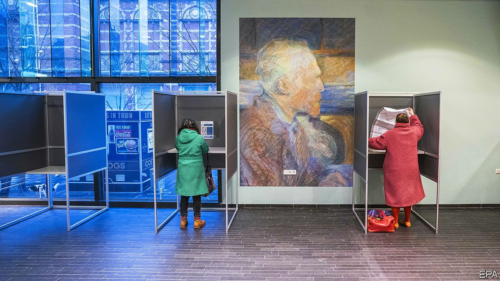

###### Suddenly Sigrid

# A Dutch election boosts both pro-EU liberals and the far right 

##### Yet the centre-right prime minister, Mark Rutte, is still likely to form a government 

 

> Mar 20th 2021 


DUTCH POLITICS are absurdly complicated. The Netherlands has a proportional representation system with no minimum threshold (most EU countries have one at 5%), ensuring a large number of parties and a constant churn of new ones. Voters are more evenly divided than ever between them. The prime minister, Mark Rutte, a brilliant and imperturbably cheerful tactician, has nonetheless managed to stay atop the heap for ten years, through three ruling coalitions. Last year he was hit with the covid-19 pandemic and with a child-benefits scandal that forced his government to resign just two months before an election. Yet there was never much doubt that when the votes were counted, he and his centre-right Liberal (VVD) party would again come in first. Preliminary results after the ballot on March 17th showed that the VVD had won 23%, well ahead of any other party.


Second place, however, was a big surprise: D66, a left-leaning, liberal pro-European party. Its leader Sigrid Kaag, the current trade minister, is a former UN diplomat who presented herself as a candidate to become the Netherlands’ first female prime minister. D66 won 15%, one of the best results in its history. For his part, Mr Rutte moved towards the centre during the campaign, imitating left-wing parties’ rhetoric on social policy. And with the exception of the populist right, every party emphatically backed strong climate policies. For a country that spent last summer leading Europe’s “frugal” club of countries opposed to greater fiscal integration and nearly torpedoed the bloc’s €750bn ($900bn) covid-19 relief fund, the election may signal an important shift.


Mr Rutte owes his victory partly to approval of his handling of covid-19. The Netherlands has not done very well—infection rates have been higher than in peers like Germany and Denmark, and track-and-trace and vaccination programmes have been slow. But most voters seemed not to mind, while others blamed the health minister, a Christian Democrat. During the campaign most of the opposition avoided the issue. As for the child-benefits scandal (in which the tax authority financially ruined thousands of parents over false accusations of fraud), it was not the VVD leader but the head of Labour who quit over his role in the affair.


Yet even for the teflon-coated Mr Rutte, forming a coalition will be difficult. Between 15 and 17 parties have made it into parliament, depending on the final count. Together, the VVD, D66 and the Christian Democrats have exactly half the seats. But the Christian Democrats’ vote share fell to just 10%, from 13% in the previous election. Their leader, Wopke Hoekstra, currently finance minister, had been billed as a contender for Mr Rutte’s job but ran a clumsy campaign with no clear theme. They may prefer a spell in opposition to rebuild their strength, making Mr Rutte’s task harder.


The populist right split into more parties, but grew overall. The Party for Freedom (PVV), led by the anti-Muslim firebrand Geert Wilders, had hoped to finish second but settled for third with 11%. A smaller far-right party, Forum for Democracy, grew to 5%, while a new one, JA21, won 2%. All are considered untouchable by the major parties. On the left, Labour, the GreenLeft party and the far-left Socialists were pummelled, each winning 5-6%. Mr Rutte is unlikely to want more than one of them in his cabinet.


That leaves the great swirl of small-to-tiny Dutch parties. They often forecast trends that take longer to materialise in other countries. Four years ago the arrival of Forum for Democracy seemed to augur a new wave of alt-right populism, but that party fractured in November over racism and anti-semitism. The Party for the Animals, the world’s first animal-rights party to win parliamentary representation, got 4%. Identity politics is going strong: DENK, a party representing Dutch Muslims, won 2%. Meanwhile Volt, a new pan-European liberal party that runs in every country in the EU, rose in the polls in the final weeks of the campaign and won 2%.


The VVD’s turn to the centre and the success of D66 suggest the next Dutch government may be a tad less parsimonious in future EU fiscal debates. But much depends on which parties join the coalition. In 2017 forming a government took over six months. Mr Rutte says the covid-19 crisis requires more urgent action, and wants speedy negotiations with D66 and the Christian Democrats. But Ms Kaag wants to bring in more parties on the left. She will be happy to take her time. ■

