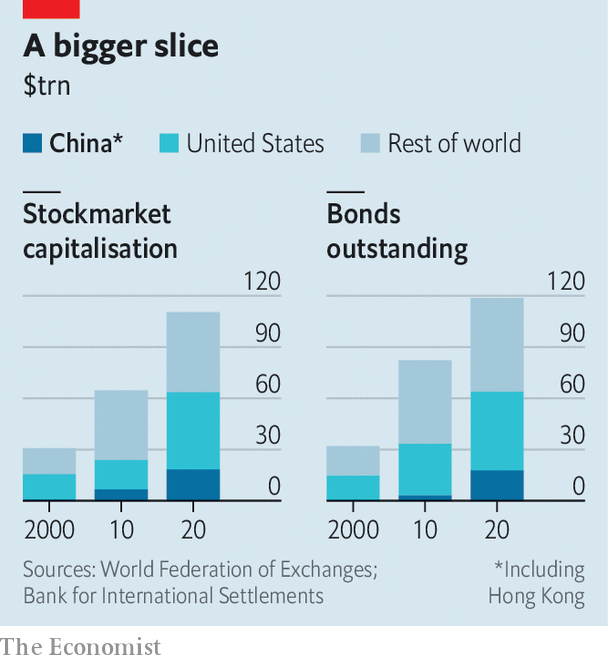
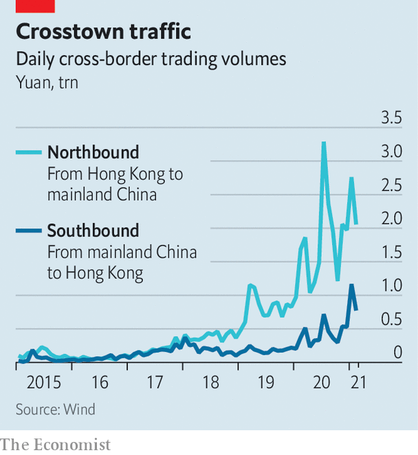

###### Over the great wall

# China’s markets are shaking off their casino reputation 

##### Can foreign firms actually win? 

 

> Mar 18th 2021 


IN A WORLD where internet memes can explain market swings, China is second to none. Early in March, with mainland equities down by 15% in two weeks—their steepest fall in years—a video circulated on Weibo, a microblogging site, of a sheep stuck in a fence on a hill and a hiker climbing up to free it. The description of the video, in its meme incarnation, was “the national team comes to rescue me”. The national team is shorthand for big state firms that are believed to stabilise the market by buying shares when they plunge.


This video, though, had a twist. The hiker frees the sheep, only for it to lose its footing and tumble down the hill. Talk of the national team’s rescue mission had spread for a few days, but equities continued to tumble, wiping out all gains made since late last year.


At last, on March 9th, the national team really did arrive. State media reported that large state-owned insurers had bought stocks. Coincidentally or not, that heralded the market bottom. For casual observers of Chinese finance it all fit a familiar pattern: stocks careening from boom to bust, propelled by day traders and rumours, and the government eventually restoring calm.

 


But to those inside the market, the story was in fact more novel. The decline in Chinese shares neatly paralleled the decline in the NASDAQ, America’s tech-heavy stock index. Guan Qingyou, a prominent Chinese economist, argued that the underlying trigger was nervousness about inflation in America. A resulting jump in American bond yields had sparked risk aversion globally and hit China hard. Foreign investors, who had helped fuel China’s equity rally last year, retreated. Reacting to the same signals, big domestic fund managers also rushed to pare their holdings.


The sell-off, in other words, furnished evidence about two important areas of progress in China’s capital markets: they are both more professional and more interwoven with global finance than before. At the same time, incessant talk about the national team was a reminder of the idiosyncrasies of finance in a state-dominated economy—idiosyncrasies that matter ever more to the rest of the world.


Just five years ago no analysis of finance in China was complete without a detailed look at shadow banking. Formal banks were too strictly controlled to satisfy borrowing needs in the fast-growing economy. Stock and bond markets were underdeveloped. So between the cracks, lightly regulated institutions cropped up, willing to lend to anyone with collateral—especially property developers and miners.


Banks, despite their conservative exterior, had a big hand in shadow financing. They got around caps on deposit rates by funnelling savings into opaque “wealth-management products”, a chunk of which flowed through the shadow firms. Some of these products offered yields of over 10%. Yet they enjoyed informal guarantees from the state-owned banks, making investors think that they were as safe as deposits. The shadow-banking industry grew to 28.5% of banks’ total assets in 2016.


Around that time a series of messy defaults alerted regulators to the dangers. They began a campaign to unwind the shadow financing. They forced trust companies to hold more capital. They stopped banks from offering guarantees on wealth products. And they opened the door to a new professional fund industry, pressing banks to launch formal wealth-management subsidiaries, rather like asset-management groups in developed markets.


Banks are barred from investing in equities but the new divisions face no such rules. They cannot, however, offer guarantees. Contracts specify that in a downturn investors will face losses. Some banks’ wealth units manage their own funds; others team up with outside managers. Much of the money flows into the stockmarket.


The ubiquity of mobile payments has given ordinary people another route to funds. With a few taps users of Alipay or WeChat Pay can choose from hundreds of products. China’s 100m or so retail punters have long believed that they can beat professional investors. But that sentiment has shifted over the past two years and many are now buying into mutual funds at record pace, says Desiree Wang of JPMorgan Asset Management. Much as retail investors have been vocal on social media about the performance of individual stocks, they now debate, laud and criticise the performance of the country’s top fund managers. 


Funds are also becoming more sophisticated. Since the global financial crisis a stream of Chinese nationals has returned to Hong Kong and Shanghai from London and New York, bringing a new set of skills, says Louis Luo of Aberdeen Standard Investments, an asset manager. Funds once limited to plain-vanilla active management have brought in specialists to launch quantitative and absolute-return funds.


These trends have been magnified at China’s big mutual funds. Three of the largest mutual-fund companies—China Asset Management, E-Fund and Southern Asset Management—have each surpassed 1trn yuan in assets under management. The rate of growth at mutual funds and at the banks’ wealth-management arms is projected to take professionally managed assets in China from around 96trn yuan ($14.7trn) in 2020 to 244trn yuan in 2029, or near the current size of the asset-management industry in America.


Part of that is a hedge-fund industry with Chinese characteristics. Regulators forbid the short-selling of individual stocks. But scores of big investment managers have emerged, with portfolios that encompass global and domestic assets as well as private and public markets. Operations at China’s hedge funds are increasingly similar to those in global financial centres, says Gokul Laroia of Morgan Stanley, a bank. The biggest is Hillhouse Capital Management, run by Zhang Lei, with about $70bn under management. Some are based offshore with a focus on China like Himalaya Capital, run in Seattle by Li Lu, once seen as a potential successor to Warren Buffett. Investors in China pay close attention to their decisions. When it was revealed last year that Mr Li had upped his stake in Postal Savings Bank of China, scores followed his lead. Shares in the bank, long derided as a stodgy state lender, have doubled in price since October.

Hello, world


Professional fund management is now approaching a tipping point. Retail investors still make up about 80% of average daily trading volume in the stockmarket; in America, even with the much ballyhooed rise in day trading, they account for just about a quarter. Yet institutional investors’ holdings as a share of China’s market capitalisation have increased from 30% in 2012 to about 50%. At this pace, says an executive at a Chinese asset manager, institutions’ share of daily trading volume could hit 50% in the next five years. For foreign firms, the professionalisation of the markets could present an opening. Nothing in China comes easily, though.


For years many officials in China feared that wily Western “wolves” would gobble up the banking market. But Xu Zhong, a senior banking official, observed in 2019 that the problem was in fact the opposite. “We are not open enough,” he said. This hindered development; competition was needed to help local firms improve. He added a rhetorical flourish of the kind that wins debates in Beijing: the lack of opening goes against President Xi Jinping’s doctrine that China must be confident in its system. China, he concluded, should be bolder. 


Mr Xu’s line of reasoning has so far prevailed. There are two separate but related openings that are now drawing Chinese and global finance more closely together. The first is the opening of China’s capital markets to foreign investors. Funds allocated to China have risen rapidly since 2018. The inclusion of many onshore stocks into global indices, such as MSCI’s flagship emerging-markets index, has led to tens of billions of dollars in passive fund allocation a year. There has also been a rush into the country’s sovereign and policy-bank bonds, a tempting alternative to ultra-low-yielding bonds elsewhere.


There is still tremendous scope for growth. In the onshore stockmarket foreigners hold nearly 5% of Chinese shares; by comparison, foreigners own about 25% of American shares. Foreigners own just 3% of Chinese bonds, versus about 30% of the American market, and are overwhelmingly concentrated in government bonds. Corporate debt is still seen as too murky.

 


One obvious concern for foreign investors is whether they can get their money into and, crucially, out of, China. Doing so is now easier. Hong Kong’s stock-connect programme, which allows trading in Chinese stocks, has fuelled a 40-fold increase in daily cross-border trading volumes in China since 2015. Repatriating profits through a qualified institutional-investor scheme used to take up to six months. Now it takes a few days. The real test will come if markets crash, as they did in 2015. Then, the government made it hard for foreigners to take funds out of the country.


The second dimension of China’s opening is to foreign institutions. Investment banks long touted China’s potential yet were granted only glacial increases in their onshore presence. Things are speeding up, thanks in no small part to the deterioration in relations between America and China. Wall Street banks, the thinking in Beijing goes, are powerful lobbyists in Washington. Goldman Sachs, which set up its joint venture in China in 2004, is applying to take over 100% of its onshore investment bank. A number of other foreign banks, including Morgan Stanley and UBS, are expanding their domestic businesses.


The optimistic case is that these investments will, in time, pay dividends. The oft-repeated line from foreign financiers is that China is a long-term, strategic project. When SMIC, a semiconductor group, listed in Shanghai in July, it raised $6.6bn, the largest offering in China since 2010. “That really got people wanting to do more work on initial public offerings (IPOs) and look beyond just secondary trading,” says Christina Ma, head of greater China equities at Goldman Sachs. To be a full-service investment bank, a patchwork of licences is needed: for wealth management, underwriting and trading, to name a few. Some firms are putting them together. The disadvantages of being a foreign operator in the Chinese market are disappearing, says Eugene Qian, the chairman of UBS Securities.


The pessimistic view is that China is, and always will be, the market of the future. The head of a foreign bank in Shanghai describes China’s regulatory demands as a “purity test”. To obtain licences to operate, banks must have teams of underwriters and risk officers in place, all with the right qualifications. That drives up staffing costs before any revenue is earned. Vanguard, an American asset manager, recently halted plans to launch its own mutual-fund unit in China, citing the time it would take to build up a big presence.


Firms that do make inroads in China may face other headaches. HSBC was long the most successful foreign commercial bank in China. Now it is caught between Beijing and America after being entangled in a dispute over Huawei, a Chinese telecoms giant. Banks will need to be skilful at managing both their relations with China’s government and their portfolios to stand any chance of success.


The giant IPO of Ant, a fintech group, would have been a monument to the power of China’s capital markets. Instead, it became a monument to the power of its government. Officials halted it in November, less than 48 hours before trading was due to begin in Shanghai and Hong Kong. Heavy-handed regulatory actions are the most obvious way in which the state exercises control over markets. But there are also two more subtle points of influence.


First, even as the government has pulled back from day-to-day economic management, state-run firms cast a shadow over everyday business. State-owned investment banks may be less capable than foreign upstarts. But most big firms that turn to the capital markets know to give most of their business to state players.


The state is also an investment force to be reckoned with. Government-guided funds, which channel cash to companies in priority sectors such as chipmaking, have amassed about 9trn yuan in capital, and are growing quickly, according to China Venture, a research firm. “If they choose to compete in a certain area, you know you can’t outbid them,” says the head of a big private Chinese investment company.


Second, the state sets rigid parameters around its markets. This is felt most acutely in foreign-exchange trading because of China’s careful management of the yuan. Though it is now easier for investors to move money across borders, they still face a host of rules once in China. If foreign firms, for example, do well trading equities, they typically must take their profits out of the country before reallocating money to bonds. Moreover, there are few currency-hedging tools in the onshore market, a hindrance for big investors. Offshore hedging is possible but expensive.

A stately manner


Over the past few months, the strength of currency inflows into China—via both its trade surplus and inbound financial investments—implied that the yuan should have appreciated strongly. The head of a currency desk at a foreign bank in Shanghai says the central bank, acting through proxies, appeared to restrain it. “Whenever the yuan rose to 6.45 [against the dollar], big Chinese banks came in to stop it,” he says. Without an open capital account, all prices in China’s markets end up skewed. Stocks in Shanghai and Shenzhen trade at a premium of roughly 30% over stocks in the same companies listed in Hong Kong.


Few dare to go against the state. The China head of a global hedge fund reports that one unusual aspect of the mainland is that securities regulators conduct random inspections, turning up without warning and demanding answers to probing questions. “They would only do that in New York if you’re under arrest,” he says.


Yet the controls around China’s markets can exert a pull of their own. Whereas China trails America in the size of its stock and bond markets, it is, by one measure, ahead in commodity futures. The number of contracts traded last year on its main exchanges (in Dalian, Shanghai and Zhengzhou) was six times higher than on America’s CME Group’s exchanges. In terms of value they were roughly equivalent.

 


It is not just that China has the biggest appetite for commodities, from copper to iron ore. It is also home to some of the world’s most liquid commodity exchanges. Smaller contract sizes make it easier for small companies to get involved in trading. And the very limits that Chinese investors face on investing offshore make commodity exchanges attractive. “There may be more contracts on foreign exchanges but not many have truly excellent liquidity. In China most contracts are liquid, giving investors lots of opportunities,” says Sunny Fang of Orient Futures, one of China’s biggest futures brokerages.


Commodity futures also show how China’s markets shape global markets. Last April the price of oil futures in America collapsed below zero as demand evaporated and storage filled up. In China, though, futures stayed at around $30 a barrel, with investors lapping them up. That attracted shipments to China and helped restore global oil prices to a more normal level.


“The information from Chinese futures is very clear. This is what the world’s biggest consumers are paying for commodities,” says John Browning of Bands Financial, a Shanghai-based futures brokerage. Whether in China or Texas, oil is oil, and prices should converge.


The information from China’s stock and bond markets is more abstract. It tells you about the health and direction of the economy—no small thing given China’s weight in the world. Yet interpreting it is not simple. Portfolio managers at Chinese investment groups have learned Western-style stock analysis but they also understand the Chinese regulatory environment, which can be crucial to performance, says Xu Yicheng of China International Capital Corporation, an investment bank. It is a divide that global firms and investors increasingly think they can, and need to, straddle. ■


Dig deeper


 (Mar 2021)

 (Mar 2021)

 (Mar 2021)

