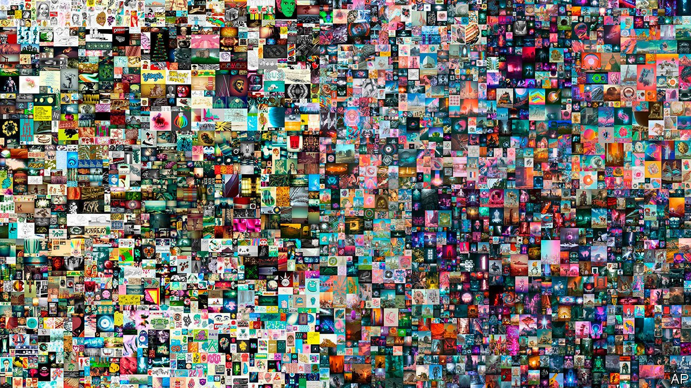

###### What’s wrong with this picture?

# Non-fungible tokens are useful, innovative—and frothy 

##### The craze extends from digital art to sports clips and cat cartoons 

 

> Mar 18th 2021 


“EQUIVALENT VIII” by Carl Andre was a minimalist sculpture bought by Britain’s Tate Gallery in 1972. The Tate described the work as “a rectangular arrangement of 120 firebricks...altering the viewer’s relationship to the surrounding space”. The public called it a pile of bricks. A few years later newspapers execrated the gallery for having wasted brick-shaped wads of cash on the avant-garde work.


Once again, a famous institution is embracing a controversial new genre. On March 11th Christie’s sold a digital collage of images called “Everydays—The First 5,000 Days” for a cool $69.3m. The sale elevated the work’s creator, Mike Winkelmann, aka Beeple, to the august company of David Hockney and Jeff Koons, the only two living painters to sell at such prices.


Christie’s sold the artwork as a “non-fungible token” (NFT), a craze for which has gripped Silicon Valley’s elite. An NFT is a secure,  that represents pieces of digital media. Invented a few years ago, it can link not only to digital art but also to text, videos or bits of code.


The pile-of-bricks criticism of digital artworks is that, in contrast to physical collectibles, they can be copied with perfect fidelity and consumed infinitely online. They thus have limited inherent value. A token brings bragging rights to a unique, authenticated version of a digital artwork, song or cute image of a cat (which first earned NFTs their popularity). Another attraction for the creative world is that NFTs make it easy to build in payments to artists when their works are sold on.


Since almost anything can be tokenised and sold if punters are willing, the craze stretches beyond pictures. Kings of Leon, a rock band, is selling a new album as an NFT and the National Basketball Association is selling clips of famous dunks. Creators can turn to a growing collection of marketplaces, such as OpenSea and Nifty Gateway. Even individual tweets are going for big sums (leading some to wonder if the former tweeter-in-chief, Donald Trump, could flog bits of his oeuvre).


The bumper Beeple sale, plus the arrival of ever more creators, means a mania that has been largely confined to crypto and techie circles could move mainstream. The global NFT market grew from a few tens of millions of dollars in annual sales a few years ago to over $300m in the past month alone, according to Andreessen Horowitz, a venture-capital firm. NFTs mesh with the massive network effects of social media and meme culture, notes Sam Hart of the Interchain Foundation, a Swiss backer of blockchain infrastructure. There has been little time to educate buyers, he says.


The pitfalls are being called out by a few crypto experts. One worry is that broad crypto-enthusiasm may be what is really behind soaring NFT values. It has not gone unnoticed that the buyer of Beeple’s “Everydays” is Metakovan, a professional crypto investor. Christie’s got its $69.3m in Ether, a cryptocurrency.


Some compare the NFT craze to the , a form of crowdfunding in which firms issue digital “coins” in return for a payment, in 2017-18, which turned to bust soon after. The soaring prices of many NFTs, reliant on ephemeral buzziness in places like Clubhouse, a hot new audio app, could quickly collapse. Celebrities including Lindsay Lohan jumping on a trend that was meant to be about helping penniless artists is, some reckon, another ominous sign. The upfront costs of “minting” NFTs are low, meanwhile, meaning potentially unlimited supply. (For now NFTs’ huge carbon footprint, owing to energy-intensive blockchain transactions, is not transparently recorded.)


A final uncertainty around NFTs’ value is that they can in practice be separated from the digital good to which they are tied, undermining their worth. A creator can change the image even after sale. One crypto artist recently “pulled the rug” on some NFTs to highlight the flaw. A series of colourful digital portraits suddenly metamorphosed into pictures of antique carpets. But the art market has always been prone to dodgy dealing. Picking NFTs looks akin to sorting real Rembrandts from those daubed by mere followers. ■

