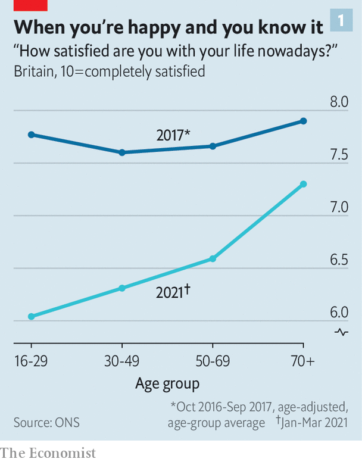
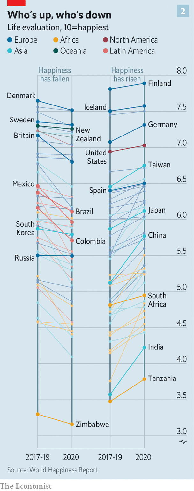

###### It might seem crazy

# The pandemic has changed the shape of global happiness 

##### The old have become happier and the young more miserable 

 

> Mar 20th 2021 


THE COVID-19 pandemic has done nothing good for the mood of Park Ha-young, an undergraduate at Seoul National University. She spent much of last year worrying about the disease, and her chances of spreading it: “I was terrified of becoming the person to cause a huge outbreak.” Her freedom has been drastically curtailed. The government determines whether she can see friends or attend classes, leaving her frustrated and unable to make plans. She is beginning to worry about finding a job after she graduates.


Politicians and officials frequently talk about how covid-19 affects public health and the economy. But for most people those are abstract considerations. What they experience each day are moods—the sense of being anxious and sad, or, if they are lucky, cheerful and optimistic. To mark World Happiness Day on March 20th, researchers linked to the UN Sustainable Development Solutions Network have tried to pin down these moods and examine how the pandemic has changed them.


Gallup, a pollster, asks the same questions in scores of countries. The most revealing one tells people to imagine a ladder, with steps numbered nought to ten. The top rung represents the best life you could have, the bottom rung represents the worst. What rung are you on now?


People’s responses to that question, known as a Cantril ladder, suggest (rather surprisingly) that the world was about as happy in the teeth of an awful pandemic as it was before the coronavirus struck. The average score across 95 countries, not population-weighted, crept up insignificantly from 5.81 in 2017-19 to 5.85 in 2020. But the pattern of life satisfaction has changed. Covid-19 has made old people more cheerful. A few countries have had some of the happiness squeezed out of them; others have amassed more of it.


Covid-19 threatens the old far more than the young, with the risk of death after contracting the disease doubling for every eight years of life. Yet the old have cheered up. Globally, between 2017-19 and 2020 happiness was boosted by 0.22 points on the Cantril ladder among people over the age of 60. Celina Beatriz Gazeti dos Santos, a 64-year-old psychologist in São Paulo, ticks off a list of things that might dampen her mood—the pandemic, widespread corruption, a dislikeable government, others’ misery. Yet she proclaims herself increasingly happy and optimistic all the same.

 


In Britain, a country with excellent happiness data, everyone has slipped, but some more than others (see chart 1). There, and in other rich countries, the age profile of happiness before the pandemic struck was roughly U-shaped when plotted on a graph. People began their adult lives in a cheerful state. They became glummer in middle age. Then, after about the age of 50, they started to became happier again. If they made it to a very advanced age, however, they fell back into the doldrums.


Today the pattern is an upward slope. The young are less satisfied than the middle-aged, who are less satisfied than the old. That might be put down to Britain’s vaccination programme, which has targeted the old first. But the pattern has barely changed over the past year. Months before Britons became familiar with what some call “the Pfizer” and “the AstraZeneca”, something had shifted.


Video-conferencing software has enabled many old people to stay in touch with their families—sometimes better than before the pandemic. In countries that locked down, they have the pleasure of knowing that society made sacrifices to protect them. And as John Helliwell, an economist at the University of British Columbia who wrote part of the World Happiness Report points out, the old feel healthier. Globally, 36% of men over the age of 60 said they had a health problem last year, down from an average of 46% in the three years before. Among women, the share with health problems fell from 51% to 42%. Old people probably are not actually healthier. Rather, covid-19 has changed the yardstick. They feel healthier because they have dodged a disease that could kill them.


Meanwhile the young have had a rough year. Many lost their jobs—in America the unemployment rate for people aged 20 to 24 shot up from 6.3% in February 2020 to 25.6% two months later (it fell back to 9.6% last month). In some rich countries young women have had a particularly hard time. They often work in sectors, such as hospitality, which have been shut down. When schools close, many are lumbered with more than their fair share of child care.


They also have busy social lives. Having lots of friends seems, counter-intuitively, to have made the pandemic harder. One study of Britain by Ben Etheridge and Lisa Spantig, both at the University of Essex, found that women with at least four close friends slumped more than anyone during the spring 2020 lockdown. “People who are used to seeing lots of friends really suffered—and women and younger people have more friends,” says Xiaowei Xu of the Institute for Fiscal Studies.

 


Some countries have fared better than others (see chart 2). Whereas Britons’ happiness slumped in 2020, Germany rose from being the 15th happiest country in the world to the seventh happiest. Britain has endured long lockdowns and an excess-death rate of 190 per 100,000 people since the start of the pandemic. Germany’s excess-death rate is just 77 per 100,000. For most of last year Germany fought covid-19 much better than most of Europe, although it has gone on to fluff the vaccination endgame—leading Bild, a tabloid newspaper, to declare in February: “Liebe Briten, we beneiden you” (dear Britain, we envy you).


Strikingly, the countries that were at the top of the happiness chart before the pandemic remain there. The three highest-ranking countries in 2020—Finland, Iceland and Denmark—were among the top four in 2017-19. All three have dealt well with covid-19, and have excess-death rates below 21 per 100,000. Iceland has a negative rate. It helps to be a remote island.


The most intriguing suggestion in the World Happiness Report is that some links between covid-19 and happiness operate in both directions. The authors do not suggest that happiness helps countries resist covid-19. Rather, they argue that one of the things that sustains national happiness also makes places better at dealing with pandemics. That thing is trust. Polls by Gallup show that many of the places that have coped best with covid-19, such as the Nordic countries and New Zealand, have widespread faith in institutions and strangers. Large majorities of their inhabitants believe that a neighbour would return a wallet if they found it.


Countries have failed to see off covid-19 for many obvious reasons. Some are poor; others are poorly led. They lack recent experience with diseases such as SARS. They cannot police their borders. But Jeffrey Sachs, an economist at Columbia University, suggests another reason: politicians and officials in many rich European and American countries decided they could not ask too much of the public. A combination of individualism and less-than-solid institutional trust meant they felt unable to insist on quarantines or mask-wearing until the situation grew desperate.

People who don’t need people


If that is right, it might help explain a broad regional change: the falling happiness of Latin America and the rising happiness of East Asia. Argentina, Brazil, Colombia and Mexico all became less happy in 2020; China, Japan and Taiwan became happier, although South Korea slipped a bit. It is as though Latin American countries had the wrong kind of happiness before 2020, says Mr Helliwell—a happiness sustained by people’s close social connections, not by high levels of social trust. A global poll in 2019 found that only 52% of people in Latin America and the Caribbean thought a neighbour would return a wallet; just 41% thought a cop would. That is the lowest share of any region.


The pervasive lack of trust made it harder for Latin American countries to tackle covid-19 in a comprehensive way. People can and do keep their distance from each other, but that is emotionally tough in countries where people are normally so sociable. Mexicans have been deprived of their leisurely Friday lunches and Sunday family gatherings (though some carry on anyway). “The pandemic has changed a lot,” laments Edmilson de Souza Santos, a builder in Barueri, a São Paulo suburb. “You have to stop living your life.”


There remains a big national puzzle. America responded poorly to covid-19 and has suffered more than 500,000 excess deaths. Yet the Gallup poll detects a slight rise in Americans’ happiness level in 2020. A panel survey by the University of Southern California shows that mental stress and anxiety shot up in America last March and April, but then subsided. Two subsequent waves of infection and death appeared not to disturb them further.


Many American states have had rather lackadaisical lockdowns, at least for adults—for schoolchildren restrictions can seem unbending. That could have kept people’s spirits up. Abi Adams-Prassl of Oxford University and other researchers found that the first wave of lockdowns, last spring, lowered women’s moods. It could also be that extreme partisanship helps. Many Americans have spent the past year in an alternate information universe in which covid-19 is just like flu. It is hard to get too worked up about fake news. ■

