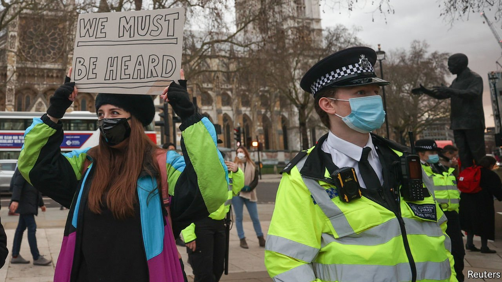

###### Civil liberties

# An illiberal bill to suppress protest in Britain 

##### The pandemic has given the government a taste for cracking down 

 

> Mar 18th 2021 


“FREEBORN ENGLISHMEN and women can no longer walk a few hundred paces down the queen’s pavement to Downing Street to protest at the closure of their local hospital,” thundered Boris Johnson in 2006. When the Tories were in opposition, Mr Johnson condemned attacks on the nation’s proud liberal traditions by the dastardly Labour government in prose weighed down with patriotic tropes.


No longer. On March 16th his government’s Police, Crime, Sentencing and Courts bill, which includes provisions that would sit comfortably in Russian or Chinese statute books, passed its second reading in the House of Commons. It increases the maximum sentence for defacing a memorial from three months to ten years and would allow police to restrict protests if the noise they make has a “relevant impact” on people in their vicinity. Since making an impact on people nearby is the point of protests, this bill would give police excessive powers to gag demonstrations.


The clause on memorials is a clue to the government’s motivation. There has been an upsurge in protests in the past couple of years, especially by Black Lives Matter (BLM) and Extinction Rebellion (XR). BLM protests targeted statues connected with the slave trade and the empire; even Winston Churchill was daubed with paint. XR caused disruption in London with a series of spectacular protests in 2019, and the prime minister no doubt fears being upstaged by a protest group with a talent for dramatic visuals at the COP26 global climate-change conference in Glasgow in November.


That societies should take pride in their histories and want to protect their memorials, even when some of the chaps on the plinths do not look quite as heroic now as they did in their own times, is understandable. That cities should try to minimise disruption to their activities, even when demonstrators have a powerful cause, is understandable. But those interests must be balanced with others.


Freedom of expression, including the freedom of assembly, is central to a liberal democracy, and decent societies have to put up with a few inconveniences to guarantee it. That’s not just because expression bolsters individual liberty, but also because governments sometimes need to hear what protesters have to say. XR has made the world take climate change more seriously. BLM has made white people think harder about racism. Most of what is now called political progress started off as protest.


The pandemic has set a dangerous precedent. Governments all over the world have used it to suppress civil liberties. Mostly, that has been in countries without the proud liberal tradition that Mr Johnson used to celebrate, but even in Britain the government appears to have got a taste for cracking down. On March 7th a nurse was fined £10,000 ($14,000) under covid-19 legislation for organising a 40-person demonstration demanding higher pay rises for health workers. And after spending much of a year locked up by decree, freeborn Englishmen and women are less trenchant in the defence of their liberties than Mr Johnson once assumed. By two to one, they think protest should be illegal in a pandemic; and when police arrested women at a vigil for a murder victim on March 13th, a plurality thought that they were right to have banned the event.


This complacency is as dangerous as the government’s illiberalism. Britons may take their freedoms for granted now, but they have had to defend them in the past and will again. That is what put Churchill—the prime minister’s hero—on a plinth. Unless Mr Johnson bins this rotten bill, he will do more damage to Churchill’s legacy than any paint-spraying protester. ■

