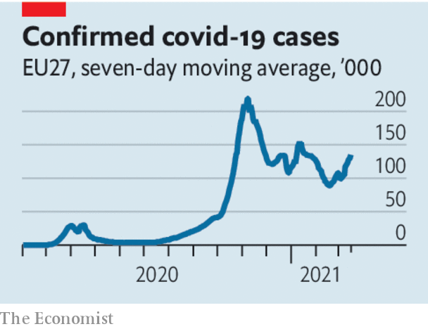

###### Another shot in the foot

# How Europe’s vaccine caution can cost lives 

##### Avoid a small risk; incur a bigger one 

 

> Mar 18th 2021 


IT DOES NOT take much for people to lose confidence in vaccines. When a few Europeans who had received the AstraZeneca (AZ) shot for covid-19 suffered unusual blood clotting that was sometimes fatal, many countries in the European Union stopped using it. They say this shows they take safety seriously. Unfortunately, their caution is more likely to cost lives.


The suspensions began after Norway reported four cases of blood clotting in adults given the AZ vaccine. Similar reports have come from other European countries. Within days at least 16 of them, including Germany, France and Italy, had called a halt. The World Health Organisation, the European Medicines Agency (EMA) and the regulator in Britain, where the AZ vaccine has been used abundantly, urged people to keep getting jabbed.


On March 18th the EMA confirmed this advice. It is hard to see how it could have reached any other conclusion. The AZ vaccine, like others, has been shown to be safe in millions of people.


Any confusion lies in the difficulty of disentangling causation from correlation. The EMA reckons that as of March 10th there had been 30 “thromboembolic events” among the 5m people in the EU who have received AZ’s vaccine. By itself, that is no more remarkable than the fact that some of them will have suddenly had relief from chronic back pain or seen their cancer go into remission. The question is whether the rates are higher than would otherwise be expected. With clots, even as evidence from specific cases needs investigating, the mass of overall data shows that the vaccines are safe.

 


In clinical trials 38% of those given the jab reported at least one side-effect, chiefly things like pain at the injection site, a headache or brief fever. So did 28% of those who got a dummy injection. Less than 1% of either group went on to suffer any serious illness. Of those who did, more had been given the placebo. Trial data are backed up by mass-vaccination experience in other countries. Britain has administered more than 10m doses of each of the AZ vaccine and the one made by Pfizer, an American firm. Its medicines regulator reckons that both vaccines cause between three and six reports of side-effects for every 1,000 doses delivered, almost all of which are mild.


Even if it turns out to entail a minuscule risk of clotting disorders, vaccination is likely to be many, many times less dangerous than catching covid-19. People routinely undertake activities that involve a small risk of blood clots, such as flying, taking birth-control pills, smoking and eating unhealthily. 


European officials have described the suspensions as temporary precautions. When the evidence is in, programmes can pick up where they left off—and the public will be reassured. That logic is wrong on two counts. One is that, while vaccination is halted, people will contract covid-19. Precautionary regulation would have continued with vaccination while the clotting was investigated because, given the prevalence of the disease in Europe, which is growing, that would minimise death and suffering. The other mistake is that doubts caused by a temporary halt are likely to persist.


Consider other vaccines. Many rich countries inoculate children against human papillomavirus (HPV), which causes cervical cancer. After anecdotal reports of side-effects in 2013, Japan stopped recommending the HPV vaccine. No amount of evidence of the safety of the HPV vaccine has persuaded it to change its mind. One paper estimates that between 5,000 and 5,700 Japanese women born between 1994 and 2007 will die as a result.


Some European medics allege that their countries suspended their vaccination programmes partly out of EU “solidarity” or frustration with EU bureaucrats telling them how to deal with the pandemic. If so, that will rebound on them. If the death toll mounts and vaccination rates remain stubbornly low, expect recriminations to fly. And rightly so. ■


Dig deeper


All our stories relating to the pandemic and the vaccines can be found on our . You can also listen to , our new podcast on the race between injections and infections, and find trackers showing ,  and the virus’s spread across  and .


Correction (March 18th 2021): An earlier version of this article said that between 5,000 and 5,700 women had already died as a result of Japan′s suspension of the HPV vaccine. This is not the case. Those figures are projections, not deaths that have already occurred. We have updated the piece to reflect this, and sincerely regret the error. 


Editor's note (March 18th 2021): This article has been updated since publication to include the conclusions of the EMA report, issued on March 18th, confirming its advice that the AZ vaccine is safe. 

