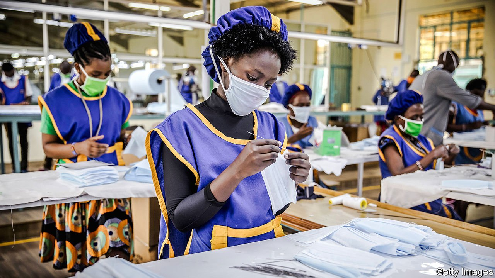
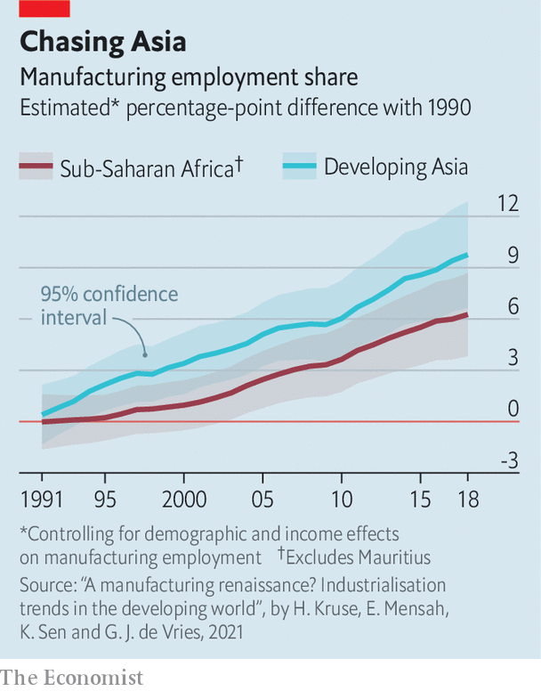

###### Manufacturing hope

# African industry is doing better than previously thought 

##### A well-worn path to prosperity is still open 

 

> Mar 18th 2021 


“THE FUTURE is here,” says Ibrahima Sarr, pointing to the factories he runs in Senegal. After working and studying for 18 years in Europe he returned home to help spark a manufacturing revolution. Now he is with Africa Development Solutions, a Malian conglomerate, managing plants that make electric bikes, pipes and, soon, clothing.


Mr Sarr is not alone in his optimism for manufacturing in Africa. The Diamniadio industrial park he looks out over is the centrepiece of Senegal’s ambitious industrialisation plan. Elsewhere in the region, Ghana has attracted car-assembly plants from Nissan and Volkswagen. Ethiopia, too, has bet heavily on manufacturing.


And the idea of making things is capturing the imagination of young Africans such as Yusuf Bilesanmi, who invented a cheap ventilator that can treat patients with covid-19 even in hospitals without electricity. His device has been shortlisted for the Royal Academy of Engineering’s Africa Prize. He wants to produce it in Nigeria after seeing how the pandemic disrupted the supply of medical gear to Africa. Doing so will also allow him to create jobs and distribute it more quickly.


This optimism cuts against established wisdom. In 2015 Dani Rodrik of Harvard University published an influential paper showing that employment in manufacturing, and manufacturing’s share of GDP, were falling in sub-Saharan Africa. This “premature deindustrialisation” was deeply worrying. Factories transformed countries like South Korea and China into economic stars. Yet Mr Rodrik’s work suggested this elevator out of poverty was stalling. (Disclosure: Mr Rodrik wrote a favourable blurb for a book on an unrelated topic by the author of this article.)

 


However, a handful of new studies suggests things are looking up. Start with a recent paper by Hagen Kruse, of the University of Groningen, and others. It reckons that the share of people working in manufacturing in sub-Saharan Africa has risen from 7.2% of the total in 2010 to 8.4%. Though starting at a lower level, that growth looks remarkably Asian, especially after adjusting for income and population (see chart). A long decline in manufacturing’s share of GDP has bottomed out, and it is now about 11%. Output is up by 91% in real terms since 2000. Given numbers such as these, talk of deindustrialisation in Africa is “silly”, says Margaret McMillan of Tufts University. The World Bank, in a recent brief, says unequivocally that “industrialisation remains viable in sub-Saharan Africa.” Even Mr Rodrik is more hopeful, suggesting that in many African countries the share of workers in manufacturing could reach 20%. That would be more than double current levels, but not quite the peaks seen in Europe, when up to a third of the workforce was in manufacturing.


There are still huge hurdles. Among the biggest is that the rise in factory employment has not been matched by expected improvements in productivity. Some reasons may be found by looking at which firms have improved, and which have not. In Tanzania and Ethiopia most of the new factory jobs were created by small, inefficient companies. Although a few big manufacturers have boosted productivity, they have not been hiring much, according to a new paper by, among others, Xinshen Diao and Mia Ellis of the International Food Policy Research Institute, a think-tank based in Washington.


One reason for the productivity gap may be that big African firms are tied into global value chains. In order to sell to companies in rich countries they have to use the latest machines to meet the highest standards. That may be helping them learn how to compete on global markets. But, in part because fancy machines require fewer workers, it is not yet creating the millions of jobs needed every year by the world’s youngest and fastest-growing population.


Even so, there are several paths African countries can take in order both to create many more jobs and to become more productive (which would make their people richer). The first is for big, productive players to increase their share of the market. That would boost productivity overall, but might slow hiring. Yet if they can go on to compete successfully in export markets, they could soon be producing so much that hiring picks up, too. Competing internationally will not be easy. Wages in most parts of Africa (with some exceptions, such as Ethiopia) are still higher than in the poorest countries in Asia. So are living costs, not least because potholed roads make it expensive to move food from farms to urban markets. Governments could help attract investment from already successful foreign firms that are looking for places to build new factories by fixing infrastructure, snipping red tape and improving schools.


These sorts of investments, as well as initiatives to improve access to loans, could help small firms to shape up, and new ones to start up. One model to emulate could be Vietnam, where firms have increased their productivity and expanded their workforce more quickly than those in Africa. Its small manufacturers invest even more intensively in machinery than its bigger ones, and are highly productive.


Not every country can create its own version of Germany’s Mittelstand, with medium-sized firms that sell to the world. But they could have a throng of mid-sized companies supplying the big exporters that are competing in global markets. Governments can help by easing bottlenecks at borders to encourage trade within Africa. Eastern Congo may not be a tempting market for firms in China, but it is a big prize for food processors in next-door Rwanda. The World Bank reckons the new continent-wide free-trade area that came into force this year could more than double intra-African trade in manufactured products by 2035. This could help combine improvements in both productivity and employment, because firms selling to less competitive regional markets need not use the very latest machines. Given that most African countries have a lot of workers and not much capital, that would be a better fit.


The pandemic has been tough on manufacturers in Africa. At another garment factory in Diamniadio, orders from America have collapsed. Yet much like manufacturing in Africa, the factory is more resilient than it appears: it has switched to making face masks. Since Mr Sarr returned to Senegal, the pandemic has only strengthened his determination to encourage industry in Africa. Covid-19 exposed Africa’s “extreme dependence” on imports and its vulnerability to shocks in supply chains around the world. “He who makes,” he says, “has the power.”■

