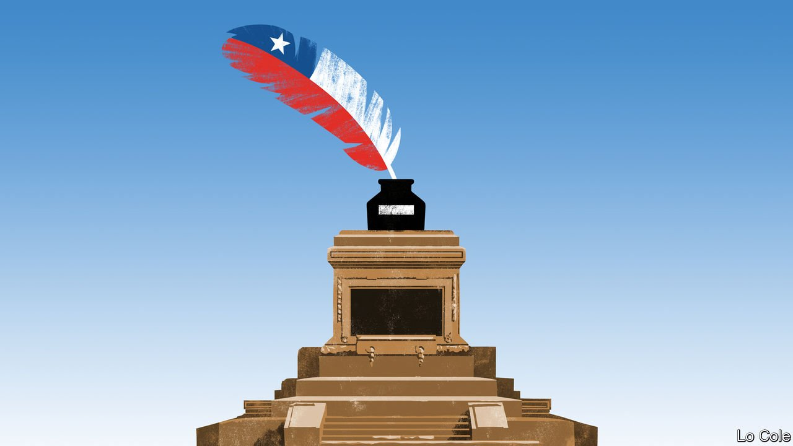

###### Bello

# A constitutional convention in Chile could forge a new social contract 

##### The current document still bears the original sin of being Pinochet’s creation 

 

> Mar 18th 2021 


GENERAL MANUEL BAQUEDANO is—or was—a Chilean national hero, as the military commander who defeated Peru in the war of the Pacific. For almost a century his bronze equestrian statue has towered over a plaza that marks the emotional heart of Santiago, a gathering place for football fans and demonstrators. Yet when Chile was shaken in late 2019 by an explosion of violent vandalism and peaceful mass protests, the statue became a target, the symbol of an established order held by some to have become intolerable. After it was repeatedly covered with spray paint and set on fire, in the middle of the night on March 12th troops took it away for restoration.


For conservatives its removal represented defeat by the mob for the centre-right government of Sebastián Piñera. Yet the more powerful symbol may be the empty stone plinth the soldiers left behind. Chile is embarking on a potentially constructive process of redefinition, with the election on April 10th and 11th of a convention to write a new constitution. Many hope that this will isolate los violentos, and forge a new social contract that creates a fairer, but still capitalist, country.


For most of the three decades since the end of the dictatorship of General Augusto Pinochet in 1990, Chile was a success. It combined a rapidly growing market economy with the rule of law. But as it got less poor, discontent grew over narrowing opportunities, segregated health and education systems, and abuses by monopolistic businesses. When anger boiled over, politicians found a way to assuage it by offering a plebiscite on setting up the convention. It was held in October. Some 78% voted yes on a turnout of 51%—the highest since voting became voluntary in 2012.


Though much amended, the existing constitution bears the original sin of being Pinochet’s creation. It is often denounced, too, as a “neoliberal” document. Under its auspices, the dictatorship assigned a big role to the market in providing pensions, health care and education. Its biggest defects, however, are that it has entrenched vested interests and makes some laws too hard to change.


The constitutional exercise brings two opposing risks: of too much change or too little; of leftist populism or a failure by the right to recognise that many Chileans have lost faith in the system. There exist safeguards, especially against the first. Everything must be approved by a two-thirds majority of the convention’s 155 members, which obliges negotiation and compromise. It’s “a very institutionalised process”, says Isabel Aninat, a law professor and former adviser to Mr Piñera. She thinks the assembly’s committees will base their deliberations on the existing document, Chile’s constitutional history and the charters of some other countries. Partly because of the pandemic, the country’s mood is calmer than it was 18 months ago. The five parties of the right, united in a single list of candidates, are likely to get over a third of the convention’s seats, while the divided far left may fare worse than it hoped.


The new charter will involve a bit more state and a bit less market. Whether or not the document is fiscally affordable will depend on the extent and detail of its probable guarantee of “social rights”. Water rights, currently held privately and in perpetuity, are a sensitive issue. Many Chileans would like to see more decentralisation, and some a semi-parliamentary system. Businesses want clear limits to state intervention. Some believe that the two-thirds rule will lead to a minimalist document—which for Latin America, where constitutions tend to be prolix, would be truly revolutionary. But it is also possible that horse-trading might lead to a plethora of clauses.


In a country where politicians and institutions, from the Catholic church to the police, are discredited, the process is almost as important as the product. There are important novelties: the assembly must have broadly equal numbers of women and men, 17 seats are reserved for indigenous people and several candidates standing for independent lists are likely to be chosen (the parties have opened their lists to independents, too).


But there will be distractions. A general election is due in November. Demands for transparency may impede the closed-door sessions that would ease compromise. In the end, the most important test will be whether the convention restores trust in democratic politics and produces a feasible blueprint for change. Get it right, and Chile will once again be a model for the region.

